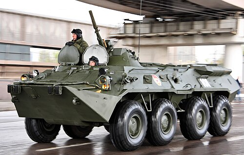
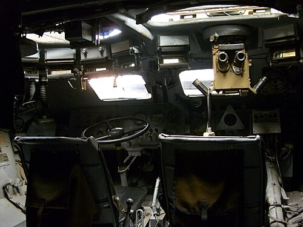

# Transporter Opancerzony BTR-80
### BTR-80 Armoured Personnel Carrier | Бронетранспортёр БТР-80

---

## Opis

BTR-80 (ros. Бронетранспортёр-80) to ośmiokołowy kołowy transporter opancerzony produkcji radzieckiej, przyjęty na uzbrojenie Armii Radzieckiej w 1985 roku jako następca starszych BTR-60 i BTR-70. Zaprojektowany z myślą o przewożeniu piechoty zmotoryzowanej na polu walki i zapewnieniu jej bezpośredniego wsparcia ogniowego, jest zdolny do pływania na wodzie. To jeden z najliczniej produkowanych i eksportowanych transporterów opancerzonych na świecie — służy w ponad 40 armiach. Wojsko rosyjskie używa go masowo do dziś, choć w Ukrainie pojazdy te poniosły bardzo duże straty.

## Dane techniczne

| Parametr | Wartość |
|----------|---------|
| Typ | Transporter opancerzony kołowy |
| Kraj produkcji | ZSRR / Rosja |
| Rok wprowadzenia | 1985 |
| Masa bojowa | 13,6 t |
| Długość | 7,7 m |
| Szerokość | 2,9 m |
| Wysokość | 2,41 m |
| Uzbrojenie | 14,5 mm KPVT + 7,62 mm PKT (wieżyczka NSVT); wariant BTR-80A: 30 mm armata 2A72 |
| Silnik | KamAZ-7403 (turbodiesel) |
| Moc silnika | 260 KM |
| Prędkość maks. (droga) | 80–90 km/h |
| Prędkość na wodzie | 10 km/h |
| Zasięg | 600 km |
| Załoga + desant | 3 + 7 os. |
| Napęd | Kołowy 8×8, amfibijny |

## Charakterystyczne cechy rozpoznawcze

> Jak odróżnić BTR-80 od innych podobnych pojazdów:

- **Kształt kadłuba — pochylony dziób:** Przednia część kadłuba jest wyraźnie pochylona pod kątem ok. 60°, z charakterystycznym zaokrąglonym "nosem" — bardziej zaokrąglonym niż w BTR-60/70, mniej kanciaste niż w BTR-90.
- **Mała okrągła wieżyczka z podwójnym uzbrojeniem:** Standardowy BTR-80 ma małą, otwartą wieżyczkę z karabinem maszynowym 14,5 mm KPVT i 7,62 mm PKT umieszczonym obok (nie w osi); BTR-80A ma zamkniętą wieżyczkę z armatą 30 mm.
- **Osiem dużych kół bez gąsienic:** Cztery osie z kołami o dużej średnicy — wyraźnie widoczne przestrzenie między kołami 1.–2. a 3.–4. osią.
- **Drzwi boczne z przegubem pośrodku pojazdu:** Charakterystyczne drzwi dzielone (górna i dolna część otwierają się osobno) znajdują się w środkowej części kadłuba między 2. a 3. osią — żołnierze wysiadają na zewnątrz, a nie przez tył.
- **Niska sylwetka w stosunku do szerokości:** Pojazd jest stosunkowo niski (2,41 m) i szeroki, co daje mu charakterystyczny "płaski" profil w porównaniu z BTR-90 czy Tajfunem.
- **Brak tylnej rampy desantowej:** W odróżnieniu od BWP-1/2 i wielu zachodnich APC, BTR-80 nie ma tylnej rampy — desant wysiada przez drzwi boczne, co jest jego wyraźną słabością rozpoznawaną przez obserwatorów.

## Ciekawostka

> BTR-80 ma jeden silnik (KamAZ-7403 diesel), co było ogromnym krokiem naprzód w stosunku do poprzednika BTR-70, który miał dwa silniki benzynowe GAZ-49B — mechanicy BTR-70 musieli obsługiwać dwa odrębne układy napędowe, co znacznie komplikowało eksploatację i serwisowanie w warunkach polowych.
