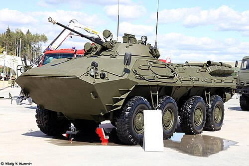
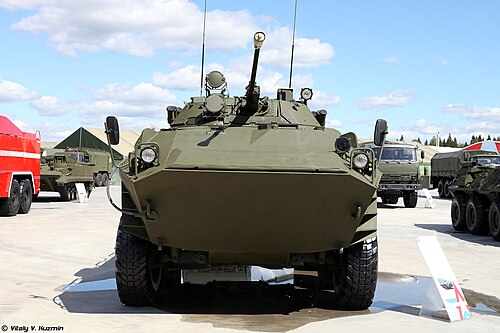

# Transporter Opancerzony BTR-90
### BTR-90 Armoured Personnel Carrier | Бронетранспортёр БТР-90

---

## Opis

BTR-90 (ros. Бронетранспортёр-90, znany też jako "Rostok") to rosyjski ośmiokołowy amfibijny transporter opancerzony opracowany w latach 90. XX wieku jako zaawansowany następca BTR-80. Pojazd jest wyraźnie większy i cięższy od poprzednika, a jego główną cechą wyróżniającą jest wieżyczka identyczna jak w BWP-2 — z automatyczną armatą 30 mm 2A42, co daje mu znacznie większą siłę ognia niż typowy APC. Mimo obiecujących parametrów, Rosja ostatecznie zrezygnowała z zakupu BTR-90 w 2011 roku, preferując modernizację linii BTR-80 do standardu BTR-82A jako tańsze rozwiązanie. Wyprodukowano zaledwie od kilkudziesięciu do ok. 130 egzemplarzy.

## Dane techniczne

| Parametr | Wartość |
|----------|---------|
| Typ | Transporter opancerzony kołowy (ciężki) |
| Kraj produkcji | Rosja |
| Rok wprowadzenia | 2004 (produkcja seryjna, ograniczona) |
| Masa bojowa | 20,9 t |
| Długość | 7,64 m |
| Szerokość | 3,20 m |
| Wysokość | 2,98 m |
| Uzbrojenie | 30 mm armata 2A42 (500 naboi) + 7,62 mm PKT + granatnik AGS-17D + PPKR 9M113 Konkurs |
| Silnik | Turbodiesel |
| Moc silnika | 510 KM |
| Prędkość maks. (droga) | 100 km/h |
| Prędkość na wodzie | 9 km/h |
| Zasięg | 800 km |
| Załoga + desant | 3 + 7 os. |
| Napęd | Kołowy 8×8, amfibijny |

## Charakterystyczne cechy rozpoznawcze

> Jak odróżnić BTR-90 od BTR-80 i innych podobnych pojazdów:

- **Znacznie większa i wyższa sylwetka:** BTR-90 jest o ok. 57 cm szerszy i ok. 57 cm wyższy od BTR-80 — różnica widoczna gołym okiem, szczególnie gdy pojazdy stoją obok siebie lub widoczne są z odległości.
- **Wieżyczka identyczna jak w BWP-2:** Zamknięta, wyraźnie większa wieżyczka z armatą 30 mm 2A42 — taka sama jak stosowana w BWP-2; to kluczowy wyróżnik odróżniający go od BTR-80 z małą wieżyczką 14,5 mm.
- **Zestaw uzbrojenia rakietowego:** Na wieżyczce widoczna wyrzutnia ppkr Konkurs — na żadnym standardowym BTR-80 nie ma takiego zestawu rakietowego na wieżyczce.
- **Bardziej kanciasty dziób kadłuba:** Przednia część jest bardziej kanciasta i "kwadratowa" niż zaokrąglony dziób BTR-80, z wyraźnymi progami pancerza na przodzie.
- **Drzwi boczne połączone z rufowymi:** BTR-90 zachowuje boczne drzwi desantowe jak BTR-80, ale ma też dodatkowe tylne włazy — układ wyjść jest bardziej rozbudowany.
- **Masa bojowa ponad 20 ton:** Na polu bitwy widoczna jest lepsza ochrona boczna — grubsze płyty pancerza dające ochronę przed 14,5 mm pociskami z przodu (a nie tylko z boku jak BTR-80).

## Ciekawostka

> BTR-90 był jednocześnie jednym z najlepiej uzbrojonych kołowych transporterów opancerzonych na świecie (porównywalnym do BMP-3 pod względem siły ognia) i jednym z największych fiasek zamówień wojskowych Rosji — po 17 latach prac i produkcji kilkudziesięciu egzemplarzy, rosyjskie ministerstwo obrony oficjalnie odrzuciło go w 2011 roku, uznając projekt za zbyt drogi i mało innowacyjny w stosunku do zmodernizowanego BTR-82A.
