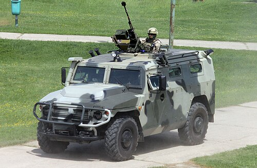
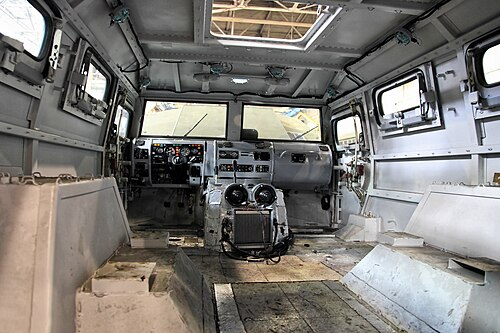

# Rosyjskie pojazdy MRAP / GAZ Tigr
### Russian MRAP / GAZ Tigr Light Multipurpose Vehicle | ГАЗ Тигр

---

## Opis

GAZ Tigr to rosyjski lekki pojazd wielozadaniowy produkowany przez Gorkowską Fabrykę Samochodów (GAZ) od 2006 roku. Pełni funkcję odpowiednika amerykańskiego Humvee, służąc jako pojazd zwiadowczy, transportowy i patrolowy. Tigr jest powszechnie stosowany przez armię rosyjską, jednostki Rosgwardii, Spetsnaz oraz FSB. Pojazd występuje w wielu wariantach — od otwartej platformy z CKM po wersję opancerzoną z modułowym uzbrojeniem. W konfliktach w Syrii i Ukrainie Tigr stał się jednym z najbardziej rozpoznawalnych rosyjskich pojazdów taktycznych, choć jego opancerzenie okazało się niewystarczające wobec nowoczesnej broni przeciwpancernej.

## Dane techniczne

| Parametr | Wartość |
|----------|---------|
| Typ | Lekki pojazd wielozadaniowy / MRAP |
| Kraj produkcji | Rosja |
| Rok wprowadzenia | 2006 |
| Masa bojowa | 7 200 kg |
| Długość | 5,67 m |
| Szerokość | 2,2 m |
| Wysokość | 2,0 m |
| Uzbrojenie | 7,62 mm PKP, 12,7 mm Kord lub 30 mm AGS-17 (zależnie od wersji) |
| Silnik | YaMZ-5347-10 turbodiesel, 215 KM |
| Prędkość maks. (droga) | 140 km/h |
| Zasięg | 1 000 km |
| Załoga + pasażerowie | 2 + 9–11 osób |
| Napęd | 4×4 |

## Charakterystyczne cechy rozpoznawcze

> Jak odróżnić GAZ Tigr od innych rosyjskich pojazdów:

- **Charakterystyczna prostokątna sylwetka z wysoką kabiną:** Tigr ma wyraźnie prostokątny, "pudełkowy" kształt nadwozia z pionowymi drzwiami — odróżnia go od bardziej opływowych pojazdów NATO
- **Duże okrągłe reflektory z przodu:** charakterystyczne okrągłe reflektory główne z przodu maski — wyraźna cecha rozpoznawcza odróżniająca od pojazdów z prostokątnymi reflektorami
- **Wysoki prześwit i duże terenowe opony:** znaczny prześwit podwozia i szerokie opony terenowe widoczne z każdej strony — pojazd sprawia wrażenie "siedzącego wysoko"
- **Moduł uzbrojenia na dachu (wieżyczka lub postument):** większość wariantów bojowych ma wyraźny moduł z uzbrojeniem na dachu — otwarta platforma lub zamknięta wieżyczka
- **Brak opancerzenia bocznych drzwi (wersja podstawowa):** podstawowy Tigr ma cienkie drzwi bez widocznych płyt pancernych, dopiero wersja Tigr-M ma wzmocnione boki
- **Kratka wlotu powietrza na masce:** charakterystyczna pozioma kratka wentylacyjna silnika z przodu maski — wyraźna cecha górnej powierzchni maski

## Ciekawostka

> GAZ Tigr pierwotnie był projektowany jako pojazd cywilny do sprzedaży eksportowej — pierwszym zainteresowanym była armia Jordanii, która zamówiła wersję militarną. Dopiero sukces eksportowy skłonił rosyjskie ministerstwo obrony do zamówienia go dla własnych sił zbrojnych. Paradoksalnie jeden z najbardziej rozpoznawalnych symboli rosyjskiego wojska zaczynał jako projekt handlowy nastawiony na eksport, a nie na potrzeby własnej armii.
