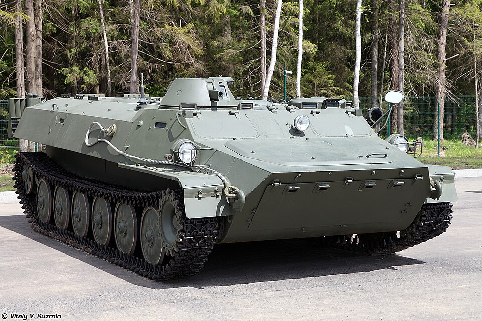

# MT-LB — wielozadaniowy transporter opancerzony
### MT-LB Armored Personnel Carrier / Artillery Tractor | МТ-ЛБ

---

## Opis

MT-LB (Mnogotselevoy Tyagach Legky Bronirovany — lekki opancerzony ciągnik wielozadaniowy) to radziecki amfibijny transporter opancerzony i ciągnik artyleryjski wprowadzony w latach 70. XX wieku. Zaprojektowany na bazie komercyjnych podzespołów samochodów ciężarowych, jest wyjątkowo tani i niezawodny. Może przewozić 11 żołnierzy lub 2000 kg ładunku, holować działa do 6500 kg. Stał się bazą dla dziesiątek wariantów: 2S1 Goździk, Strela-10, radarów SNAR, niszczycieli czołgów. Rosja straciła w Ukrainie ponad 1710 egzemplarzy — więcej niż jakiegokolwiek innego pojazdu.

## Dane techniczne

| Parametr | Wartość |
|----------|---------|
| Typ | Transporter opancerzony / ciągnik artyleryjski (amfibia) |
| Kraj produkcji | ZSRR |
| Rok wprowadzenia | ok. 1970 |
| Masa bojowa | 11,9 t |
| Długość | 6,45 m |
| Szerokość | 2,86 m |
| Wysokość | 1,86 m |
| Uzbrojenie | KM PKT 7,62 mm w małej wieżyczce |
| Ładowność | 11 żołnierzy lub 2000 kg ładunku |
| Siła ciągu | holowanie do 6500 kg |
| Silnik | YaMZ-238 diesel, 240 KM |
| Prędkość maks. (droga) | 61 km/h |
| Prędkość w wodzie | 5–6 km/h (napęd gąsienicami) |
| Zasięg | 500 km |
| Pancerz | Stal 3–14 mm (ochrona przed bronią strzelecką i odłamkami) |
| Załoga | 2 osoby + 11 desantu |

## Charakterystyczne cechy rozpoznawcze

> Jak odróżnić MT-LB od BTR-80 i BMP:

- **Mała wieżyczka z PKT przesunięta ku przodowi po prawej stronie** — niska, jednoosobowa kopułka; brak większej wieży; wygląda jak "transporter bez wieży z guzkiem z boku"
- **Bardzo niska i płaska sylwetka** — wysokość tylko 1,86 m; znacznie niższy niż BTR-80 (2,35 m) i BMP-2 (2,06 m)
- **Sześć kół nośnych równomiernie rozmieszczonych** — widoczne z boku; wariant MT-LBu ma 7 kół i wyższy kadłub
- **Napęd w wodzie gąsienicami** (bez śrub) — podczas pływania nie widać wychylanych napędników; porusza się wolno i niezgrabnie na wodzie
- **Szerokie gąsienice w wersji MT-LBV** — zimowa odmiana ma gąsienice 670 mm (vs 350 mm w standardzie); wygląda jak "rozkroczony" transporter
- **Często z doposażeniem na dachu** — w Ukrainie powszechnie montowane: ZU-23-2, S-60, wieże BMP, wyrzutnie rakiet — każda kombinacja jest inna

## Warianty na bazie MT-LB

| Wariant | Opis |
|---------|------|
| MT-LBu | Wydłużony kadłub (7 kół), mocniejszy silnik — baza dla 2S1, Strela-10, SNAR |
| MT-LBV | Szersze gąsienice (670 mm) do działania na śniegu i bagnach |
| MT-LBM 6MB | Moduł z działkiem 30 mm na dachu |
| 2S1 Goździk | Haubica 122 mm na podwoziu MT-LBu |
| 9P149 Shturm-S | Niszczyciel czołgów z PPK Szturm na podwoziu MT-LBu |
| Strela-10 | Zestaw rakietowy plot. na podwoziu MT-LBu |

## Ciekawostka

> MT-LB zbudowano z części samochodów ciężarowych — silnik V8 pochodzi wprost z cywilnych ciężarówek. To sprawiło, że był ekstremalnie tani i produkowany w ogromnych ilościach. W Ukrainie Rosjanie w desperacji montowali na MT-LB nie tylko ZU-23-2 i S-60, ale nawet okrętowe wyrzutnie bomb głębinowych RBU-6000. Ukraina posiadała przed wojną ponad 2090 sztuk — Rosja straciła ich ponad 1710, co czyni MT-LB najbardziej stratnym pojazdem konfliktu.
