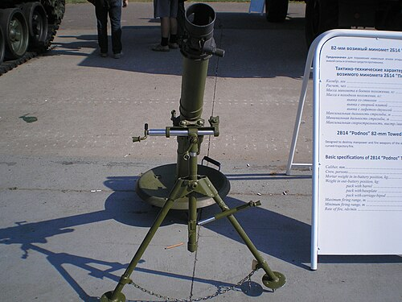

# Moździerz 2B14 Podnos
### 2B14 Podnos Mortar | 2Б14 «Поднос»

---

## Opis

2B14 Podnos (Поднос — Taca) to radziecko-rosyjski lekki moździerz piechoty kalibru 82 mm opracowany w latach 70. i przyjęty do służby w 1983 roku jako zastępnik przestarzałego moździerza BM-37. Wyróżnia się bardzo prostą, lekką i wytrzymałą konstrukcją — całość waży zaledwie 42 kg, co pozwala na transport przez trzyosobową drużynę (lufa, płyta bazowa i trójnóg w trzech osobnych częściach). Podnos może strzelać bez rozkładania trójnogu bezpośrednio z płyty bazowej, co przyspiesza gotowość bojową. Jest podstawowym moździerzem szczebla pluton-kompania w armii rosyjskiej i był szeroko stosowany w Afganistanie, Czeczenii i na Ukrainie.

## Dane techniczne

| Parametr | Wartość |
|----------|---------|
| Typ | Lekki moździerz piechoty |
| Kraj produkcji | ZSRR / Rosja |
| Rok wprowadzenia | 1983 |
| Kaliber | 82 mm |
| Długość lufy | 1 220 mm |
| Masa bojowa | 42 kg (całość) |
| Zasięg maks. | 4 000 m |
| Zasięg min. | 85 m |
| Szybkostrzelność | 20–25 strz./min |
| Obsługa | 3 osoby |

## Charakterystyczne cechy rozpoznawcze

> Jak odróżnić 2B14 Podnos od moździerza PM-38/BM-37 i 2B9 Wasilek:

- **Klasyczna pionowa lufa moździerzowa — wyraźnie prosta i długa:** Podnos jest typowym moździerzem klasycznym — lufa stoi prawie pionowo (60–85°); żadnych poziomych luf, taśmowników ani kół artyleryjskich jak w Wasilku
- **Okrągła kwadratowa lub prostokątna płyta bazowa stalowa:** płyta bazowa Podnosu jest prostokątna z charakterystycznym wzorem usztywnień; płyta BM-37 jest okrągła — różnica kształtu płyty jest dobrym wyróżnikiem
- **Lekki prosty trójnóg z mechanizmem kątowania:** trójnóg Podnosu jest uproszczony i wyraźnie lżejszy niż starszych moździerzy; całość wygląda nowocześ­niej i bardziej kanciasty niż BM-37
- **Brak kółek transportowych (w odróżnieniu od Wasilka):** Podnos nie ma kół ani lawetu — jest rozkładany na ziemi i noszony w częściach; Wasilek ma kołowy lawet artyleryjski; ta różnica natychmiast odróżnia oba systemy
- **Mały rozmiar całości — kompaktowość:** złożony Podnos mieści się w plecakach trzech żołnierzy; przy rozłożonym moździerzu widać, że jest wyraźnie mniejszy i prostszy niż haubice czy samobieżne działa artylerii
- **Amunicja 82 mm wkładana od góry lufy — ładowanie gwintowe:** żołnierz ładuje nabój wkładając go od góry do lufy — standardowy sposób ładowania klasycznych moździerzy; Wasilek natomiast ładuje się automatycznie z taśmy z boku

## Ciekawostka

> Podnos jest tak prosty i tani, że produkowany jest w Rosji bez zmian od 1983 roku — co jest rekordem jak na nowoczesną broń. Ukraina i Rosja używają identycznych Podnosów po obu stronach linii frontu w wojnie 2022–; bywa, że zdobyte przez jedną ze stron pociski idealnie pasują do moździerzy przeciwnika. Żołnierze rosyjscy mówią, że Podnos "nie psuje się nigdy" — i dodają, że to jedyna broń w piechurze, o której serwisie zapomina się zupełnie.

