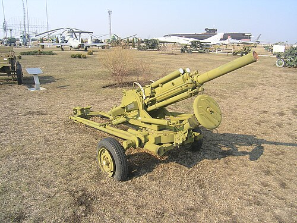

# Automatyczny moździerz 2B9 Wasilek
### 2B9 Vasilek Automatic Mortar | 2Б9 «Василёк»

---

## Opis

2B9 Wasilek (Василёк — Chaber) to radziecka automatyczna armata-moździerz kalibru 82 mm opracowana w 1967 roku i przyjęta do służby w 1970 roku. Wyróżnia się wśród moździerzy możliwością prowadzenia ognia automatycznego — przy użyciu taśmowego podawania amunicji Wasilek strzela z szybkostrzelnością do 170 nabojów na minutę (serie po 4 naboje), co jest nieosiągalne dla klasycznych moździerzy. Może strzelać zarówno po standardowej trajektorii moździerzowej (wyrzut w górę), jak i napiętym lotem bezpośrednim jak haubica — co daje dużą elastyczność taktyczną. Jest ciągnięty przez lekki pojazd lub montowany na różnych platformach. Stosowany przez wiele armii byłego ZSRR i krajów Bliskiego Wschodu.

## Dane techniczne

| Parametr | Wartość |
|----------|---------|
| Typ | Automatyczny moździerz / armata-moździerz |
| Kraj produkcji | ZSRR / Rosja |
| Rok wprowadzenia | 1970 |
| Kaliber | 82 mm |
| Długość lufy | 1 200 mm |
| Masa bojowa | 632 kg |
| Zasięg maks. | 4 270 m |
| Zasięg min. | 800 m |
| Szybkostrzelność | do 170 strz./min (automatycznie), 1–3 strz./min (ręcznie) |
| Obsługa | 4 osoby |

## Charakterystyczne cechy rozpoznawcze

> Jak odróżnić 2B9 Wasilek od klasycznych moździerzy i lekkich armat:

- **Lufa ustawiona poziomo lub pod małym kątem — nie pionowo jak moździerz:** Wasilek w trybie bezpośrednim strzela płaskim torem; wizualnie wygląda jak mała armata lub działo, nie jak typowy moździerz stojący prawie pionowo — to kluczowa cecha odróżniająca
- **Podajnik taśmowy z boku lufy:** charakterystyczny poziomy podajnik z taśmą nabojów biegnący prostopadle do lufy — widoczny element odróżniający Wasilka od wszystkich innych moździerzy; żaden klasyczny moździerz nie ma taśmowego podajnika
- **Czterokołowy lawet artyleryjski (nie podstawa płytowa):** Wasilek jest montowany na kołowym lawecie artyleryjskim ciągnionym przez pojazd — klasyczne moździerze stoją na stalowej płycie bazowej wkopanej w ziemię; Wasilek można przytransportować szybko bez rozkładania
- **Układ lufy podobny do małej haubicy lub granatnika:** proporcje są artyleryjskie, nie moździerzowe — lufa jest stosunkowo długa (120 cm), a bryła przypomina miniaturową armatę przeciwpancerną bardziej niż moździerz
- **Mała, kompaktowa platforma — wyraźnie lżejsza niż działa artylerii:** całość waży 632 kg i jest wyraźnie mniejsza od haubic 122 mm; można ją łatwo odróżnić od D-30 czy 2S1 po miniaturowych rozmiarach
- **Amunicja 82 mm w taśmach po 4 sztuki:** charakterystyczne "taśmy" z czterema nabojami używane do automatycznego ładowania — widoczne przy obsłudze i w transporterach amunicji; żaden inny system moździerzowy nie używa taśmowania

## Ciekawostka

> Wasilek był używany przez obie strony w wojnie afgańskiej. Radzieccy żołnierze szczególnie cenili go za możliwość prowadzenia ognia automatycznego — mówili, że "Wasilek zamienia moździerz w karabin maszynowy". Mudżahedini zdobywali Wasilki i używali ich przeciwko Sowietom — co było jednym z paradoksów tej wojny. Broń miała też wadę: automatyczne ładowanie powodowało szybkie przegrzanie lufy, przez co serie dłuższe niż 40 nabojów wymagały ochłodzenia wodą lub przerwy; w suchym klimacie Afganistanu było to poważnym problemem.

