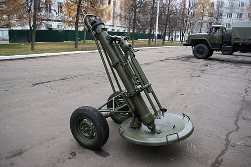

# Ciężki moździerz 2S12 Sani
### 2S12 Sani Heavy Mortar | 2С12 «Сани»

---

## Opis

2S12 Sani (Сани — Sanie) to radziecki ciężki moździerz piechoty kalibru 120 mm opracowany w latach 70. jako przenośny system o zasięgu i sile rażenia pośrednim między lekkimi moździerzami 82 mm a artylerią polową. Sani waży 210 kg i jest holowany na dwukołowym lawecie przez lekki pojazd (UAZ-469, GAZ-66), ale może też być rozkładany do pozycji strzeleckiej bezpośrednio na ziemi. Pocisk 120 mm Sani ma znacznie większą siłę rażenia niż 82 mm moździerze Podnos i Wasilek — może niszczyć lekkie pojazdy opancerzone i umocnienia polowe. Jest standardowym moździerzem szczebla batalionu w armii rosyjskiej.

## Dane techniczne

| Parametr | Wartość |
|----------|---------|
| Typ | Ciężki moździerz holowany |
| Kraj produkcji | ZSRR / Rosja |
| Rok wprowadzenia | 1981 |
| Kaliber | 120 mm |
| Długość lufy | 1 854 mm |
| Masa bojowa | 210 kg |
| Zasięg maks. | 7 100 m |
| Zasięg min. | 480 m |
| Szybkostrzelność | 12–15 strz./min |
| Obsługa | 5 osób |

## Charakterystyczne cechy rozpoznawcze

> Jak odróżnić 2S12 Sani od 2B14 Podnos i moździerza M-120:

- **Znacznie większa i cięższa konstrukcja niż 82 mm moździerze:** Sani waży 210 kg i ma lufę niemal 2 metry — wizualnie jest wyraźnie większy od Podnosu; przy bezpośrednim porównaniu różnica kalibrów 82 vs 120 mm jest oczywista
- **Dwukołowy lawet transportowy:** Sani jest holowany na dwóch kółkach — kiedy stoi w pozycji bojowej, kółka są uniesione lub zdjęte; ten charakterystyczny lawet odróżnia Sani od prostego Podnosu, który nie ma kół
- **Duża okrągła płyta bazowa ze wzorem radialnym:** płyta bazowa Sani 120 mm jest większa i cięższa od płyty Podnosu; charakterystyczny okrągły lub wielokątny kształt z grubszymi żebrami wzmacniającymi
- **Lufa z zewnętrznym pierścieniem komory nabojowej:** Sani ma charakterystyczny "garb" na lufie przy komorze nabojowej — grubszy odcinek w dolnej części lufy — widoczny przy bliższym ogladaniu, inny od gładkiej lufy Podnosu
- **Obsługa 5-osobowa — znacznie więcej niż 3-osobowy Podnos:** do obsługi Sani potrzeba 5 żołnierzy ze względu na ciężkie naboje 120 mm; operacja załadowania wymaga dwóch ludzi; to widoczne podczas strzelania
- **Transport przez pojazd — holowany, nie noszony:** Sani nie jest noszony w plecakach; do jego transportu konieczny jest pojazd (UAZ lub ciężarówka); przy rozbiórce i złożeniu na ziemi zajmuje znacznie więcej miejsca niż Podnos

## Ciekawostka

> 2S12 Sani zyskał nieoczekiwanie dużą popularność wśród rosyjskich artylerzystów w wojnach czeczeńskich — bo naboje 120 mm mogły niszczyć budynki murowane, których nie "przebijał" moździerz 82 mm. Dowódcy batalionów mówili, że Sani to "artyleria dla piechoty": lżejszy od haubicy, łatwiejszy do przebiegi w górach niż samobieżna artyleria, a siłą ognia porównywalny z lekkimi działami. Paradoksalnie, po wojnie afgańskiej część Sanich trafiła do mudżahedinów — którzy oceniali je wyżej niż zdobyte moździerze zachodnie.

