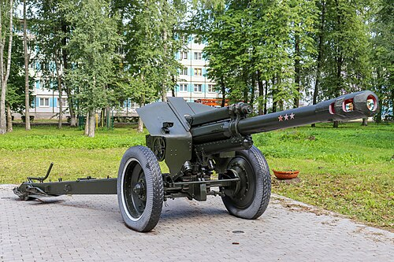

# Haubica D-1
### D-1 Howitzer | Д-1 (152-мм гаубица обр. 1943 г.)

---

## Opis

D-1 to radziecka haubica kalibru 152 mm opracowana przez Fiodora Pietrowa i przyjęta do służby w 1943 roku jako uproszczony następnik starszej haubicy M-10. Zaprojektowana w środku II wojny światowej z naciskiem na prostotę produkcji — Sowieci potrzebowali ciężkiej haubicy możliwej do masowej produkcji. D-1 zebrała doskonałe opinie na froncie wschodnim i pozostała w służbie przez dekady. Kaliber 152 mm daje jej znaczną siłę rażenia — pocisk o masie 40 kg jest zdolny do niszczenia ciężkich umocnień betonowych. Mimo bardzo podeszłego wieku D-1 nadal pojawia się w konfliktach — w tym na Ukrainie po 2022 roku, gdzie oba strony wyciągnęły ją z magazynów.

## Dane techniczne

| Parametr | Wartość |
|----------|---------|
| Typ | Ciężka haubica holowana |
| Kraj produkcji | ZSRR |
| Rok wprowadzenia | 1943 |
| Kaliber | 152 mm |
| Długość lufy | 4 207 mm (L/27,7) |
| Masa bojowa | 3 600 kg |
| Zasięg maks. | 12 400 m |
| Kąt elevacji | −3° do +63,5° |
| Szybkostrzelność | 3–4 strz./min |
| Obsługa | 8 osób |

## Charakterystyczne cechy rozpoznawcze

> Jak odróżnić D-1 od D-20 i haubicy M-30 (122 mm):

- **Krótka, gruba lufa 152 mm z wyraźnym hamulcem wylotowym:** D-1 ma krótką lufę (tylko L/27,7) zakończoną dużym cylindrycznym dwukomorowym hamulcem wylotowym; w porównaniu z M-30 (122 mm) lufa jest grubsza i krótsza proporcjonalnie do kalibru
- **Grube i szerokie koła gumowe na stalowych felgach:** D-1 ma charakterystyczne grube koła z gumowymi oponami — inne niż archaiczne stalowe koła M-30 i nieco inne proporcje kół niż D-30; wyglądają ciężko i solidnie
- **Lawet z dwoma składanymi ramionami — "płaski" układ transportowy:** lawet D-1 jest prostą dwukolumną konstrukcją ze składanymi ramionami — w transporcie układ jest płaski; to cecha wspólna z D-20, ale D-1 jest mniejsza i krótsza od D-20
- **Mniejsza i lżejsza niż D-20 — ale ten sam kaliber:** ktoś kto zna D-20 widzi, że D-1 jest wyraźnie krótsza (lufa L/27 vs L/38 w D-20) i lżejsza (3,6 t vs 5,7 t); jeśli kaliber trudno ocenić, to proporcje sylwetki wskazują na D-1
- **Charakterystyczny kąt elevacji do 63,5° — widoczna przy strzelaniu wysoko:** D-1 może strzelać bardzo stromo (max 63°), co jest cechą charakterystyczną haubic — w pozycji maksymalnej elevacji lufa D-1 jest niemal pionowa
- **Obsługa 8 osób — widoczna przy pracy z ciężkimi pociskami 152 mm:** pocisk D-1 waży 40–43 kg; jego ładowanie wymaga dwóch żołnierzy; przy obserwacji obsługi wyraźnie widać ciężką amunicję ładowaną ręcznie

## Ciekawostka

> D-1 została zaprojektowana w rekordowym tempie — 18 dni od koncepcji do gotowego prototypu w 1942 roku. Fiodor Pietrow, który wcześniej zaprojektował M-30, po prostu założył lufę 152 mm na lawet M-30 — oszczędzając czas i pieniądze. To "frankenstein-artyleria" działała tak dobrze, że Sowieci produkowali ją w ponad 2 800 egzemplarzy i do dziś nie zastąpili jej w pełni. Na Ukrainie w 2022 roku D-1 pojawiła się z obu stron frontu — ponad 80-letnia broń strzelała nabojami z fabryk, które zbudował Stalin.

