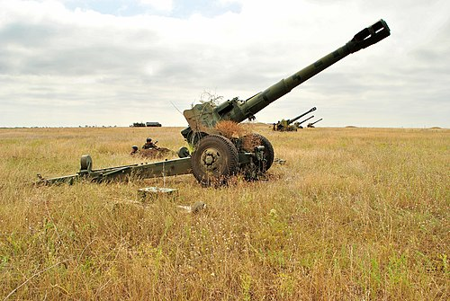

# Haubica-armata D-20
### D-20 Gun-Howitzer | Д-20 (152-мм пушка-гаубица)

---

## Opis

D-20 to radziecka haubica-armata kalibru 152 mm opracowana przez Fiodora Pietrowa i przyjęta do służby w 1955 roku. Łączy w sobie właściwości haubicy (wysoka elevacja, stromy tor pocisku) i armaty (długa lufa, duża prędkość wylotowa, płaski tor) — stąd określenie "haubica-armata". Używa tej samej amunicji co samobieżna 2S3 Akacja, co upraszcza logistykę. D-20 przez dekady była standardową ciężką artylerią dywizyjną krajów Układu Warszawskiego — służyła w Polsce, NRD, Czechosłowacji i innych armiach. Nadal używana przez armię rosyjską (głównie rezerwy i magazyny) i wiele armii świata.

## Dane techniczne

| Parametr | Wartość |
|----------|---------|
| Typ | Haubica-armata holowana |
| Kraj produkcji | ZSRR |
| Rok wprowadzenia | 1955 |
| Kaliber | 152 mm |
| Długość lufy | 5 195 mm (L/34,2) |
| Masa bojowa | 5 700 kg |
| Zasięg maks. | 17 400 m (standardowy) / 24 000 m (aktywno-rakietowy) |
| Kąt elevacji | −5° do +65° |
| Szybkostrzelność | 5–6 strz./min |
| Obsługa | 8 osób |

## Charakterystyczne cechy rozpoznawcze

> Jak odróżnić D-20 od D-1 i haubicy D-30 (122 mm):

- **Długa lufa 152 mm z charakterystycznym wielokomorowym hamulcem wylotowym:** D-20 ma lufę wyraźnie dłuższą niż D-1 (L/34 vs L/27) zakończoną charakterystycznym podwójnym lub wielokomorowym hamulcem wylotowym — "łatka" na końcu lufy jest wizualnie bardziej rozbudowana niż w D-1
- **Dwa składane ramiona lawetu w kształcie litery V:** w pozycji strzeleckiej D-20 ma dwa ramiona odchylane na boki tworząc szerokie "V" — daje to stabilność przy dużym odrzucie; D-30 ma trzy ramiona układające się w gwiazdę; D-1 ma węższe "V"
- **Masywne stalowo-gumowe koła z charakterystycznymi felgami:** koła D-20 są duże (ok. 1 m średnicy), solidne, z gumowymi oponami; wyraźnie masywniejsze niż koła D-30 (122 mm)
- **Wyraźnie cięższa i dłuższa od D-30 — widoczna różnica gabarytów:** D-20 waży 5,7 t a D-30 waży 3,2 t; przy porównaniu obie są kołowe i haubiczne, ale D-20 jest znacznie większa; długość lawetu z lufą D-20 jest o ok. 1,5 m dłuższa
- **Lufa opuszczona w transport poziomo ponad lawet:** w konfiguracji transportowej lufa D-20 jest pozioma, skierowana do przodu nad ramionami lawetu; charakterystyczna długa lufa nadaje sylwetce "strzałkowy" kształt przy holowaniu
- **Ten sam kaliber i amunicja co 2S3 Akacja:** D-20 i samobieżna 2S3 używają tych samych nabojów 152 mm; przy obserwacji amunicji — te same duże żółte pociski

## Ciekawostka

> D-20 była numerem jeden w polskiej artylerii dywizyjnej przez całą zimną wojnę — Polska miała ponad 500 sztuk D-20. Kiedy Polska wycofała D-20 ze służby i przeszła na NATO-wskie haubice 155 mm, część egzemplarzy trafiła do muzeów, część sprzedano, a część — co kontrowersyjne — wróciła przez eksport do Afryki i Bliskiego Wschodu. W 2022 roku Polska przekazała część swojego sprzętu Ukrainie — i D-20, podobnie jak 2S1, stanęły po ukraińskiej stronie frontu.

