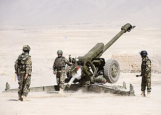

# Haubica holowana D-30 (2A18)
### D-30 122mm Towed Howitzer | Д-30 (2А18)

---

## Opis

D-30 (indeks GRAU: 2A18) to radziecka 122 mm haubica holowana zaprojektowana jako następca M-30 i wprowadzona do służby w 1960 roku. Charakteryzuje się unikalnym trójosiowym łożem rozkładanym w kształt trójnoga — po rozłożeniu trzech nóg możliwe jest prowadzenie ognia okrężnego w pełnym zakresie 360°, bez potrzeby przekładania działa. D-30 jest jedną z najbardziej udanych i wszechstronnych haubic w historii — produkowana w kilkudziesięciu krajach, służy w ponad 60 armiach i była używana w niemal każdym większym konflikcie zbrojnym od lat 60. po dziś dzień. Doskonale sprawdza się zarówno jako haubica polowa, jak i jako broń przeciwpancerna (strzelając pociskami HEAT, przebija do 460 mm pancerza).

## Dane techniczne

| Parametr | Wartość |
|----------|---------|
| Typ | Haubica holowana 122 mm |
| Kraj produkcji | ZSRR |
| Rok wprowadzenia | 1960 |
| Kaliber | 122 mm |
| Masa bojowa | 3 210 kg |
| Długość lufy | L/38 |
| Zasięg strzału | do 15,4 km (standardowy), do 21,9 km (RAP) |
| Szybkostrzelność | 5–6 strz./min (maks. 10–12) |
| Kąt ostrzału (poziomy) | 360° (po rozłożeniu łoża) |
| Obsługa | 8 osób |

## Charakterystyczne cechy rozpoznawcze

> Jak odróżnić D-30 od innych haubic holowanych:

- **Trójnożne łoże rozłożone jak "pająk":** gdy D-30 jest w pozycji bojowej, trzy nogi łoża są rozłożone pod kątem 120° do siebie, tworząc charakterystyczny kształt trzech ramion — żadna inna haubica nie ma identycznego układu
- **Obrót o 360° bez przestawiania całego działa:** w pozycji bojowej D-30 można skierować w dowolną stronę bez podnoszenia nóg — ta cecha jest unikalna i widoczna podczas obserwacji stanowiska ogniowego
- **Dwa koła jezdne z przodu po złożeniu do transportu:** w pozycji marszowej D-30 jedzie "nosem" z lufą z przodu — dwa duże koła z przodu, łoże złożone z tyłu za lufą
- **Charakterystyczna długa osłona lufy (termiczna) — brak lub obecność:** starsze D-30 nie mają osłony termicznej lufy, nowsze wersje i modernizacje mogą ją mieć; w obu przypadkach proporcje są charakterystyczne
- **Niski profil działa na stanowisku ogniowym:** d-30 jest bardzo niska — obsługa pracuje przy niej w pozycji półprzysiadowej; to wyróżnia ją od wyższych haubic zachodnich
- **Dwa duże koła z grubymi oponami terenowymi:** koła transportowe D-30 są duże, z wyraźnym bieżnikiem terenowym — umieszczone po bokach łoża głównego

## Ciekawostka

> D-30 to broń tak wszechstronna, że stała się "jeepem artylerii" — używana jest przez regularnie armie, siły nieregularne, terrorystów i obrońców miast na całym świecie. W Syrii nagrano, jak ISIS montuje D-30 na platformie pickupa tworząc mobilne działo. W Ukrainie Obrona Terytorialna użyła D-30 zdobytych na Rosjanach natychmiast po przeszkoleniu w ciągu kilku godzin — tak prosta jest w obsłudze. Szacuje się, że na świecie istnieje ponad 12 000 sprawnych egzemplarzy D-30.
