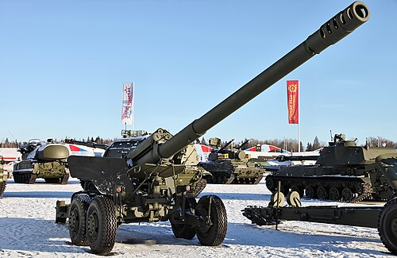

# Armata 2A36 Giacynt-B
### 2A36 Giatsint-B Field Gun | 2А36 «Гиацинт-Б»

---

## Opis

2A36 Giacynt-B (Гиацинт — Hiacynt) to radziecka potężna armata polowa kalibru 152 mm opracowana w latach 70. i przyjęta do służby w 1976 roku. Wyróżnia się wyjątkowo długą lufą (L/54) zapewniającą zasięg do 27 200 m standardowym pociskiem i do 40 000 m amunicją aktywno-rakietową — co czyni ją jedną z najdłużej strzelających holowanych armat na świecie. Giacynt-B jest holowaną wersją samobieżnej 2S5 Giacynt-S i używa tej samej amunicji. Ze względu na masę ponad 9 ton wymaga ciągnika artyleryjskiego KrAZ lub AT-T. Stosowana jako działo kontrbateryjne i rażące cele w głębokości obrony przeciwnika.

## Dane techniczne

| Parametr | Wartość |
|----------|---------|
| Typ | Armata polowa ciężka |
| Kraj produkcji | ZSRR / Rosja |
| Rok wprowadzenia | 1976 |
| Kaliber | 152 mm |
| Długość lufy | 8 197 mm (L/54) |
| Masa bojowa | 9 800 kg |
| Zasięg maks. | 27 200 m (standardowy) / 40 000 m (aktywno-rakietowy) |
| Kąt elevacji | −2° do +57° |
| Szybkostrzelność | 5–6 strz./min |
| Obsługa | 8 osób |

## Charakterystyczne cechy rozpoznawcze

> Jak odróżnić Giacynt-B od Msta-B i D-20:

- **Najdłuższa lufa spośród wszystkich holowanych armat 152 mm — ponad 8 metrów:** lufa 8,2 m czyni Giacynt-B wyjątkową — jest o metr dłuższa od Msta-B i o 3 metry dłuższa od D-20; przy transporcie lufa wystaje daleko przed ciągnik lub za niego
- **Duży, charakterystyczny hamulec wylotowy w kształcie "kuli":** Giacynt-B ma charakterystyczny kulisto-cylindryczny hamulec wylotowy na końcu bardzo długiej lufy — inny kształt niż wielosegmentowe hamulce Msta-B; ten "kulowy" zakończenie jest kluczowym identyfikatorem wizualnym
- **Masywny lawet z szerokim rozstawem kół i dużymi ogumieniami:** Giacynt-B jest wyraźnie cięższy od Msta-B (9,8 t vs 7 t); lawet jest masywniejszy, z większymi kołami; ciężarówki holujące Giacynt-B to wielotonowe ciągniki, nie lekkie pojazdy
- **Brak osłony (tarczy) obsługi — otwarta platforma strzelecka:** Giacynt-B nie ma tarczy balistycznej chroniącej obsługę — to "gołe" działo artyleryjskie; Msta-B i D-20 mają przynajmniej minimalną osłonę
- **Wyraźnie "armatni" wygląd — mniejszy kąt elevacji niż haubice:** armata Giacynt-B ma mniejszy kąt elevacji (max 57°) niż haubice Msta-B (70°) i D-20 (65°) — przy strzelaniu lufa jest bardziej pozioma, jak przystało armacie
- **Holowanie wymaga ciągnika artyleryjskiego klasy KrAZ lub AT-T:** masa 9,8 t wymaga ciągnika gąsienicowego lub ciężkiego kołowego; przy kolumnie marszowej widoczny ciągnik artyleryjski za Giacyntem jest sam w sobie sygnałem, że holowane działo jest wyjątkowo ciężkie

## Ciekawostka

> Giacynt-B był jedną z odpowiedzi Sowietów na zachodnie działa kontrbateryjne z lat 70. — w szczególności na amerykański M198 155 mm i jego zasięg 22 km. Sowieci chcieli coś, co "przeleci nad" M198 i uderzy w stanowiska ogniowe, zanim M198 zdąży odpowiedzieć. Giacynt-B ze swoimi 27 km zasięgu (i 40 km z amunicją rakietową) spełniał to zadanie z nadwyżką. W wojnie na Ukrainie Giacynt-B pojawił się po stronie rosyjskiej jako broń kontrbateryjna — celując w ukraińskie haubice M777 i Krab.

