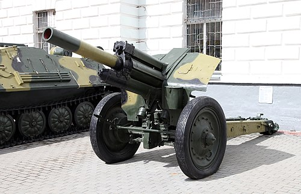

# Haubica polowa M-30
### M-30 Field Howitzer | М-30 (122-мм гаубица обр. 1938 г.)

---

## Opis

M-30 to radziecka haubica polowa kalibru 122 mm zaprojektowana przez Fiodora Pietrowa i przyjęta do służby w 1938 roku. Pomimo swojego wieku, M-30 pozostaje w użyciu w wielu armiach świata i — w mniejszym zakresie — w rosyjskich siłach rezerwowych i w artyleryjskich jednostkach Gwardii Narodowej. Jest legendą II wojny światowej: produkowana w dziesiątkach tysięcy egzemplarzy, decydowała o przebiegu wielu bitew na froncie wschodnim. M-30 strzelała na odległość do 11 800 m i mogła prowadzić ogień w każdych warunkach pogodowych. Prosta i niezawodna konstrukcja powoduje, że nawet po 80 latach nadal pojawia się w strefach konfliktów — w tym na Ukrainie.

## Dane techniczne

| Parametr | Wartość |
|----------|---------|
| Typ | Haubica polowa holowana |
| Kraj produkcji | ZSRR |
| Rok wprowadzenia | 1938 |
| Kaliber | 122 mm |
| Długość lufy | 2 800 mm |
| Masa bojowa | 2 450 kg |
| Zasięg maks. | 11 800 m |
| Kąt elevacji | −3° do +63,5° |
| Szybkostrzelność | 5–6 strz./min |
| Obsługa | 8 osób |

## Charakterystyczne cechy rozpoznawcze

> Jak odróżnić M-30 od D-30 i D-1:

- **Duże drewniane lub stalowe koła — charakterystyczny archaiczny wygląd:** M-30 ma duże stalowe koła (oryginalnie drewniane z metalową obwódką) — bardzo archaiczny wygląd w porównaniu z nowoczesnymi armatami; D-30 ma gumowe opony na stalowych kołach
- **Prosta skrzynkowa konstrukcja lawetu na dwóch kołach:** lawet M-30 to klasyczna dwukolna belka — w pozycji strzeleckiej przedni lejc (dyszel) jest opuszczony na ziemię; D-30 ma trójnoży lawet; ta różnica jest natychmiast widoczna
- **Lufa bez dużego hamulca wylotowego:** M-30 ma lufę bez wyraźnego hamulca wylotowego na końcu — tylko nieznaczna "grzybkowa" osłona; nowsze działa (D-30, 2S1) mają charakterystyczne duże wieloszczelinowe hamulce wylotowe
- **Niska sylwetka z poziomą lufą:** M-30 ma lufę ustawioną nisko nad ziemią — zestaw wygląda płasko i ciężko; D-30 jest wyższy i bardziej "elegancki" z wyraźnym trójnogiem
- **Konfiguracja 2-kołowa na dyszlu ciągnionym przez ciągnik:** M-30 jest zawsze holowana w konfiguracji dyszlowej (przód do góry); charakterystyczne długie ramiona holownicze widoczne po bokach przy transporcie
- **Wyraźnie starsza i mniej ergonomiczna obsługa:** obsługa M-30 wymaga 8 ludzi (D-30 tylko 6); mechanizm ładowania jest manualny i ciężki; wygląd obsługi i rozmieszczenie stanowisk są "artylerią retro"

## Ciekawostka

> M-30 zbudowano w ponad 19 000 egzemplarzy podczas II wojny światowej — i była to broń, którą żołnierze niemieccy wyjątkowo cenili po zdobyciu: nazywali ją "rosyjskim cudem" ze względu na niezawodność i celność. Wehrmacht oficjalnie przyjął zdobyte M-30 na uzbrojenie pod oznaczeniem 12,2 cm Feldhaubitze 396(r). Po wojnie Sowieci eksportowali M-30 w setki krajów — i dziś broń ta pojawia się w konfliktach od Afryki przez Bliski Wschód po Ukrainę, gdzie strzelały do 2024 roku.

