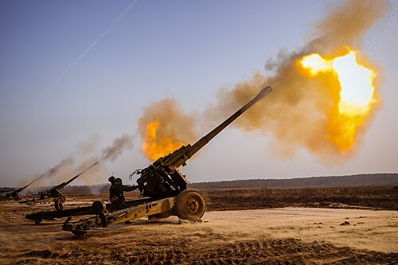

# Haubica 2A65 Msta-B
### 2A65 Msta-B Howitzer | 2А65 «Мста-Б»

---

## Opis

2A65 Msta-B to rosyjska holowana haubica kalibru 152 mm opracowana w latach 80. i przyjęta do służby w 1987 roku jako holowana wersja samobieżnej 2S19 Msta-S. Używa tych samych luf i amunicji co 2S19 — co upraszcza logistykę i szkolenie. Msta-B ma zasięg do 24 700 m (pocisk standardowy) i do 30 000 m z amunicją aktywno-rakietową, w tym z precyzyjnym pociskiem Krasnopol naprowadzanym laserowo. Jest to jedna z najnowocześniejszych holowanych haubic w służbie rosyjskiej — łączy klasyczną prostotę holowanego działa z możliwościami ogniowymi samobieżnego systemu Msta-S. Szeroko stosowana w wojnie na Ukrainie po obu stronach konfliktu.

## Dane techniczne

| Parametr | Wartość |
|----------|---------|
| Typ | Holowana haubica ciężka |
| Kraj produkcji | Rosja |
| Rok wprowadzenia | 1987 |
| Kaliber | 152 mm |
| Długość lufy | 7 200 mm (L/47,4) |
| Masa bojowa | 7 000 kg |
| Zasięg maks. | 24 700 m (standardowy) / 30 000 m (aktywno-rakietowy) |
| Kąt elevacji | −3° do +70° |
| Szybkostrzelność | 6–8 strz./min |
| Obsługa | 8 osób |

## Charakterystyczne cechy rozpoznawcze

> Jak odróżnić Msta-B od D-20 i holowanych haubic NATO:

- **Bardzo długa lufa 152 mm — najdłuższa wśród holowanych haubic rosyjskich:** lufa Msta-B ma 7,2 m (L/47), wyraźnie dłuższa od D-20 (5,2 m) i D-1 (4,2 m); ta proporcja czyni Mstę-B charakterystyczną — "wąska i długa"
- **Charakterystyczny wielokomorowy hamulec wylotowy na bardzo długiej lufie:** hamulec wylotowy Msta-B jest duży i wielosegmentowy, osadzony na końcu wyjątkowo długiej lufy — kombinacja długości i dużego hamulca jest kluczowym wyróżnikiem wizualnym
- **Dwa szerokie ramiona lawetu w konfiguracji "V" — podobne do D-20 ale masywniejsze:** Msta-B ma klasyczne dwa odchylane ramiona, ale cały lawet jest wyraźnie masywniejszy i nowocześ­niejszy niż D-20; bardziej kanciaste kształty elementów metalowych
- **Platforma kołowa z hydraulicznym układem poziomowania:** Msta-B ma mały hydrauliczny układ stabilizowania platformy przed strzelaniem — charakterystyczne cylindry hydrauliczne widoczne przy nogach lawetu; starsze D-20 i D-1 nie mają hydrauliki
- **Osłona balistyczna obsługi (tarcza) mała i geometryczna:** Msta-B ma skromną metalową tarczę chroniącą obsługę; jej geometryczny, kanciasty kształt różni się od zaokrąglonych tarcz starszych dział radzieckich
- **Ta sama amunicja co 2S19 Msta-S i pociski Krasnopol:** rozpoznanie po amunicji — Msta-B używa nowoczesnych pocisków 152 mm, w tym charakterystycznych pocisków Krasnopol z półprzezroczystymi żółto-brązowymi noskami laserowymi

## Ciekawostka

> Msta-B jest wyjątkowym przypadkiem: holowane działo zaprojektowane po samobieżnym. Zwykle holowane systemy poprzedzają samobieżne — Msta-B jest odwrotnie, bo projektanci wzięli gotową lufę 2S19 i umieścili ją na kołowym lawecie. Efektem jest holowana haubica z możliwościami ogniowymi dorównującymi wielu samobieżnym systemom NATO. Na Ukrainie Msta-B pojawiła się po obu stronach frontu — ukraińskie wojska zdobywały rosyjskie egzemplarze i natychmiast je używały, ponieważ mają te same lufy co rosyjskie, a amunicja jest zamienna.

