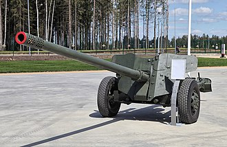

# Armata przeciwpancerna MT-12 Rapira
### MT-12 Rapira 100mm Anti-Tank Gun | МТ-12 «Рапира»

---

## Opis

MT-12 Rapira (ros. «Рапира» — rapier) to radziecka 100 mm armata przeciwpancerna gładkolufowa, wprowadzona do służby w 1970 roku jako unowocześnienie armaty T-12. Przeznaczona jest do bezpośredniego zwalczania pojazdów opancerzonych, fortyfikacji i schronów. Może strzelać pociskami APFSDS, HEAT i HE, a także pociskami kierowanymi 9M117 Bastion (ppk odpalany przez lufę). Choć MT-12 nie może przebić frontowego pancerza nowoczesnych czołgów głównych, jest wciąż używana do zwalczania BWP, transporterów i czołgów starszych generacji, a także jako działo wsparcia ogniowego. W wojnie w Ukrainie jednostki OT stosują ją intensywnie.

## Dane techniczne

| Parametr | Wartość |
|----------|---------|
| Typ | Armata przeciwpancerna holowana 100 mm |
| Kraj produkcji | ZSRR |
| Rok wprowadzenia | 1970 |
| Kaliber | 100 mm (gładkolufowa) |
| Masa bojowa | 3 050 kg |
| Zasięg (bezpośredni) | 3 000 m |
| Zasięg (pośredni) | 8 200 m |
| Przenikanie pancerza | 390–450 mm (APFSDS) |
| Ppk 9M117 Bastion | do 5 000 m, 650 mm za ERA |
| Obsługa | 7 osób |

## Charakterystyczne cechy rozpoznawcze

> Jak odróżnić MT-12 od D-30 i innych dział holowanych:

- **Bardzo długa, cienka lufa gładkolufowa bez hamulca wylotowego:** MT-12 ma jedną z najdłuższych i najsmuklejszych luf wśród holowanych dział tego kalibru — brak hamulca wylotowego (gładkolufowa) to charakterystyczny element
- **Dwójnożne łoże rozchylane (nie trójnóg jak D-30):** łoże MT-12 rozkłada się w dwie nogi — nie trzy jak D-30; w pozycji bojowej wygląda jak odwrócona litera "V"
- **Tarcza pancerna z dużym wycięciem na lufę:** z przodu MT-12 widoczna jest duża pionowa tarcza ochronna z centralnym wycięciem przez które przechodzi lufa — tarcza jest wyżej niż w D-30
- **Duże koła ze stalowymi obręczami (bez opon) lub z oponami:** MT-12 ma charakterystyczne duże koła — część egzemplarzy ma gumowe opony terenowe, część starszych ma stalowe obręcze
- **Profil "bardzo niska armata z długą lufą":** sylwetka MT-12 z boku to bardzo niska konstrukcja z nieproporcjonalnie długą, cienką lufą — specyficzny profil różniący się od haubic
- **Lufa bez osłony termicznej i bez kompensatora:** gładka lufa bez żadnych dodatków na końcu to główny identyfikator; porównaj z D-30 (hamulec wylotowy) czy M-46 (hamulec + kompensator)

## Ciekawostka

> MT-12 jest jedną z niewielu armat holowanych zaprojektowanych do strzelania pociskami kierowanymi przez lufę — system 9M117 Bastion pozwala wystrzelić ppk z lufy działa, prowadząc go laserowo do celu. Oznacza to, że stara armata holowana może trafić w czołg z odległości 5 km z pierwszego strzału — coś niemożliwego dla standardowej amunicji tej armaty. To rozwiązanie przedłuża użyteczność MT-12 o kolejne dekady mimo rosnącej grubości pancerzy.
