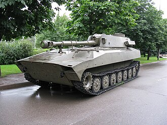

# Haubica samobieżna 2S1 Goździk
### 2S1 Gvozdika Self-Propelled Howitzer | 2С1 «Гвоздика»

---

## Opis

2S1 Goździk (ros. «Гвоздика» — goździk) to radziecka 122 mm haubica samobieżna opracowana w latach 60. XX wieku i wprowadzona do służby w 1972 roku. Zbudowana na podwoziu MT-LBu, wyposażona jest w pełni obrotową wieżę z haubicą 2A18. Posiada zdolność amfibijną — może przepływać rzeki bez przygotowania inżynieryjnego dzięki uszczelnieniu kadłuba i użyciu gąsienic jako napędu wodnego. Goździk jest jednym z najszerzej eksportowanych radzieckich dział samobieżnych — służy w ponad 30 armiach świata i był intensywnie stosowany w wojnie w Ukrainie po obu stronach konfliktu.

## Dane techniczne

| Parametr | Wartość |
|----------|---------|
| Typ | Samobieżna haubica gąsienicowa |
| Kraj produkcji | ZSRR / Rosja |
| Rok wprowadzenia | 1972 |
| Masa bojowa | 16 t |
| Długość (z lufą) | 7,26 m |
| Szerokość | 2,85 m |
| Wysokość | 2,73 m |
| Uzbrojenie główne | Haubica 122 mm 2A18 |
| Zasięg strzału | do 15,3 km (standardowy), do 21,9 km (RAP) |
| Szybkostrzelność | 4–5 strz./min |
| Silnik | YaMZ-238N diesel, 300 KM |
| Prędkość maks. | 60 km/h |
| Zasięg | 500 km |
| Załoga | 4 osoby |

## Charakterystyczne cechy rozpoznawcze

> Jak odróżnić 2S1 od innych dział samobieżnych:

- **Niska, zaokrąglona wieża na szerokim kadłubie:** wieża 2S1 jest stosunkowo niska i okrągła w planie, osadzona na charakterystycznym szerokim, płaskim kadłubie MT-LBu
- **Krótka, gruba lufa 122 mm z hamulcem wylotowym:** lufa jest wyraźnie krótsza i grubsza niż w 2S3 (152 mm) — z charakterystycznym dwukomorowym hamulcem wylotowym
- **Szerokie gąsienice i niski profil:** podwozie MT-LBu ma wyjątkowo szerokie gąsienice (szersze niż podwozia czołgów) i bardzo niski profil całego pojazdu
- **Brak osłony przeciwodłamkowej lufy (typowo):** standardowa wersja 2S1 nie ma termicznej osłony lufy, co odróżnia ją od nowszych systemów
- **Okrągły komin/wentylator na lewej stronie wieży:** charakterystyczny okrągły otwór wentylacyjny po lewej stronie wieży to stały element 2S1
- **Małe koła jezdne (7 kół po każdej stronie):** podwozie MT-LBu ma 7 małych kółek jezdnych — wyraźnie więcej niż typowe podwozia czołgów z 6 kołami

## Ciekawostka

> Goździk jest jednym z niewielu dział samobieżnych zdolnych do pływania bez żadnego przygotowania — szczelność kadłuba jest tak dobra, że pojazd może wjechać bezpośrednio do rzeki i przepłynąć na drugi brzeg używając gąsienic jako wioseł. Prędkość pływania wynosi około 4,5 km/h. Ta cecha okazała się nieoceniona podczas przekraczania licznych rzek w Ukrainie i Syrii.
