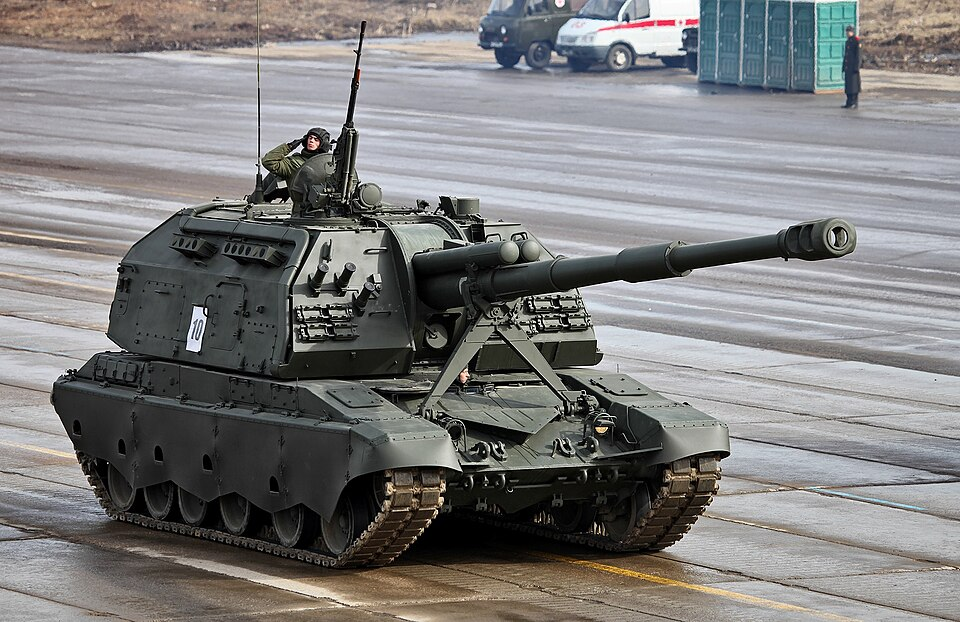

# 2S19 Msta-S — 152 mm armatohaubica samobieżna
### 2S19 Msta-S Self-Propelled Howitzer | 2С19 «Мста-С»

---

## Opis

2S19 Msta-S to rosyjska 152 mm armatohaubica samobieżna, wprowadzona do służby w 1989 roku jako następca 2S3 Akacja. Oparta na podwoziu czołgu T-80 z silnikiem V-84A z T-72, należy do głównych systemów artyleryjskich Sił Zbrojnych FR. Działo 2A64 osiąga donośność do 29 km standardową amunicją (40 km z napędem rakietowym). Wyposażona w automatyczny system ładowania (6–8 strz./min), lemiesz do okopywania się, snorkel i generator dymu. Ponosi rekordowe straty w Ukrainie — do połowy 2025 roku Rosja straciła ponad 246 pojazdów tego typu.

## Dane techniczne

| Parametr | Wartość |
|----------|---------|
| Typ | Armatohaubica samobieżna 152 mm |
| Kraj produkcji | ZSRR / Rosja |
| Rok wprowadzenia | 1989 |
| Masa bojowa | 42 t |
| Długość kadłuba | 7,15 m |
| Szerokość | 3,38 m |
| Wysokość | 2,99 m |
| Uzbrojenie główne | Armatohaubica 152 mm 2A64 (lf. 47 kal.) |
| Donośność | 24,7 km (std.) / 29 km (base-bleed) / 36–40 km (RA) |
| Szybkostrzelność | 6–8 strz./min (2S19M2: 10 strz./min) |
| Uzbrojenie pomocnicze | WKCKM 12,7 mm NSVT (plot.) |
| Silnik | V-84A diesel, 840 KM |
| Prędkość maks. | 60 km/h |
| Zasięg | 500 km |
| Pancerz | 15 mm stal (ochrona przed odłamkami i bronią strzelecką) |
| Załoga | 5 osób |

## Charakterystyczne cechy rozpoznawcze

> Jak odróżnić 2S19 od 2S3 Akacja i innych armatohaubic:

- **Masywna, kwadratowa wieża z charakterystycznym prostokątnym profilem** — wieża 2S19 jest wyraźnie wyższa i bardziej kancista niż niska kopuła wieży 2S3; przypomina odwrócone pudło
- **Długa lufa 152 mm z hamulcem wylotowym i osłoną termiczną** — lufa ze specyficznym wielokomorowym hamulcem na końcu, wyraźnie dłuższa niż w 2S3
- **Podwozie z 6 dużymi kołami nośnymi** — identyczne jak T-72/T-80, które wyraźnie odróżnia go od 2S3 (podwozie SO-152 z 6 kołami mniejszymi)
- **WKCKM 12,7 mm na dachu wieży** — widoczny karabin maszynowy na podstawie obrotowej z prawej strony włazu dowódcy
- **Lemiesz spycharkowy z tyłu kadłuba** — składana łopata widoczna pod tylną ścianą kadłuba

## Ciekawostka

> Na bazie podwozia 2S19 zbudowano prototyp "1K17 Szhatie" — czołg laserowy uzbrojony w baterię laserów do niszczenia optyki przeciwnika. Rosjanie stracili w Ukrainie ponad 246 egzemplarzy Msta-S, a Ukraińcy przerabiają uszkodzone wozy na transportery opancerzone lub montują na nich wieże T-72 (tzw. "FrankenMsta"). System był intensywnie używany w bitwie o Bachmut po obu stronach.
