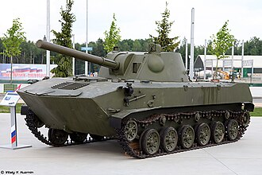

# Moździerz samobieżny 2S23 Nona-SVK
### 2S23 Nona-SVK Self-Propelled Mortar | 2С23 «Нона-СВК»

---

## Opis

2S23 Nona-SVK (ros. «Нона-СВК» — Nowoje Orużije Naziemnoj Artillerii, Samochódnaja Wintowaja Kołiesnaja) to rosyjski 120 mm samobieżny moździerz-armata na podwoziu kołowym BTR-80, wprowadzony do służby w 1990 roku. Jest kołową wersją gąsienicowej 2S9 Nona-S i przeznaczony dla jednostek zmotoryzowanych (nie powietrznodesantowych). Zastosowanie podwozia BTR-80 (8×8) daje większą mobilność drogową i prostszą logistykę niż wersja gąsienicowa. System może prowadzić ogień na wszystkie strony bez zawracania pojazdu, z zasięgiem do 12,8 km. Stosowany przez armię rosyjską i jednostki zmotoryzowane.

## Dane techniczne

| Parametr | Wartość |
|----------|---------|
| Typ | Samobieżny moździerz-armata kołowy 120 mm |
| Kraj produkcji | Rosja |
| Rok wprowadzenia | 1990 |
| Masa bojowa | 14,5 t |
| Uzbrojenie główne | 120 mm 2A60 (haubico-moździerz) |
| Zasięg strzału | do 8,8 km (standardowy), do 12,8 km (RAP) |
| Szybkostrzelność | 8–10 strz./min |
| Pojazd bazowy | BTR-80 (kołowy 8×8) |
| Prędkość maks. | 80 km/h |
| Zasięg | 600 km |
| Załoga | 4 osoby |

## Charakterystyczne cechy rozpoznawcze

> Jak odróżnić 2S23 od 2S9 i BTR-80:

- **Kołowe podwozie BTR-80 z wieżą zamiast standardowej wieżyczki:** od razu widać, że to pojazd kołowy (8 kół) z charakterystyczną wieżą moździerza zamiast typowej wieżyczki CKM BTR-80
- **Krótka, gruba lufa 120 mm z wieży na środku pojazdu:** z górnej części kadłuba wyrasta wieża z krótką grubą lufą skierowaną ku górze lub lekko do przodu — inna proporcja niż długa lufa armat
- **Sylwetka BTR-80 z "naroślem" wieżowym:** kadłub jest identyczny z BTR-80 — "pochylony nos", 8 kół, boczne drzwi desantowe — tylko wieżyczka jest inna
- **Brak hamulca wylotowego na lufie:** lufa jest gładka na końcu (moździerz gładkolufowy) — w odróżnieniu od haubic i armat z hamulcami wylotowymi
- **Obrót wieży o 360°:** wieża może się obracać dookoła — widać to jako oddzielna, duża konstrukcja na kadłubie BTR
- **Antena radiostacji na tyłach wieży:** charakterystyczna długa antena z tyłu lub boku wieży — taka sama jak w wersji bojowej BTR-80

## Ciekawostka

> 2S23 jest jedynym rosyjskim systemem artyleryjskim kołowym zdolnym do pływania — podwozie BTR-80 zachowuje swoje zdolności amfibijne nawet z wieżą moździerza. Oznacza to, że cała bateria 2S23 może przepłynąć rzekę bez pontonu i zaraz po wyjściu z wody prowadzić ogień. Ta cecha bywa niedoceniana, ale okazała się cenna przy forsowaniu rzek w wielu konfliktach zbrojnych.
