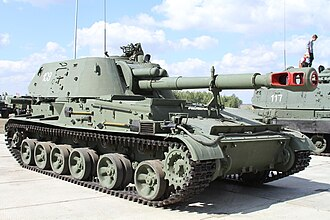

# Haubica samobieżna 2S3 Akacja
### 2S3 Akatsiya Self-Propelled Howitzer | 2С3 «Акация»

---

## Opis

2S3 Akacja (ros. «Акация» — akacja) to radziecka 152 mm haubica samobieżna opracowana w 1968 roku i wprowadzona do służby w 1971 roku. Stanowi odpowiedź na zachodnie systemy artylerii samobieżnej i przez dekady była podstawową haubicą samobieżną Wojsk Lądowych ZSRR i Rosji. Zbudowana na specjalnym podwoziu gąsienicowym z w pełni zamkniętą, obrotową wieżą. Pojazd może strzelać pociskami standardowymi, rakietowymi wspomaganymi (RAP), a także nuklearnymi pociskami taktycznymi. Akacja jest wciąż szeroko stosowana w armii rosyjskiej i była intensywnie używana w Syrii i Ukrainie.

## Dane techniczne

| Parametr | Wartość |
|----------|---------|
| Typ | Samobieżna haubica gąsienicowa |
| Kraj produkcji | ZSRR / Rosja |
| Rok wprowadzenia | 1971 |
| Masa bojowa | 27,5 t |
| Długość (z lufą) | 8,4 m |
| Szerokość | 3,25 m |
| Wysokość | 3,05 m |
| Uzbrojenie główne | Haubica 152,4 mm D-22 |
| Zasięg strzału | do 24 km (standardowy), do 30 km (RAP) |
| Szybkostrzelność | 3–4 strz./min |
| Silnik | W-59 diesel, 520 KM |
| Prędkość maks. | 63 km/h |
| Zasięg | 500 km |
| Załoga | 4–6 osób |

## Charakterystyczne cechy rozpoznawcze

> Jak odróżnić 2S3 od 2S1 i innych haubic samobieżnych:

- **Duża, walcowata wieża z długą lufą 152 mm:** wieża 2S3 jest wyraźnie większa i wyższa niż 2S1 — długa lufa 152 mm z typowym cylindrycznym hamulcem wylotowym jednoznacznie identyfikuje ten system
- **Wysoka sylwetka pojazdu (3,05 m):** 2S3 jest wyraźnie wyższy od 2S1 — sylwetka bardziej przypomina czołg niż niski transporter
- **Prostokątna tylna część kadłuba z drzwiami:** z tyłu kadłuba widoczne są duże drzwi ładunkowe — przez które uzupełnia się amunicję — typowy element 2S3
- **Charakterystyczny kształt wieży — cylindryczna z płaskim dachem:** wieża ma kształt niemal idealnego walca z płaskim dachem i licznymi włazami
- **6 kół jezdnych na gąsienicach z dużymi lukami:** podwozie ma 6 kół jezdnych na każdej stronie z wyraźnymi przestrzeniami między nimi
- **Antena radiowa na prawej stronie wieży:** długa pałąkowa lub sztyftowa antena radiostacji stoi typowo po prawej tylnej stronie wieży

## Ciekawostka

> 2S3 jest jednym z niewielu systemów artylerii samobieżnej zaprojektowanych do strzelania taktyczną bronią nuklearną — specjalny pocisk jądrowy 3BV2 (kaliber 152 mm) mógł być odpalany ze standardowej lufy systemu. Procedura strzelania jądrowego wymagała jednak ewakuacji obszaru w promieniu kilkuset metrów od pojazdu przed strzałem ze względu na promieniowanie własnego ładunku.
