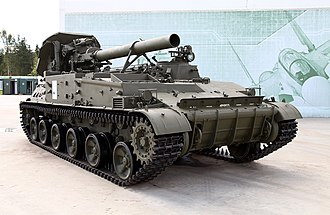

# Moździerz samobieżny 2S4 Tulipan
### 2S4 Tyulpan Self-Propelled Mortar | 2С4 «Тюльпан»

---

## Opis

2S4 Tulipan (ros. «Тюльпан» — tulipan) to radziecki 240 mm moździerz samobieżny — największy system moździerzowy będący w służbie wojskowej na świecie. Wprowadzony do służby w 1975 roku, przeznaczony jest do niszczenia silnie ufortyfikowanych pozycji obronnych, bunkrów żelbetowych i skupisk wojsk. Pocisk 240 mm waży do 130 kg i może przenosić głowicę nuklearną, chemiczną lub termobaryczną. Tulipan był używany w Afganistanie do niszczenia jaskiń i fortec mudżahedinów, w Czeczenii do burzenia bloków mieszkalnych oraz w Ukrainie do atakowania miast. Ze względu na niszczycielską siłę rażenia jest nazywany przez żołnierzy "pociągiem śmierci".

## Dane techniczne

| Parametr | Wartość |
|----------|---------|
| Typ | Samobieżny moździerz 240 mm |
| Kraj produkcji | ZSRR / Rosja |
| Rok wprowadzenia | 1975 |
| Masa bojowa | 27,5 t |
| Uzbrojenie główne | 240 mm moździerz gładkolufowy 2B8 |
| Zasięg strzału | 800 m – 18 000 m |
| Masa pocisku | do 130 kg |
| Szybkostrzelność | 1 strz./min |
| Amunicja | 40 pocisków standardowych / 20 RAP |
| Prędkość maks. | 60 km/h |
| Załoga | 4 (w pojeździe) + 5 (w pojeździe wsparcia) |

## Charakterystyczne cechy rozpoznawcze

> Jak odróżnić 2S4 od innych dział samobieżnych:

- **Ogromna lufa 240 mm z tyłu pojazdu — wycelowana ku górze:** w pozycji marszowej gigantyczna lufa jest złożona wzdłuż kadłuba; w pozycji bojowej jest pionowo uniesiona ku górze — wygląda jak wielki komin
- **Ładowanie pocisku z tyłu na ziemi:** w odróżnieniu od innych dział, Tulipan ładuje się podając pocisk od tyłu kadłuba na specjalny tacę — widać to wyraźnie na zdjęciach z ćwiczeń
- **Masywne lemiesze stabilizujące z tyłu:** w pozycji bojowej z tyłu pojazdu opuszczane są dwa ogromne lemiesze wbijające się głęboko w ziemię — niezbędne przy odrzucie strzału 240 mm
- **Brak wieży — otwarta platforma z tyłu:** górna tylna część 2S4 jest całkowicie otwarta — moździerz stoi na odkrytej platformie, obsługa pracuje na zewnątrz przy każdym strzale
- **Krótki, masywny kadłub bez wystającej lufy z przodu:** w pozycji marszowej lufa leży wzdłuż kadłuba, więc pojazd wygląda jak "pudełko z tyłu" — inaczej niż 2S3 czy 2S5 z wystającą do przodu lufą
- **Podwozie podobne do 2S3 ale wyraźnie cięższe:** 2S4 jest o podobnej długości co 2S3, ale masywniejszy, z głębiej osadonymi gąsienicami i większym prześwitem

## Ciekawostka

> W Afganistanie jeden Tulipan zużył tyle amunicji do niszczenia jednej jaskini, ile normalnie wystarczyłoby na tygodniową bitwę. Lokalni mieszkańcy nazywali go "bogiem wojny" — nie z podziwu, ale ze strachu. Jeden pocisk 3F2 (termobaryczny) wypełnia sferyczną falą uderzeniową przestrzeń o objętości budynku mieszkalnego, zabijając wszystkich wewnątrz przez nadciśnienie — bez konieczności bezpośredniego trafienia.
