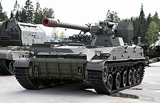

# Armata samobieżna 2S5 Hiacynt-S
### 2S5 Giatsint-S Self-Propelled Gun | 2С5 «Гиацинт-С»

---

## Opis

2S5 Hiacynt-S (ros. «Гиацинт-С» — hiacynt samobieżny) to radziecka 152 mm armata samobieżna o wyjątkowo dużym zasięgu, wprowadzona do służby w 1978 roku. W odróżnieniu od haubic 2S1 i 2S3 jest to armata (działo o długiej lufie i wysokiej prędkości początkowej pocisku), co daje jej zasięg do 28 km pociskami standardowymi i aż 40 km pociskami rakietowo wspomaganymi. System jest przeznaczony do zwalczania głęboko rozmieszczonych celów w tylach wroga — stanowisk dowodzenia, składów amunicji i węzłów komunikacyjnych. Lufa i mechanizm ładowania są umieszczone na otwartym tylnym stanowisku (bez wieży), co odróżnia Hiacynt-S od większości innych dział samobieżnych.

## Dane techniczne

| Parametr | Wartość |
|----------|---------|
| Typ | Samobieżna armata gąsienicowa |
| Kraj produkcji | ZSRR / Rosja |
| Rok wprowadzenia | 1978 |
| Masa bojowa | 28,2 t |
| Długość | 8,33 m |
| Uzbrojenie główne | Armata 152 mm 2A37 (lufa L/54) |
| Zasięg strzału | do 28 km (standardowy), do 40 km (RAP) |
| Szybkostrzelność | 5–6 strz./min |
| Amunicja | 30 nabojów w pojeździe |
| Silnik | diesel, 520 KM |
| Prędkość maks. | 62 km/h |
| Zasięg | 500 km |
| Załoga | 5 osób |

## Charakterystyczne cechy rozpoznawcze

> Jak odróżnić 2S5 od 2S3 i innych dział samobieżnych:

- **Brak zamkniętej wieży — otwarte stanowisko ogniowe z tyłu:** 2S5 nie ma wieży! Działo i obsługa są całkowicie odkryte z tyłu pojazdu — to natychmiastowy odróżnik od 2S3 (pełna wieża) i 2S1
- **Wyjątkowo długa lufa (L/54):** lufa 2S5 jest wyraźnie dłuższa proporcjonalnie do pojazdu niż w 2S3 — sięga daleko przed przód kadłuba i jest cienka (armata, nie haubica)
- **Duża tarcza ochronna przy lufie:** przed stanowiskiem obsługi stoi charakterystyczna prostokątna tarcza stalowa chroniąca załogę przed odłamkami z przodu
- **Kadłub podobny do 2S3 ale bez wieży:** podwozie i kadłub 2S5 są podobne do 2S3, ale górna część pojazdu jest płaska z otwartą platformą z tyłu
- **Dwa ramiona hydrauliczne do stabilizacji:** z tyłu kadłuba opuszczane są dwa duże lemiesze/ramiona hydrauliczne wbijające się w ziemię dla stabilizacji podczas strzelania
- **Długi wysięgnik ładowania amunicji:** automatyczny podajnik amunicji z tyłu pojazdu to charakterystyczny element — duże ramię mechaniczne ładujące naboje kaliber 152 mm

## Ciekawostka

> 2S5 był jednym z pierwszych radzieckich systemów artylerii zdolnych do strzelania pociskami z samonaprowadzaniem laserowym Krasnopol — specjalnym pociskiem 152 mm, który po wystrzale sam naprowadza się na cel podświetlony laserem przez obserwatora naziemnego lub drona. Jeden pocisk Krasnopol kosztuje wielokrotnie więcej niż standardowy, ale gwarantuje trafienie w pojazd lub bunkier z pierwszego strzału.
