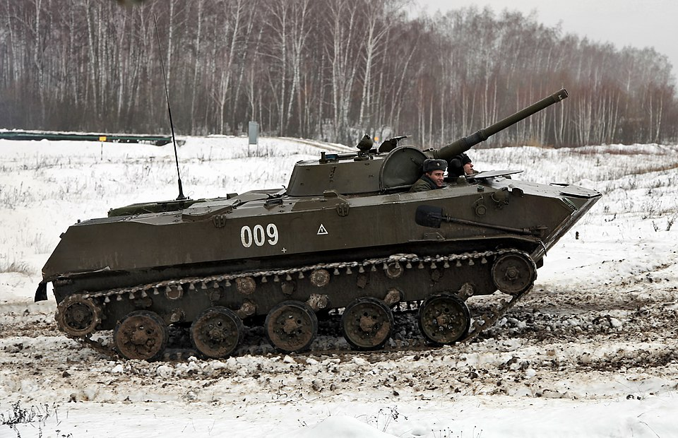

# BMD-1 — bojowy wóz desantowy
### BMD-1 Airborne Infantry Fighting Vehicle | БМД-1

---

## Opis

BMD-1 (Bojewaja Maszyna Diesanta) to radziecki bojowy wóz desantowy, wprowadzony do służby 14 kwietnia 1969 roku. Zaprojektowany wyłącznie dla wojsk powietrznodesantowych (WDW) — może być zrzucany na spadochronie z samolotu Ił-76 z kierowcą i działonowym siedzącymi wewnątrz. Uzbrojony w tę samą wieżę co BMP-1, waży jednak zaledwie 8,3 t — ponad dwukrotnie mniej. Desant musi wsiadać przez włazy w dachu (brak tylnych wrót). Używany przez Rosję i Ukrainę od 2014 roku.

## Dane techniczne

| Parametr | Wartość |
|----------|---------|
| Typ | Bojowy wóz desantowy (amfibia) |
| Kraj produkcji | ZSRR |
| Rok wprowadzenia | 1969 |
| Masa bojowa | 8,3 t |
| Długość | 5,41 m |
| Szerokość | 2,53 m |
| Wysokość | 1,97 m |
| Uzbrojenie główne | Armata 73 mm 2A28 Grom (gładkolufowa) |
| Uzbrojenie dodatkowe | PPK 9M14M/9M111M, 3× KM PKT 7,62 mm (w tym 2 kadłubowe) |
| Silnik | 5D-20 diesel, 241–270 KM |
| Prędkość maks. (droga) | 80 km/h |
| Prędkość w wodzie | 10 km/h |
| Zasięg | 600 km |
| Pancerz | Stop aluminium ABT-101; przód kadłuba 15 mm, wieża 6–23 mm |
| Załoga | 2 osoby + 6 desantu |

## Charakterystyczne cechy rozpoznawcze

> Jak odróżnić BMD-1 od BMP-1 i innych wozów:

- **Znacznie mniejszy od BMP-1** — przy identycznej wieży kadłub jest wyraźnie krótszy i niższy; BMD-1 wygląda jak "skurczony BMP-1"
- **Dwa kadłubowe KM PKT w narożnikach dziobu** — dwie lufy wystające z przednich rogów kadłuba, unikalna cecha nieobecna w BMP
- **Brak tylnych wrót desantowych** — desant wsiada wyłącznie przez włazy w dachu; tył kadłuba jest zamknięty silnikiem
- **Regulowane zawieszenie hydropneumatyczne** — pojazd może się "przykucnąć" do ok. 100 mm prześwitu lub unieść do 450 mm
- **Falochron na dziobie** — składana osłona przeciwfalowa unoszona przed wejściem do wody
- **5 małych kół nośnych równomiernie rozmieszczonych** — w odróżnieniu od 6 kół MT-LB lub nierównomiernego rozstawu T-72

## Ciekawostka

> BMD-1 był pierwszym czołgiem/wozem bojowym na świecie zrzucanym na spadochronie z załogą w środku — system PRSM-915 z retrorakietami hamuje opadanie tuż przed lądowaniem. Wcześniej pojazdy zrzucano puste, a załoga lądowała oddzielnie i często nie mogła znaleźć wozu w terenie. Identyczna wieża co BMP-1 oznacza, że żołnierze z dystansu mogą pomylić oba pojazdy — BMD-1 jest jednak o ponad połowę lżejszy.
