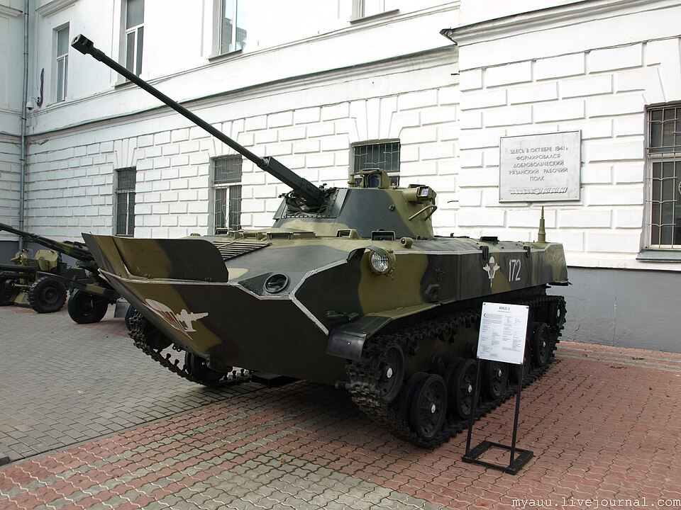

# BMD-2 — bojowy wóz desantowy
### BMD-2 Airborne Infantry Fighting Vehicle | БМД-2

---

## Opis

BMD-2 to radziecka modernizacja BMD-1 wprowadzona do służby w 1985 roku. Zachowuje kadłub poprzednika, lecz otrzymuje zupełnie nową wieżę B-30 z działkiem automatycznym 30 mm 2A42 i wyrzutnią PPK — identyczne uzbrojenie co BMP-2. Masa wzrosła do 11,5 t. Jak wszystkie BMD, jest w pełni amfibijny i zrzucany z Iła-76 z załogą w środku. Najliczniej produkowany wóz rodziny BMD — jego straty w Ukrainie do 2025 roku wyniosły ponad 410 egzemplarzy.

## Dane techniczne

| Parametr | Wartość |
|----------|---------|
| Typ | Bojowy wóz desantowy (amfibia) |
| Kraj produkcji | ZSRR |
| Rok wprowadzenia | 1985 |
| Masa bojowa | 11,5 t |
| Długość | 5,91 m (z lufą) / 5,40 m (kadłub) |
| Szerokość | 2,63 m |
| Wysokość | 1,62–1,97 m (regulowane zawieszenie) |
| Uzbrojenie główne | Działko automatyczne 30 mm 2A42 (300 nab.) |
| Uzbrojenie dodatkowe | PPK 9M111 Fagot / 9M113 Konkurs, KM PKT 7,62 mm (sprzężony), KM PKT 7,62 mm (kadłubowy) |
| Silnik | 5D-20 diesel, 241 KM |
| Prędkość maks. (droga) | 80 km/h |
| Prędkość w wodzie | 10 km/h |
| Zasięg | 450 km |
| Pancerz | Stop aluminium; przód kadłuba 15 mm, wieża 7 mm |
| Załoga | 2 osoby + 6 desantu |

## Charakterystyczne cechy rozpoznawcze

> Jak odróżnić BMD-2 od BMD-1 i BMP-2:

- **Długa lufa działka 30 mm zamiast krótkiej armaty 73 mm** — najwyraźniejsza różnica względem BMD-1; lufa 2A42 jest cienka i długa, armata Grom w BMD-1 krótka i gruba
- **Nowa wieża B-30 — jednoosobowa, mniejsza niż w BMP-2** — specjalnie zaprojektowana dla BMD-2, bo standardowa wieża BMP-2 nie mieściła się na małym kadłubie
- **Wyrzutnia PPK na szczycie wieży** — sworzniowa wyrzutnia Fagot/Konkurs widoczna na górze wieży, zamiast prowadnicy nad działem jak w BMD-1
- **Celownik o dużym kącie uniesienia po lewej stronie lufy** — umożliwia ostrzał celów powietrznych; charakterystyczny element boczny wieży
- **Reflektor z przodu wieży** — biały reflektor dospawany do czoła wieży B-30
- **Kadłubowy KM w dziobie** — jak BMD-1, zachowane jedno stanowisko PKT z przodu kadłuba (po prawej stronie)

## Ciekawostka

> Do 2025 roku Rosja straciła w Ukrainie ponad 410 egzemplarzy BMD-2 — więcej niż jakiegokolwiek innego wozu bojowego tego typu. Aluminiowy pancerz, wystarczający na odłamki, okazał się niemal bezużyteczny wobec dronów FPV i karabinów maszynowych. BMD-2 to jednocześnie pojazd, który może wylądować na polu walki w 30 sekund po otwarciu się tylnej rampy Iła-76 — z pilotem i działonowym siedzącymi w środku podczas całego opadania.
