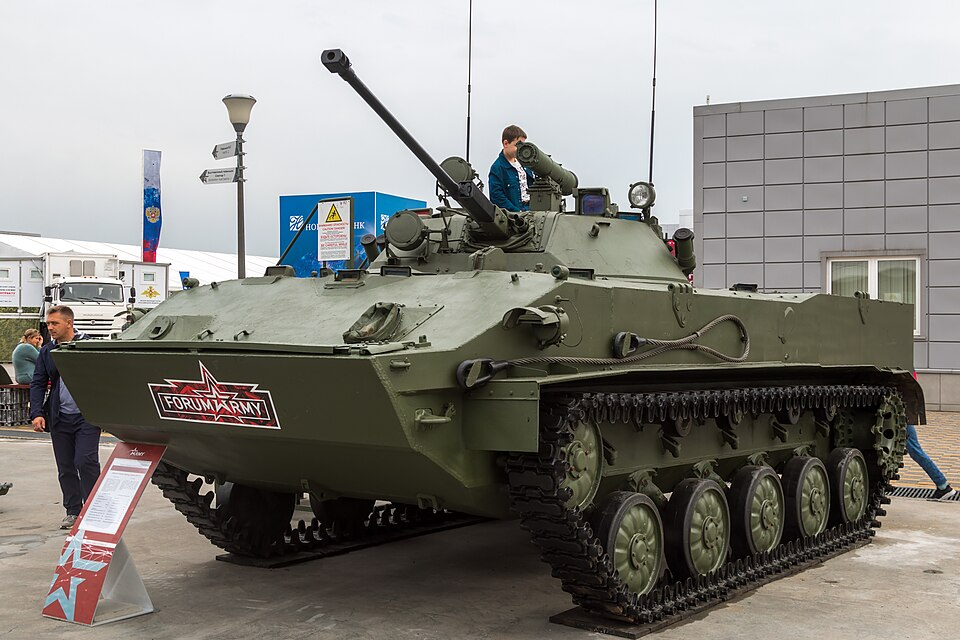

# BMD-3 — bojowy wóz desantowy
### BMD-3 Airborne Infantry Fighting Vehicle | БМД-3

---

## Opis

BMD-3 to radziecki bojowy wóz desantowy trzeciej generacji, przyjęty do służby w 1990 roku — ostatni rok ZSRR. W odróżnieniu od BMD-1 i BMD-2 jest całkowicie nową konstrukcją, nie modernizacją. Otrzymał pełnowymiarową wieżę z BMP-2 oraz unikalne uzbrojenie kadłubowe: granatnik AGS-17 i karabin RPK-74. Silnik 450 KM i masa 12,9 t. Wyprodukowano zaledwie 137 egzemplarzy — z powodu upadku ZSRR produkcję wstrzymano w 1997 roku. Jego wydłużone podwozie (7 kół) posłużyło jako baza dla 2S25 Sprut-SD i BTR-MD Rakuszka.

## Dane techniczne

| Parametr | Wartość |
|----------|---------|
| Typ | Bojowy wóz desantowy (amfibia) |
| Kraj produkcji | ZSRR / Rosja |
| Rok wprowadzenia | 1990 |
| Masa bojowa | 12,9 t |
| Długość | 6,00 m |
| Szerokość | 3,13 m |
| Wysokość | 2,25 m |
| Uzbrojenie główne | Działko automatyczne 30 mm 2A42 (500 nab., kąt podniesienia do 75°) |
| Uzbrojenie dodatkowe | PPK 9M111/9M113, KM PKT 7,62 mm, AGS-17 30 mm (kadłub lewy), RPK-74 5,45 mm (kadłub prawy) |
| Silnik | 2V-06-2 diesel, 450 KM |
| Prędkość maks. (droga) | 70 km/h |
| Prędkość w wodzie | 10 km/h |
| Zasięg | 500 km |
| Pancerz | Stop aluminium (kadłub) + stal (wieża) |
| Załoga | 3 osoby + 7 desantu (4 przy zrzucie) |

## Charakterystyczne cechy rozpoznawcze

> Jak odróżnić BMD-3 od BMD-1, BMD-2 i BMP-2:

- **Pełnowymiarowa wieża BMP-2** — w odróżnieniu od miniaturowej wieży B-30 w BMD-2; identyczna jak w BMP-2, dwuosobowa
- **Granatnik AGS-17 i karabin RPK-74 w dziobie** — dwie lufy w kadłubie z przodu: AGS-17 po lewej i RPK-74 po prawej; unikalna cecha nieobecna w żadnym innym wozie tej rodziny
- **Wyraźnie większy i szerszy kadłub** — nowa konstrukcja, nie przeróbka BMD-1; szerokość 3,13 m (BMD-2: 2,63 m)
- **5 kół nośnych w kadłubie bazowym** — mimo większych rozmiarów wersja podstawowa zachowuje 5 kół; 7 kół pojawia się w wydłużonych wariantach podwozia (Sprut-SD, Rakuszka)
- **Wyższy profil niż BMD-2** — wieża BMP-2 jest wyraźnie wyższa niż jednoosobowa B-30

## Ciekawostka

> Wyprodukowano tylko 137 egzemplarzy — tyle co jeden batalion. Upadek ZSRR w 1991 roku i cięcia budżetowe uniemożliwiły dalszą produkcję. Mimo to podwozie BMD-3 okazało się na tyle udane, że posłużyło jako baza dla niszczyciela czołgów 2S25 Sprut-SD (wydłużone do 7 kół) oraz transportera BTR-MD Rakuszka. Nie odnotowano żadnych strat BMD-3 w Ukrainie — prawdopodobnie nie trafiły na front.
