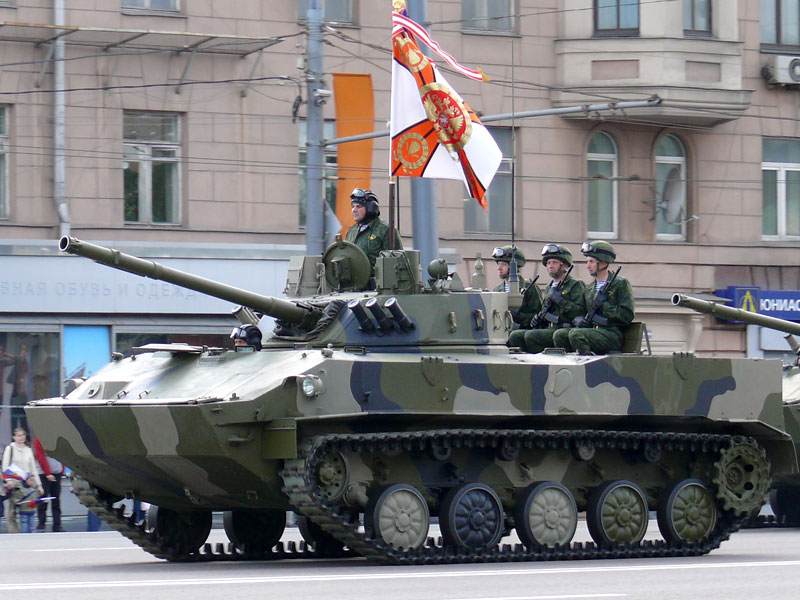

# BMD-4 — bojowy wóz desantowy
### BMD-4 Airborne Infantry Fighting Vehicle | БМД-4

---

## Opis

BMD-4 to rosyjski bojowy wóz desantowy czwartej generacji, przyjęty do służby 31 grudnia 2004 roku. Kadłub oparty na BMD-3, lecz wyposażony w zupełnie nowy moduł wieżowy Bachtcha-U łączący armatę 100 mm z działkiem 30 mm — identyczny zestaw jak w BMP-3. Armata 100 mm może odpalać laserowo naprowadzane PPK 9M117M1 Arkan przez lufę. Straty Rosji w Ukrainie: ponad 178 egzemplarzy BMD-4M do marca 2026 roku.

## Dane techniczne

| Parametr | Wartość |
|----------|---------|
| Typ | Bojowy wóz desantowy (amfibia) |
| Kraj produkcji | Rosja |
| Rok wprowadzenia | 2004 |
| Masa bojowa | 13,6 t |
| Długość | 6,36 m (z lufą) / 6,10 m (kadłub) |
| Szerokość | 3,11 m |
| Wysokość | 2,45 m |
| Uzbrojenie główne | Moduł Bachtcha-U: armata 100 mm 2A70 + działko 30 mm 2A72 |
| Amunicja armaty 100 mm | Pociski OFz + PPK 9M117M1 Arkan (przez lufę) |
| Uzbrojenie dodatkowe | KM PKT 7,62 mm, RPK-74 5,45 mm (kadłub prawy), PPK Fagot/Konkurs (dach wieży) |
| Silnik | 2V-06-2 diesel, 450 KM (BMD-4M: UTD-29, 500 KM) |
| Prędkość maks. (droga) | 70 km/h |
| Prędkość w wodzie | 10 km/h |
| Zasięg | 500 km |
| Pancerz | Stop aluminium (kadłub) + stal (wieża); przód chroni przed 30 mm |
| Załoga | 3 osoby + 5 desantu |

## Charakterystyczne cechy rozpoznawcze

> Jak odróżnić BMD-4 od BMD-3 i BMP-3:

- **Dwie sprzężone lufy na wieży: gruba krótka (100 mm) + cienka długa (30 mm)** — unikalna cecha modułu Bachtcha-U; żaden inny wóz desantowy nie ma takiego układu
- **Moduł Bachtcha-U — niska, zaokrąglona wieża bez wyraźnych krawędzi** — przypomina wieżę BMP-3, ale na mniejszym i węższym kadłubie BMD
- **Wyrzutnia PPK na dachu wieży** — dodatkowa prowadnica Fagot/Konkurs widoczna z tyłu modułu wieżowego
- **Kadłub identyczny z BMD-3** — te same proporcje, szerokość 3,11 m, układ kół; rozpoznawalny po wieży, nie kadłubie
- **Mniejszy i lżejszy od BMP-3** — BMD-4 waży 13,6 t, BMP-3 waży 18,7 t; przy podobnej wieży kadłub jest wyraźnie szczuplejszy

## Ciekawostka

> Nazwa modułu Bachtcha-U (Бахча-У) oznacza dosłownie "melonowe pole". W ładowni jednego Iła-76 mieszczą się tylko dwa BMD-4 (wobec trzech BMD-1/2). Armata 100 mm może odpalać PPK przez lufę — bez przeładowania i z pełną osłoną załogi. Do marca 2026 roku Rosja straciła w Ukrainie 178 wozów BMD-4M, w tym 150 zniszczonych całkowicie.
