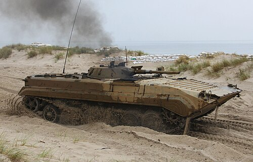

# Bojowy Wóz Piechoty BMP-1
### BMP-1 Infantry Fighting Vehicle | БМП-1 (Боевая машина пехоты)

---

## Opis

BMP-1 to radziecki bojowy wóz piechoty, wprowadzony do uzbrojenia w 1966 roku jako pierwszy na świecie seryjnie produkowany pojazd tej klasy — łączący zdolność do transportu żołnierzy z rzeczywistą siłą ognia. Powstał z myślą o wojnie nuklearnej, gdzie piechota musiała prowadzić działania nie wysiadając z pojazdu, a specjalne strzelnice umożliwiały żołnierzom desantu ostrzał z wnętrza wozu. Służył i nadal służy w dziesiątkach armii na całym świecie, a jego bojowy chrzest przeszedł podczas konfliktu na Bliskim Wschodzie w 1973 roku. Pomimo przestarzałości uzbrojenia głównego, BMP-1 pozostaje w służbie wielu sił zbrojnych, w tym armii rosyjskiej, gdzie bywa zastępowany nowszymi konstrukcjami lub poddawany modernizacji.

## Dane techniczne

| Parametr | Wartość |
|----------|---------|
| Typ | Bojowy wóz piechoty |
| Kraj produkcji | ZSRR |
| Rok wprowadzenia | 1966 |
| Masa bojowa | 13,2 t |
| Długość | 6,74 m |
| Szerokość | 2,94 m |
| Wysokość | 2,07 m |
| Uzbrojenie główne | Armata gładkolufowa 73 mm 2A28 Grom + wyrzutnia PPKR 9M14 Malyutka |
| Uzbrojenie dodatkowe | km 7,62 mm PKT (sprzężony) |
| Silnik | UTD-20 V6 diesel |
| Moc silnika | 300 KM |
| Prędkość maks. (droga) | 65 km/h |
| Prędkość na wodzie | 7–8 km/h |
| Zasięg | 600 km |
| Załoga + desant | 3 + 8 os. |

## Charakterystyczne cechy rozpoznawcze

> Jak odróżnić BMP-1 od innych podobnych modeli:

- **Wieżyczka stożkowa, niska i okrągła:** Charakterystyczna mała wieżyczka o stożkowym kształcie, wyraźnie niższa niż w BMP-2 i BMP-3 — oglądana z boku przypomina ścięty stożek.
- **Działo 73 mm z wyraźnym tłumikiem płomieni:** Gruba, krótka lufa z wydatnym, cylindrycznym tłumikiem płomieni na końcu — zupełnie inny wygląd niż smukła lufa 30 mm autocannon w BMP-2.
- **Wyrzutnia rakiet PPKR na wieżyczce:** Ponad lufą armaty widoczna jest szyna wyrzutni rakiet przeciwpancernych Malyutka — charakterystyczny element górnej sylwetki.
- **Nisko położony, pochyły dziób kadłuba:** Przednia część kadłuba jest bardzo stromo pochylona, z charakterystycznymi podłużnymi żebrami wzmacniającymi — tworzy ostry, klinkowy kształt z przodu.
- **Prostokątne włazy desantu na rufie:** Z tyłu wozu widoczne są duże, prostokątne drzwi tylne (służą jednocześnie jako zbiorniki paliwa) otwierane na zewnątrz — charakterystyczna cecha odróżniająca od BMP-3.
- **Porty strzeleckie wzdłuż burt:** Wzdłuż bocznych powierzchni kadłuba widoczne są charakterystyczne małe, owalne otwory strzelnicze dla żołnierzy desantu — wyraźnie widoczne w liczbie 4 po każdej stronie.

## Ciekawostka

> BMP-1 był tak nowatorski w chwili powstania, że NATO przez długi czas nie potrafiło właściwie ocenić jego możliwości bojowych — zachodnie wywiady sądziły, że ta mała maszyna nie może jednocześnie być amfibią, przewozić ośmiu żołnierzy i posiadać tak silnego uzbrojenia. Dopiero zdobyte egzemplarze z wojen na Bliskim Wschodzie pozwoliły Zachodowi zrozumieć rewolucję, jaką BMP-1 wprowadził na pole walki.
