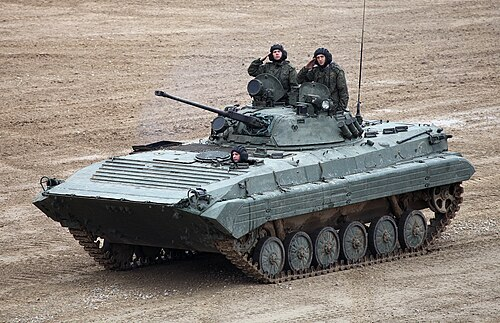
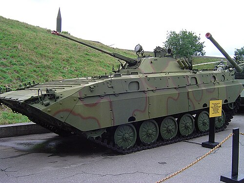

# Bojowy Wóz Piechoty BMP-2
### BMP-2 Infantry Fighting Vehicle | БМП-2 (Боевая машина пехоты)

---

## Opis

BMP-2 to radziecka modernizacja BMP-1, wprowadzona do uzbrojenia w 1980 roku jako bezpośrednia odpowiedź na doświadczenia bojowe — przede wszystkim słabość 73 mm armaty BMP-1 w walce z lotnictwem i słabo opancerzonymi pojazdami. Kluczową zmianą było zastąpienie stożkowej jednoosobowej wieżyczki nową, dwuosobową wieżą uzbrojoną w szybkostrzelną armatę automatyczną 30 mm 2A42, zdolną razić zarówno pojazdy opancerzone, jak i cele powietrzne. BMP-2 przeszedł chrzest bojowy w Afganistanie, gdzie jego armata 30 mm okazała się o wiele skuteczniejsza w walce w górach niż uzbrojenie poprzednika. Do dziś BMP-2 pozostaje podstawowym BWP armii rosyjskiej i jest eksploatowany w ponad 30 krajach świata.

## Dane techniczne

| Parametr | Wartość |
|----------|---------|
| Typ | Bojowy wóz piechoty |
| Kraj produkcji | ZSRR / Rosja |
| Rok wprowadzenia | 1980 |
| Masa bojowa | 14,3 t |
| Długość | 6,74 m |
| Szerokość | 3,15 m |
| Wysokość | 2,45 m |
| Uzbrojenie główne | Armata automatyczna 30 mm 2A42 + wyrzutnia PPKR 9P135M (Fagot/Konkurs) |
| Uzbrojenie dodatkowe | km 7,62 mm PKT (sprzężony) |
| Silnik | UTD-20/3 diesel |
| Moc silnika | 300 KM |
| Prędkość maks. (droga) | 65 km/h |
| Prędkość na wodzie | 7 km/h |
| Zasięg | 600 km |
| Załoga + desant | 3 + 7 os. |

## Charakterystyczne cechy rozpoznawcze

> Jak odróżnić BMP-2 od innych podobnych modeli:

- **Dwuosobowa, wyraźnie wyższa wieżyczka:** Wieża BMP-2 jest wyraźnie wyższa i bardziej masywna niż stożkowa wieżyczka BMP-1, mieści dwóch ludzi (dowódcę i działonowego) — jest to najbardziej rzucająca się w oczy różnica.
- **Smukła, długa lufa armaty 30 mm:** Cienka, długa lufa autocannonu 2A42 z charakterystycznym cylindrycznym tłumikiem płomieni — znacznie smuklejsza i dłuższa niż grube działo BMP-1.
- **Wyrzutnia PPKR po lewej stronie wieży:** Na lewym boku wieży widoczna jest szyna z wyrzutnią rakiet przeciwpancernych (Fagot lub Konkurs) — umieszczona z boku, nie nad lufą jak w BMP-1.
- **Wyraźne pochylenie lufy ku górze:** Armata 2A42 może być unoszona pod znacznym kątem elewacji (do +74°), dzięki czemu BMP-2 w gotowości bojowej często prezentuje lufę uniesioną bardziej ku górze niż BMP-1.
- **Kadłub identyczny z BMP-1:** Dolna część wozu — kadłub, układ jezdny, tylne drzwi — jest praktycznie taka sama jak w BMP-1. Jeśli wieżyczka jest nowa, a kadłub wygląda jak BMP-1, to jest BMP-2.
- **Strzelnice desantowe — mniej niż w BMP-1:** BMP-2 ma mniejszą liczbę strzelnic bocznych (mniej żołnierzy desantu: 7 zamiast 8), ale są one podobnego kształtu jak w poprzedniku.

## Ciekawostka

> Armata 2A42 zastosowana w BMP-2 ma aż dwa podajniki amunicji, co pozwala działonowemu przełączać w locie między amunicją przeciwpancerną a odłamkowo-burzącą — bez konieczności zatrzymywania się czy przeładowania. To rozwiązanie, niespotykane w ówczesnych zachodnich pojazdach, dawało rosyjskim żołnierzom ogromną elastyczność w walce z różnymi celami.
