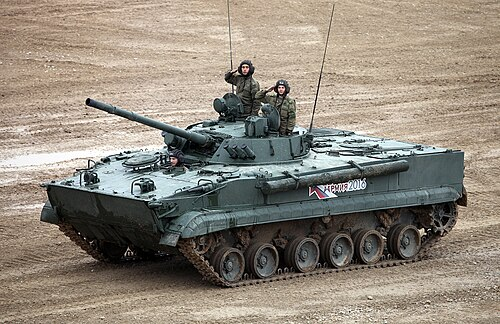
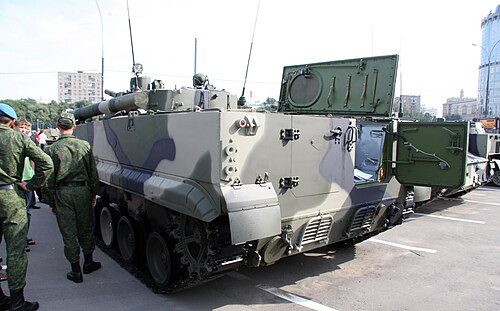

# Bojowy Wóz Piechoty BMP-3
### BMP-3 Infantry Fighting Vehicle | БМП-3 (Боевая машина пехоты)

---

## Opis

BMP-3 to rosyjski bojowy wóz piechoty trzeciej generacji, wprowadzony do służby w 1987 roku, zaprojektowany jako całkowicie nowa konstrukcja — nie ewolucja, lecz rewolucja w stosunku do BMP-1 i BMP-2. Jego unikalną cechą jest wyjątkowo silne uzbrojenie: kombinacja niskociśnieniowej armaty 100 mm (zdolnej też do odpalania rakiet ppanc.), szybkostrzelnego autocannonu 30 mm i trzech karabinów maszynowych 7,62 mm czyni z niego wóz o ogniowej sile porównywalnej z niektórymi czołgami lekkimi. BMP-3 jest dziś podstawowym BWP armii rosyjskiej i uczestniczy w walkach na Ukrainie od 2022 roku; eksportowany był m.in. do Emiratów Arabskich, Kuwejtu i Korei Południowej. Jego złożoność i wyższy koszt produkcji sprawił, że nigdy nie zastąpił w pełni BMP-2 w Siłach Zbrojnych Federacji Rosyjskiej.

## Dane techniczne

| Parametr | Wartość |
|----------|---------|
| Typ | Bojowy wóz piechoty |
| Kraj produkcji | ZSRR / Rosja |
| Rok wprowadzenia | 1987 |
| Masa bojowa | 18,7 t |
| Długość | 7,14 m |
| Szerokość | 3,20 m |
| Wysokość | 2,40 m |
| Uzbrojenie główne | Armata 100 mm 2A70 + autocannon 30 mm 2A72 + PPKR 9M117 Bastion |
| Uzbrojenie dodatkowe | 3 × km 7,62 mm PKT |
| Silnik | UTD-29M diesel |
| Moc silnika | 500 KM |
| Prędkość maks. (droga) | 72 km/h |
| Prędkość na wodzie | 10 km/h |
| Zasięg | 600 km |
| Załoga + desant | 3 + 7 os. |

## Charakterystyczne cechy rozpoznawcze

> Jak odróżnić BMP-3 od innych podobnych modeli:

- **Duża, dwuosobowa wieża z dwiema lufami:** Najbardziej charakterystyczna cecha — wieża BMP-3 nosi dwie lufy obok siebie: grubą, krótką armatę 100 mm po lewej i smukły autocannon 30 mm po prawej stronie. Żaden inny BWP nie ma takiej konfiguracji.
- **Masywna, zaokrąglona wieża o dużej średnicy podstawy:** Wieża BMP-3 jest wyraźnie większa i bardziej zaokrąglona niż wieże BMP-1 i BMP-2 — zajmuje znaczną część górnej powierzchni kadłuba.
- **Silnik z tyłu, kierowca w centrum kadłuba:** W odróżnieniu od BMP-1 i BMP-2 (silnik z przodu), BMP-3 ma silnik z tyłu — kierowca siedzi centralnie w przedziale desantowym, co widać po centralnym włazie kierowcy na dziobie kadłuba.
- **Trzy włazy desantowe na rufie i właz kierowcy z przodu:** Żołnierze desantu opuszczają pojazd przez otwory w tylnym pancerzu (dwa mniejsze boczne klapy i jeden centralny), a nie przez duże tylne drzwi jak w BMP-1/2.
- **Wyraźnie szerszy i dłuższy kadłub:** BMP-3 jest widocznie większy od poprzedników: dłuższy (7,14 vs 6,74 m) i wyraźnie cięższy (18,7 t vs 13–14 t) — sprawia wrażenie masywniejszego, pełniejszego w kształcie pojazdu.
- **Specjalne wywietrzniki silnika z tyłu kadłuba:** Na tylnej ścianie kadłuba BMP-3 widoczne są duże kratki wentylacyjne silnika umieszczonego z tyłu — w BMP-1/2 tylna ściana to przede wszystkim drzwi desantowe.

## Ciekawostka

> BMP-3 może strzelać rakietami przeciwpancernymi bezpośrednio przez lufę armaty 100 mm — technologia zwana ATGM-through-the-barrel pozwala na precyzyjne rażenie celów opancerzonych na odległość do 4 km, przy czym pojazd nie musi zatrzymywać się ani odsłaniać wyrzutni ponad pancerzem. Czyni to z niego jeden z nielicznych BWP zdolnych do skutecznej walki z czołgami na dużych dystansach bez narażania załogi.
