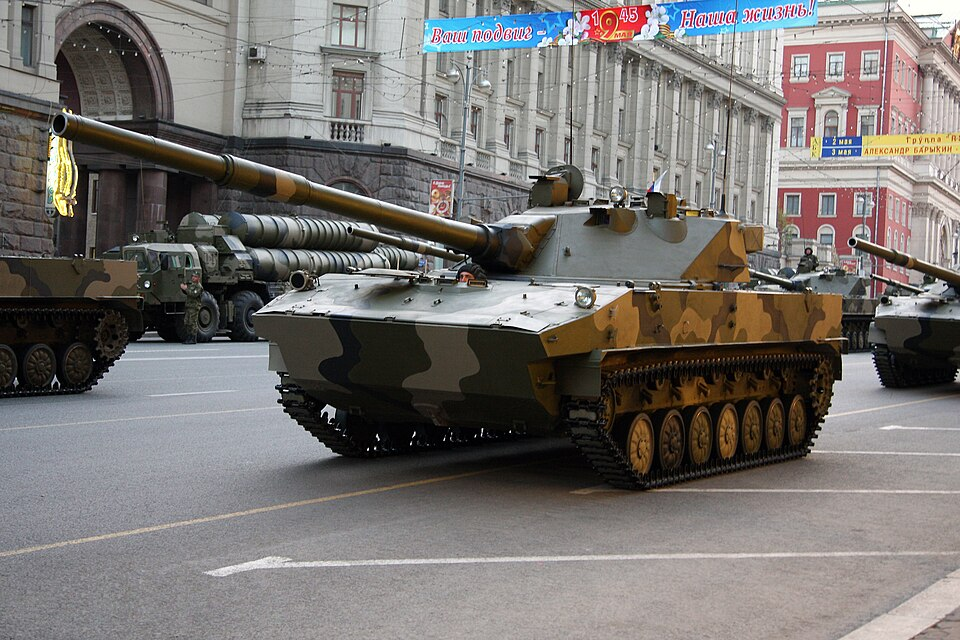

# Niszczyciel czołgów 2S25 Sprut-SD
### 2S25 Sprut-SD Self-Propelled Anti-Tank Gun | 2С25 «Спрут-СД»

---

## Opis

2S25 Sprut-SD (ros. „Ośmiornica") to rosyjski lekki czołg / samobieżne działo przeciwpancerne opracowane dla wojsk powietrznodesantowych (WDW). Weszło do służby w 2005 roku. Przeznaczone do zrzutu na spadochronach wraz z 3-osobową załogą wewnątrz, jest w pełni amfibijne i może wspinać się na statki o własnych siłach. Uzbrojone jest w tę samą 125 mm armatę gładkolufową co T-72, T-80 i T-90 — przy masie zaledwie 18 ton. W 2010 roku wstrzymano produkcję po pożarze jednego z egzemplarzy podczas defilady na Placu Czerwonym; w Ukrainie pojawia się od 2022 roku.

## Dane techniczne

| Parametr | Wartość |
|----------|---------|
| Typ | Lekki czołg / niszczyciel czołgów (desantowy) |
| Kraj produkcji | Rosja |
| Rok wprowadzenia | 2005 |
| Masa bojowa | 18 t |
| Długość (z działem) | 9,77 m |
| Silnik | 2V-06-2S diesel, 510 KM |
| Uzbrojenie główne | Armata 125 mm 2A75 (gładkolufowa, z automatem ładowania) |
| Uzbrojenie dodatkowe | KM 7,62 mm PKT (sprzężony) |
| Prędkość maks. (droga) | 70–71 km/h |
| Prędkość w wodzie | 8–10 km/h |
| Zasięg | 500 km |
| Pancerz | Aluminiowo-kompozytowy; chroni czoło przed 23 mm z 500 m |
| Załoga | 3 osoby (kierowca, działonowy, dowódca) |

## Charakterystyczne cechy rozpoznawcze

> Jak odróżnić 2S25 od BWP i czołgów:

- **7 kół nośnych z każdej strony** — podwozie BMD-3 wydłużono; bazowe BMD-3 ma 5 kół; żaden czołg linowy nie wygląda tak "smukło" przy takiej długości
- **Bardzo niska sylwetka z długą lufą 125 mm bez hamulca wylotowego** — lufa z osłoną termiczną, przedmuchiwaczem pośrodku, ale bez charakterystycznego "kubka" na końcu
- **Wieża pośrodku pojazdu** — dwuosobowa, spawana stalowa wieża umieszczona centralnie, nie z tyłu jak w ISU/2S5
- **Dwa pędniki wodne z tyłu kadłuba** — widoczne pokrywy pędników za ostatnim kołem
- **Regulowane zawieszenie hydropneumatyczne** — pojazd może "kucać" lub "stawać na palcach" o 40 cm w górę/dół

## Ciekawostka

> 2S25 może być zrzucany na spadochronie z Iłami Il-76 z 3-osobową załogą wewnątrz — jedyny tak uzbrojony pojazd na świecie zdolny do samodzielnego wejścia na okręt. W 2010 roku po defiladzie jeden egzemplarz stanął w płomieniach wskutek wycieku paliwa — to wystarczyło by zamknąć linię produkcyjną. Armata 2A75 strzela tą samą amunicją co T-90, w tym pociskami kierowanymi przez lufę.
