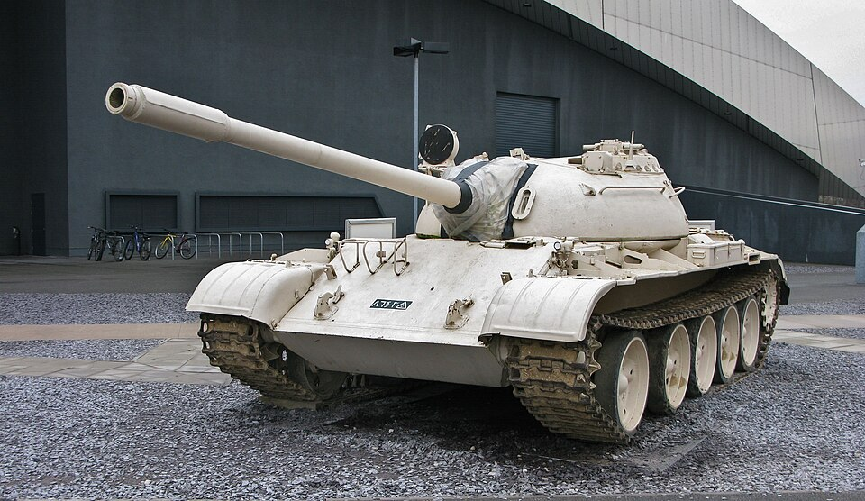

# Czołg średni T-55
### T-55 Medium Tank | Т-55 Средний танк

---

## Opis

T-55 to radziecki czołg średni przyjęty na uzbrojenie Armii Radzieckiej 8 maja 1958 roku, będący głęboko zmodernizowaną wersją T-54. Jest jednym z najliczniej produkowanych czołgów w historii — szacuje się, że powstało ponad 96 000 egzemplarzy różnych wariantów. Był standardowym czołgiem Układu Warszawskiego przez lata 60. i 70. XX wieku i trafił do armii ponad 50 krajów. Choć dawno wycofany z aktywnej służby, od wiosny 2023 roku Rosja wyciągała T-55 z głębokich rezerw magazynowych i wysyłała na front w Ukrainie jako mobilne działa wsparcia ogniowego.

## Dane techniczne

| Parametr | Wartość |
|----------|---------|
| Typ | Czołg średni |
| Kraj produkcji | ZSRR |
| Rok wprowadzenia | 1958 |
| Masa bojowa | ok. 36–36,5 t |
| Długość (z działem) | 9,00 m |
| Szerokość | 3,27–3,37 m |
| Wysokość | 2,35–2,40 m |
| Uzbrojenie główne | Armata 100 mm D-10T2S (gwintowana) |
| Uzbrojenie dodatkowe | KM 7,62 mm PKT (sprzężony), WKCKM 12,7 mm DSzKM (plot.) |
| Silnik | W-55 diesel, 580 KM |
| Prędkość maks. (droga) | 50–51 km/h |
| Zasięg | 325–500 km (do 610 km z bak. dod.) |
| Załoga | 4 osoby (dowódca, działonowy, ładowniczy, kierowca) |
| Pancerz czoła wieży | do 203–205 mm (odlewany) |

## Charakterystyczne cechy rozpoznawcze

> Jak odróżnić T-55 od T-54, T-62 i innych czołgów:

- **Wyraźna przerwa między 1. a 2. kołem nośnym:** największy odstęp między kołami jest z przodu pojazdu — odwrotnie niż w T-62, gdzie przerwy rosną ku tyłowi
- **Półsferyczna, zaokrąglona wieża bez kopuły wentylatora:** w odróżnieniu od T-54 brak małej kopułki z prawej strony dachu wieży
- **Brak otworu strzelniczego w przedniej płycie kadłuba:** T-54 miał nieruchomy km w dziobie; T-55 nie — środek czołowej płyty jest gładki
- **Rura wydechowa widoczna na lewym tylnym błotniku:** charakterystyczny element zewnętrzny
- **Armata 100 mm z przedmuchiwaczem bliżej wylotu lufy:** w odróżnieniu od T-62, którego 115 mm armata ma przedmuchiwacz w połowie lufy
- **Brak fartuchów bocznych** (ekranów gumowo-metalowych) w wersji bazowej

## Ciekawostka

> T-55 to najliczniej produkowany czołg w historii — ponad 96 000 sztuk. Był też pierwszym czołgiem wyposażonym w system ochrony przed bronią masowego rażenia (PAZ). W wojnie w Ukrainie Rosjanie używali go nie jako czołgu liniowego, lecz jako "mobilnej artylerii" — wyciągniętej z magazynów po ogromnych stratach nowoczesnego sprzętu. Ukraińcy zdobyli T-55 z cokołu pomnika w Mariupolu i użyli go jako bunkier podczas obrony Azowstalu.
