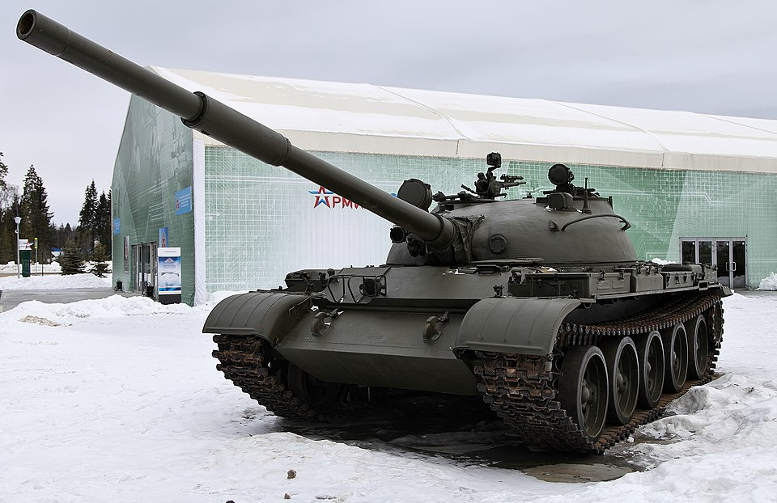

# Czołg podstawowy T-62
### T-62 Main Battle Tank | Т-62 Основной боевой танк

---

## Opis

T-62 to radziecki czołg podstawowy wprowadzony do służby w lipcu 1961 roku. Jest historycznie przełomowy — jako pierwszy seryjnie produkowany czołg na świecie uzbrojony w armatę gładkolufową, zdolną do strzelania pociskami podkalibrowymi stabilizowanymi brzechwowo (APFSDS). Powstał jako ewolucja T-55, z którym dzieli wiele elementów konstrukcji. Produkowany w ZSRR do 1975 roku (ok. 22 000 egzemplarzy), trafił do blisko 40 krajów. Od maja 2022 roku Rosja wyciąga T-62 z głębokich rezerw i wysyła na front w Ukrainie.

## Dane techniczne

| Parametr | Wartość |
|----------|---------|
| Typ | Czołg podstawowy |
| Kraj produkcji | ZSRR |
| Rok wprowadzenia | 1961 |
| Masa bojowa | ok. 37–40 t |
| Długość (z działem) | 9,34 m |
| Szerokość | 3,30 m |
| Wysokość | 2,28–2,40 m |
| Uzbrojenie główne | Armata 115 mm 2A20 U-5TS "Mołot" (gładkolufowa) |
| Uzbrojenie dodatkowe | KM 7,62 mm PKT (sprzężony), WKCKM 12,7 mm DSzK (plot.) |
| Silnik | W-55V diesel, 580 KM |
| Prędkość maks. (droga) | 50 km/h |
| Zasięg | 450 km (do 650 km z bak. dod.) |
| Załoga | 4 osoby (dowódca, działonowy, ładowniczy, kierowca) |
| Pancerz czoła wieży | 214–242 mm (odlewany) |

## Charakterystyczne cechy rozpoznawcze

> Jak odróżnić T-62 od T-55 i T-72:

- **Przerwy między kołami rosną ku tyłowi:** trzy ostatnie pary kół nośnych są rozmieszczone szerzej niż przednie — odwrotnie niż w T-55, gdzie największa przerwa jest z przodu
- **Jajowata, spłaszczona wieża bez wyraźnych krawędzi:** bardziej owalna niż wieża T-55; wyraźnie różna od kanciastej wieży T-72
- **Klapka wyrzutnika łusek z tyłu wieży:** mały prostokątny właz po lewej lub prawej stronie tylnej ściany wieży — unikalna cecha T-62 (łuski 115 mm są wyrzucane automatycznie na zewnątrz)
- **Przedmuchiwacz gazów w połowie lufy:** charakterystyczne zgrubienie lufy dokładnie pośrodku jej długości; w T-55 z armatą 100 mm przedmuchiwacz jest bliżej wylotu
- **Brak fartuchów bocznych** w wersji bazowej (pojawiają się dopiero w T-62M)

## Ciekawostka

> T-62 był pierwszym na świecie seryjnym czołgiem z armatą gładkolufową. Ze względu na ogromne rozmiary łusek 115 mm zastosowano unikalny automat wyrzutowy — po strzale tylna klapka wieży otwierała się i gorąca łuska wylatywała na zewnątrz. W 1969 roku zdobyczny T-62 (utopiony przez Chińczyków w rzece Ussuri) posłużył im jako baza technologiczna do stworzenia własnego czołgu Typ 69. W Ukrainie Rosjanie montują na wieżach T-62 improwizowane klatki spawane z prętów stalowych, mające chronić przed dronami i pociskami kumulacyjnymi.
