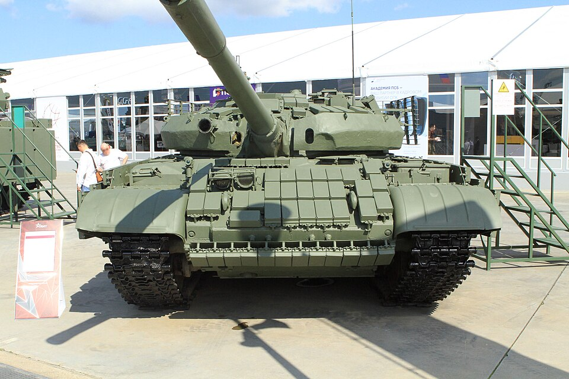

# Czołg podstawowy T-62M
### T-62M Main Battle Tank | Т-62М Основной боевой танк

---

## Opis

T-62M to modernizacja czołgu T-62 przeprowadzona w 1983 roku, mająca na celu przedłużenie żywotności bojowej przestarzałej platformy. Wprowadzono dodatkowy pancerz pasywny BDD (bloki kompozytowe na wieży i kadłubie), nowy system kierowania ogniem "Wołna" z dalmierzem laserowym, mocniejszy silnik W-55U (620 KM) oraz możliwość odpalania przeciwpancernych pocisków kierowanych 9M117 Bastion przez lufę armaty. Wariant z pancerzem reaktywnym Kontakt-1 (z 1985 r.) oznaczany jest jako **T-62MW**. T-62M pojawił się w Afganistanie i jest szeroko stosowany przez Rosję w wojnie w Ukrainie od 2022 roku.

## Dane techniczne

| Parametr | Wartość |
|----------|---------|
| Typ | Czołg podstawowy (modernizacja T-62) |
| Kraj produkcji | ZSRR |
| Rok modernizacji | 1983 |
| Masa bojowa | ok. 40–41,5 t (zwiększona przez pancerz BDD) |
| Uzbrojenie główne | Armata 115 mm 2A20 U-5TS (gładkolufowa) |
| Uzbrojenie dodatkowe | KM 7,62 mm PKT, WKCKM 12,7 mm DSzK; rakiety 9M117 Bastion |
| Silnik | W-55U diesel, 620 KM |
| System KO | "Wołna" z dalmierzem laserowym KTD-1/2 i przelicznikiem balistycznym |
| Pancerz dodatkowy | BDD (pasywny kompozyt) na wieży i glacis; T-62MW: ERA Kontakt-1 |
| Załoga | 4 osoby (dowódca, działonowy, ładowniczy, kierowca) |

## Charakterystyczne cechy rozpoznawcze

> Jak odróżnić T-62M od bazowego T-62:

- **Dwa podkowiaste bloki BDD na wieży:** półokrągłe, masywne bloki pancerza kompozytowego okalające armatę z obu stron — zmieniają sylwetkę wieży nie do poznania; usunięto też poręcze dla piechoty
- **Osłona termiczna lufy:** gruba, rurowa osłona ciągnie się wzdłuż lufy armaty — w bazowym T-62 lufa jest "gołą" rurą
- **Prostokątna skrzynka dalmierza laserowego nad jarzmem armaty:** widoczny z zewnątrz pancerny pojemnik tuż nad podstawą lufy
- **Gumowo-metalowe fartuchy boczne:** ekrany wzdłuż gąsienic, których brak w T-62 bazowym
- **T-62MW:** dodatkowo prostokątne kostki ERA Kontakt-1 przykrywające glacis i wieżę (identyczne jak na T-72B)
- **Wyrzutnie granatów dymnych:** skupisko 2×4 wyrzutni na tylnej ścianie wieży (po prawej stronie)

## Ciekawostka

> Pancerz BDD tak skutecznie wzmocnił ochronę T-62M, że czołek wieży stał się niemal równorzędny z wczesnymi wariantami T-64A i T-72 Ural. Gdy wywiad USA po raz pierwszy zaobserwował T-62M w Afganistanie, nie znając oficjalnego oznaczenia, nadał mu własny kod: **T-62E**. W Ukrainie zdobyczne T-62M bywają przebudowywane przez Ukraińców — zdejmują wieżę i instalują wieżę z BWP-2 z działkiem 30 mm, tworząc improwizowany ciężki wóz bojowy piechoty.
