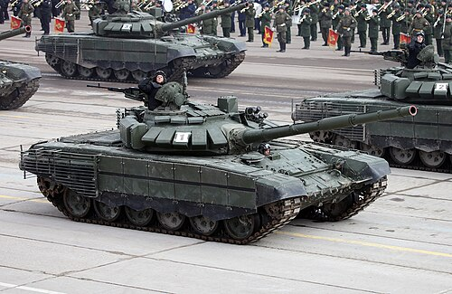
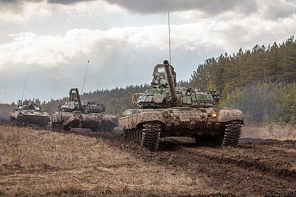

# Czołg podstawowy T-72
### T-72 Main Battle Tank | Т-72 Основной боевой танк

---

## Opis

T-72 to radziecki czołg podstawowy opracowany w latach 60. XX wieku jako tańsza i prostsza alternatywa dla T-64. Wszedł na wyposażenie Armii Radzieckiej w 1973 roku i stał się jednym z najszerzej produkowanych czołgów w historii — wyprodukowano ponad 20 000 egzemplarzy różnych wariantów. Służy do dziś w armiach ponad 40 krajów i jest podstawowym czołgiem Wojsk Lądowych Federacji Rosyjskiej, regularnie modernizowany do wersji T-72B3M. Brał udział w niemal wszystkich konfliktach zbrojnych od lat 80. XX wieku po dzień dzisiejszy, w tym w wojnie w Ukrainie.

## Dane techniczne

| Parametr | Wartość |
|----------|---------|
| Typ | Czołg podstawowy |
| Kraj produkcji | ZSRR / Rosja |
| Rok wprowadzenia | 1973 |
| Masa bojowa | 41,5–46 t (zależnie od wersji) |
| Długość (z działem) | 9,53 m |
| Szerokość | 3,59 m |
| Wysokość | 2,23 m |
| Uzbrojenie główne | Armata 125 mm 2A46M (gładkolufowa) |
| Uzbrojenie dodatkowe | CKM 7,62 mm PKT, CKM 12,7 mm NSVT |
| Silnik | W-84MS diesel, 840 KM (T-72B3: 1130 KM) |
| Prędkość maks. (droga) | 60–70 km/h |
| Zasięg | 460–700 km |
| Załoga | 3 osoby (dowódca, działonowy, kierowca) |
| Pancerz czoła wieży | kompozytowy + reaktywny ERA Kontakt-5 |

## Charakterystyczne cechy rozpoznawcze

> Jak odróżnić T-72 od T-80 i T-90:

- **Zaokrąglona, niska wieża:** charakterystyczny "grzyb" — wieża T-72 jest niższa i bardziej zaokrąglona niż wieża T-80, bez ostrego podciętego profilu
- **Brak osłony lufy (termicznej):** starsze warianty T-72 mają lufę bez charakterystycznej czarnej rury izolacyjnej; nowsze T-72B3 mają ją, ale cieńszą niż T-90M
- **Koła jezdne z dużymi otworami:** T-72 ma 6 dużych kół jezdnych z wyraźnymi okrągłymi otworami odciążającymi — T-80 ma koła pełne lub z mniejszymi otworami
- **Napęd gąsienicowy bez fartucha bocznego (lub z krótkim):** starsze T-72 nie mają pełnych gumowych fartuchów bocznych, widać górną część gąsienicy
- **ERA Kontakt-1 lub Kontakt-5:** T-72B pokryty jest charakterystycznymi prostokątnymi blokami pancerza reaktywnego na czole kadłuba i wieży
- **Silnik diesla — charakterystyczny dym:** T-72 jest napędzany silnikiem Diesla, przy przyspieszeniu wydziela czarny lub szarawy dym; T-80 (turbina gazowa) praktycznie nie dymuje

## Ciekawostka

> T-72 jest jedynym czołgiem na świecie, który wygrał starcie z wozem własnym — w 1991 roku podczas Operacji Pustynna Burza jeden iracki T-72 zniszczył innego irackiego T-72 wskutek pomyłki ogniowej (friendly fire). Co bardziej niesamowite, T-72 był produkowany w tylu krajach i wariantach, że zdarzało się, iż strony przeciwne używały identycznych egzemplarzy tego samego czołgu.
