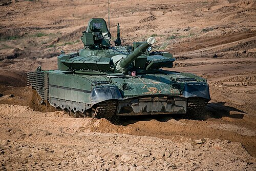
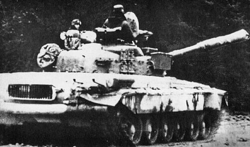

# Czołg podstawowy T-80
### T-80 Main Battle Tank | Т-80 Основной боевой танк

---

## Opis

T-80 to radziecki czołg podstawowy wyposażony w silnik turbinowy — jedyny seryjnie produkowany czołg na świecie z takim napędem. Wszedł na wyposażenie w 1976 roku i był uważany za najbardziej zaawansowany radziecki czołg swoich czasów. Turbina gazowa GTD-1000 pozwala na błyskawiczny rozruch nawet w temperaturach -40°C, co czyni T-80 szczególnie wartościowym na teatrze działań w Arktyce i Syberii. Rosja intensywnie modernizuje T-80 do wersji T-80BVM, wyposażając go w pancerz reaktywny Relikt, celownik termowizyjny i nowe uzbrojenie.

## Dane techniczne

| Parametr | Wartość |
|----------|---------|
| Typ | Czołg podstawowy |
| Kraj produkcji | ZSRR / Rosja |
| Rok wprowadzenia | 1976 |
| Masa bojowa | 42,5–46 t |
| Długość (z działem) | 9,9 m |
| Szerokość | 3,4 m |
| Wysokość | 2,2 m |
| Uzbrojenie główne | Armata 125 mm 2A46M-4 (gładkolufowa) |
| Uzbrojenie dodatkowe | CKM 7,62 mm PKT, CKM 12,7 mm NSVT |
| Silnik | Turbina gazowa GTD-1000TF, 1 000 KM (T-80BVM: 1 250 KM) |
| Prędkość maks. (droga) | 70–80 km/h |
| Zasięg | 335–500 km |
| Załoga | 3 osoby |
| Pancerz czoła wieży | Kompozytowy + ERA Relikt (T-80BVM) |

## Charakterystyczne cechy rozpoznawcze

> Jak odróżnić T-80 od T-72 i T-90:

- **Brak dymu przy ruszaniu:** silnik turbinowy T-80 jest praktycznie bezdymny — w odróżnieniu od diesla T-72/T-90, które przy zimnym starcie lub pełnym gazie wydzielają wyraźny dym
- **Charakterystyczny wizjer kierowcy z przodu kadłuba po lewej:** rozmieszczenie przyrządów obserwacyjnych kierowcy jest inne niż w T-72
- **Pełne koła jezdne z gumową opaską:** T-80 ma koła jezdne bez otworów odciążających (pełne), podczas gdy T-72 ma koła z dużymi okrągłymi otworami
- **Wieża o bardziej ostrym, podciętym profilu:** wieża T-80BU/BVM jest nieco bardziej kanciastą konstrukcją niż "grzyb" T-72
- **ERA Relikt w wersji BVM:** bloki pancerza reaktywnego Relikt są większe i o innym kształcie niż Kontakt-5 na T-72B — rozmieszczone gęściej na czole wieży
- **Układ wydechowy po lewej stronie kadłuba:** turbina gazowa ma charakterystyczny duży okrągły wylot spalin po lewej stronie tylnej części kadłuba

## Ciekawostka

> T-80 jest jedynym czołgiem, który podczas walk w Groznym w 1994–1995 roku poniósł katastrofalne straty nie z powodu wad konstrukcyjnych, lecz błędów taktycznych — wysyłano go bez piechoty wsparcia w wąskie uliczki miejskie. Paradoksalnie te same czołgi doskonale sprawdziły się w Syrii, gdzie stosowano je z właściwą taktyką. Turbina gazowa T-80 zużywa przy tym tyle paliwa, że wojsko rosyjskie żartowało, iż czołg "pije jak samolot".
