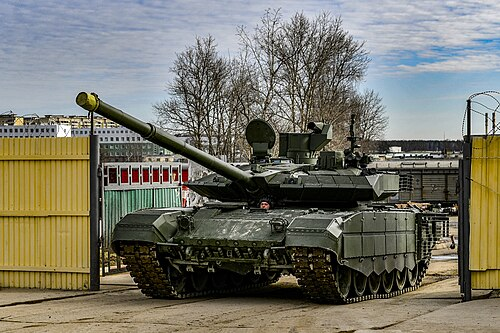
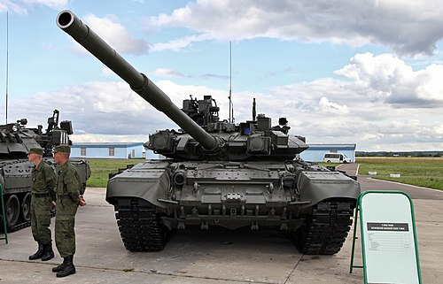

# Czołg podstawowy T-90
### T-90 Main Battle Tank | Т-90 Основной боевой танк

---

## Opis

T-90 to rosyjski czołg podstawowy będący głęboką modernizacją T-72, wprowadzony do służby w 1992 roku. Stanowi połączenie sprawdzonego kadłuba T-72 z wieżą i systemem kierowania ogniem zaczerpniętymi z T-80U. Kluczową cechą wyróżniającą jest system aktywnej ochrony Sztora-1, który zakłóca systemy naprowadzania przeciwpancernych pocisków kierowanych. Najnowsza wersja T-90M „Proryw" wyposażona jest w nową spawaną wieżę z pancerzem reaktywnym Relikt, celownik Sosna-U z kamerą termowizyjną i silnik W-92S2F o mocy 1 130 KM. T-90M to aktualnie najnowocześniejszy seryjnie produkowany czołg rosyjskiej armii.

## Dane techniczne

| Parametr | Wartość |
|----------|---------|
| Typ | Czołg podstawowy |
| Kraj produkcji | Rosja |
| Rok wprowadzenia | 1992 (T-90M: 2020) |
| Masa bojowa | 46,5–48 t |
| Długość (z działem) | 9,53 m |
| Szerokość | 3,78 m |
| Wysokość | 2,22 m |
| Uzbrojenie główne | Armata 125 mm 2A46M-5 |
| Uzbrojenie dodatkowe | CKM 7,62 mm PKT, CKM 12,7 mm Kord |
| Silnik | W-92S2F diesel, 1 130 KM |
| Prędkość maks. (droga) | 65–70 km/h |
| Zasięg | 550–700 km |
| Załoga | 3 osoby |
| System aktywnej ochrony | Sztora-1 (zakłócacz IR) |

## Charakterystyczne cechy rozpoznawcze

> Jak odróżnić T-90 od T-72 i T-80:

- **Dwie czerwone "oczy" po bokach lufy:** charakterystyczne podczerwone reflektory systemu Sztora-1 umieszczone symetrycznie po obu stronach lufy — unikalny element nieobecny w T-72 ani T-80
- **Nowa spawana wieża T-90M:** wersja M posiada charakterystyczną, bardziej kanciastą wieżę z pionowymi ścianami, wyraźnie różniącą się od zaokrąglonej wieży T-72 i T-90A
- **ERA Relikt na całym czole:** bloki pancerza reaktywnego pokrywają gęsto czoło kadłuba i wieży, tworząc charakterystyczny "ceglany" wzór
- **Termowizja w wieży — wypukła kopułka po lewej stronie:** czujnik termowizyjny celownika Sosna-U to wyraźnie widoczny okrągły moduł po lewej stronie wieży
- **Lufa z rękawem termicznym i wycieraczką:** T-90A/M ma grubą czarną osłonę termiczną lufy oraz wycieraczką u nasady — bardziej masywną niż w T-72
- **Krata przeciwkumulacyjna na tylnej ścianie wieży:** T-90M wyposażony jest w charakterystyczną kratownicową osłonę tylnej części wieży

## Ciekawostka

> W 2016 roku podczas walk w Syrii T-90A przeżył bezpośrednie trafienie pociskiem TOW-2A — nagranie zostało opublikowane przez rebeliantów jako dowód zniszczenia czołgu, tymczasem T-90 odjechał o własnych siłach. Analiza wykazała, że system Sztora-1 zakłócił laserowe naprowadzanie pocisku w ostatniej chwili, a pancerz reaktywny pochłonął większość energii kumulacyjnej. To nagranie stało się niezamierzoną reklamą rosyjskiego czołgu na całym świecie.
