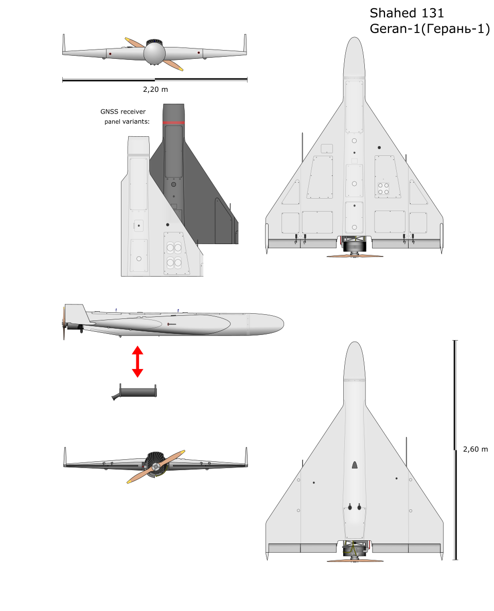

# Geran-1 (Shahed-131) — mały dron kamikaze
### Shahed-131 / Geranium-1 | Герань-1

---

## Opis

Geran-1 (irański oryginał: Shahed-131) to mniejszy wariant drona kamikaze z tej samej irańskiej rodziny co Geran-2/Shahed-136. Stosowany przez Rosję do ataków na cele o mniejszym opancerzeniu lub w połączeniu z większymi Geranami-2 w masowych atakach. Lżejszy i tańszy od Gerana-2, ale z zasięgiem ok. 900 km. Używa silnika Wankla Serat-1 — innego niż tłokowy Mado MD-550 w Geranie-2. W ataków Rosja często miesza Geran-1 i Geran-2 w jednej salwie, by utrudnić obronę przeciwlotniczą kalkulowanie kosztów zestrzelenia.

## Dane techniczne

| Parametr | Wartość |
|----------|---------|
| Typ | Mały dron kamikaze dalekiego zasięgu |
| Kraj produkcji | Iran (HESA) dla Rosji |
| Rok pierwszego użycia na Ukrainie | Październik 2022 |
| Długość | ok. 2,0 m |
| Rozpiętość skrzydeł | ok. 2,5 m (mniejszy niż Geran-2) |
| Masa | ok. 200 kg (szacunkowo, podobna do Shahed-136 ale mniejszy) |
| Głowica | ok. 15 kg materiałów wybuchowych |
| Silnik | Wankel Serat-1 (38 KM), kopia chińskiego silnika Wankla |
| Prędkość lotu | 180–200 km/h |
| Zasięg | ok. 900 km |
| Nawigacja | INS + GPS |

## Charakterystyczne cechy rozpoznawcze

> Jak odróżnić Geran-1 od Geran-2:

- **Mniejszy rozmiar** — w powietrzu Geran-1 jest wyraźnie mniejszy od Gerana-2; przy porównaniu dwóch dronów obok siebie różnica jest widoczna, ale bez punktu odniesienia trudna do ocenienia
- **Te same skrzydła delta i stateczniki pionowe ku górze** — identyczna geometria jak Geran-2 (stateczniki TYLKO pionowo w górę, brak dolnych); kształt skrzydeł prawie identyczny z Geranem-2
- **Dźwięk: silnik Wankla vs tłokowy** — Geran-1 ma silnik Wankla (Serat-1); dźwięk jest nieco „gładzszy" i mniej „perkusyjny" niż tłokowy Geran-2; oba są jednak głośne i łatwe do identyfikacji akustycznej
- **Mniejsza głowica** — 15 kg vs 50 kg; efekty trafień są mniej spektakularne i widoczne
- **Zachowanie w ataku identyczne z Geranem-2** — nurkowanie na cel pod kątem; ta sama taktyka masowych ataków salwą nocną

## Ciekawostka

> Mieszane ataki Geran-1 + Geran-2 zmuszają ukraińską OPL do trudnych decyzji ekonomicznych: rakieta Patriot PAC-2 kosztuje ok. 4 mln USD — zestrzelenie nią drona za 20 tys. USD to przelicznik 200:1. Dlatego Ukraina sięga po artylerię, Geparda i sieci anty-dronów zamiast rakiet. Zestrzelone drony Geran-1 rozkładano na części; inżynierowie odkryli, że użyty przez Ir Serat-1 to kopie chińskich silników Wankla, które z kolei są kopiami silników brytyjskich z lat 60.
