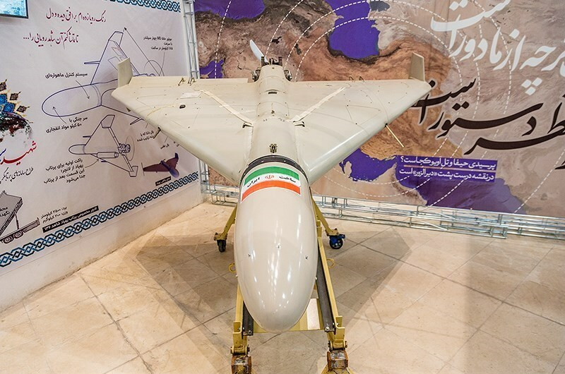

# Geran-2 (Shahed-136) — dron kamikaze dalekiego zasięgu
### Shahed-136 / Geranium-2 | Герань-2

---

## Opis

Geran-2 (irańska nazwa: Shahed-136) to irański dron kamikaze (loitering munition) produkowany w Iranie i dostarczany Rosji od 2022 r. Rosja nadała mu nazwę „Geran-2" (Geranium-2) i stosuje go masowo do ataków na infrastrukturę energetyczną Ukrainy — elektrownie, podstacje, ciepłownie. Jest jednorazowy: po dotarciu do celu nurkuje i detonuje 50-kilogramową głowicę odłamkowo-burzącą. Produkowany z tanich podzespołów cywilnych, kosztuje ok. 20–30 tys. USD — wielokrotnie mniej niż rakieta manewrująca. Ukraina zestrzeluje go masowo za pomocą systemów artyleryjskich, Gepardów, dronów FPV i sieci obrony powietrznej.

## Dane techniczne

| Parametr | Wartość |
|----------|---------|
| Typ | Dron kamikaze (loitering munition) dalekiego zasięgu |
| Kraj produkcji | Iran (Shahed Electronics Industries) dla Rosji |
| Rok pierwszego użycia na Ukrainie | Październik 2022 |
| Długość | 3,5 m |
| Rozpiętość skrzydeł | 2,5 m |
| Masa startowa | ok. 200 kg |
| Głowica | 50 kg materiałów wybuchowych (odłamkowo-burząca) |
| Silnik | Mado MD-550 (kopia cywilna), 2-suwowy, ok. 50 KM |
| Napęd | Śmigło pchające z tyłu kadłuba |
| Prędkość lotu | 185–195 km/h |
| Zasięg | 900–2 500 km (różne dane) |
| Nawigacja | GPS + INS (odporny na zakłócenia) |

## Charakterystyczne cechy rozpoznawcze

> Jak rozpoznać Gerana-2 w powietrzu:

- **Skrzydła delta z prostymi statecznikami pionowymi TYLKO do góry** — trójkątne skrzydło delta z charakterystycznym kątem, a nad skrzydłami sterczą dwa pionowe stateczniki; nie ma stateczników skierowanych ku dołowi
- **Śmigło z tyłu (pchające)** — silnik na tylnym końcu kadłuba z małym śmigłem pchającym; widoczne z tyłu jako kręcące się koło
- **Dźwięk: głośny „kosiarz" lub „motorower"** — odgłos 2-suwowego silnika spalinowego słyszalny z odległości 5+ km; zupełnie inny od drona quadcoptera czy odrzutowego
- **Leci wolno i nisko** — ok. 185 km/h, często poniżej 100–200 m; zachowuje prosty kurs; obserwator z ziemi ma kilkanaście sekund na reakcję
- **Biały lub szaro-brązowy kolor** — typowo malowany w jasnym odcieniu; w nocy praktycznie niewidoczny wizualnie, ale słyszalny
- **Zachowanie: nurkowanie na cel** — w fazie ataku wyraźnie zmienia kurs pionowy i przyspiesza; widoczny jako nurkowanie pod kątem ok. 30–45°

## Ciekawostka

> Iran i Rosja zaprzeczały, że Geran-2 jest irańskim Shahedem-136 — aż do czasu, gdy na polach Ukrainy zestrzelono tysiące dronów z irańskimi oznaczeniami i podzespołami z Iranu, Chin, USA i Niemiec. Analitycy OSINT (open-source intelligence) udokumentowali każdy element z tabliczkami znamionowymi. Do początku 2025 r. Ukraina zestrzelała ponad 8 000 dronów Geran/Shahed — a Rosja produkowała je na własnym terytorium (fabryka w Ałabugi).
