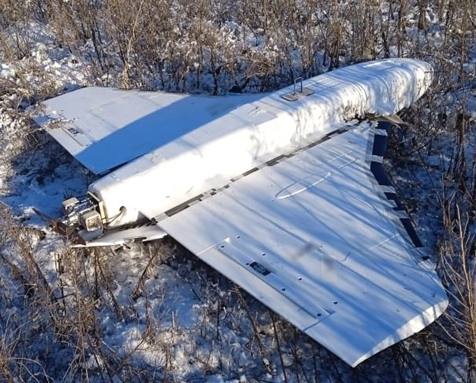

# Gerbera — wielozadaniowy dron kamikaze małego zasięgu
### Gerbera (Герберa) | Герберa

---

## Opis

Gerbera to rosyjski dron kamikaze opracowany i wdrożony od lipca 2024 r. Zaprojektowany jako tańsza i prostsza alternatywa dla Gerana-2 do ataków na cele bliższe linii frontu. Skonstruowany z tektury, pianki i sklejki — materiałów budowlanych kupowanych w sklepach, co utrudnia sankcjonowanie produkcji. Waży ok. 10–15 kg, przenosi ładunek do 5 kg. Może spełniać trzy role: kamikaze (uderzenie w cel), rozpoznawczą (transmisja obrazu) lub przekaźnika (relay dla innych dronów, zwiększanie zasięgu). Pomimo prymitywnej budowy, tani koszt (ok. 10 000 USD) sprawia, że może być produkowany masowo. Ukraiński wywiad jako pierwszy potwierdził jego istnienie po zestrzeleniu pierwszego egzemplarza.

## Dane techniczne

| Parametr | Wartość |
|----------|---------|
| Typ | Wielozadaniowy dron kamikaze / rozpoznawczy krótkiego zasięgu |
| Kraj produkcji | Rosja |
| Rok pierwszego użycia na Ukrainie | Lipiec 2024 |
| Długość | ok. 2,0 m |
| Rozpiętość skrzydeł | ok. 2,5 m |
| Masa | ok. 10–15 kg |
| Ładunek / głowica | do 5 kg |
| Zasięg | 300–600 km (w zależności od roli) |
| Koszt szacunkowy | ok. 10 000 USD |
| Materiały budowy | Sklejka, pianka polistyrenowa, karton |

## Charakterystyczne cechy rozpoznawcze

> Jak rozpoznać Gerberę:

- **Podobna sylwetka do Gerana-2** — delta skrzydła, śmigło pchające; ale wyraźnie mniejszy i lżejszy; wykonany z widocznie innego materiału
- **„Mebel" zamiast metalu** — skrzynia Gerbery wygląda jak zmontowana ze sklejki; na bliski dystans widać surowy materiał i szpachle zamiast kompozytu; „dron z IKEA" wg ukraińskich komentatorów
- **Brak charakterystycznych cech aerodynamicznych Shahed** — nie jest wierną kopią Shahed-136; własna prosta geometria skrzydeł
- **Trzy role = jeden egzemplarz** — dron może być wystrzelony jako kamikaze lub jako dron trwały (recon/relay); nie ma zewnętrznych oznak wskazujących na konkretną rolę przed startem

## Ciekawostka

> Gerbera to prawdopodobnie celowa odpowiedź rosyjskiego przemysłu na sankcje: budowa z materiałów ogólnodostępnych (sklejka, pianka), podzespołów elektronicznych z rynku cywilnego i prostego silnika sprawia, że sankcje ITAR i EU na zaawansowane półprzewodniki mają mniejszy wpływ na produkcję. Analiza zestrzelonych Gerber wykazała podzespoły firm: Analog Devices, Texas Instruments, NXP, STMicroelectronics i U-Blox — wszystkie kupowane przez podstawione firmy z sankcjonowanych krajów.
