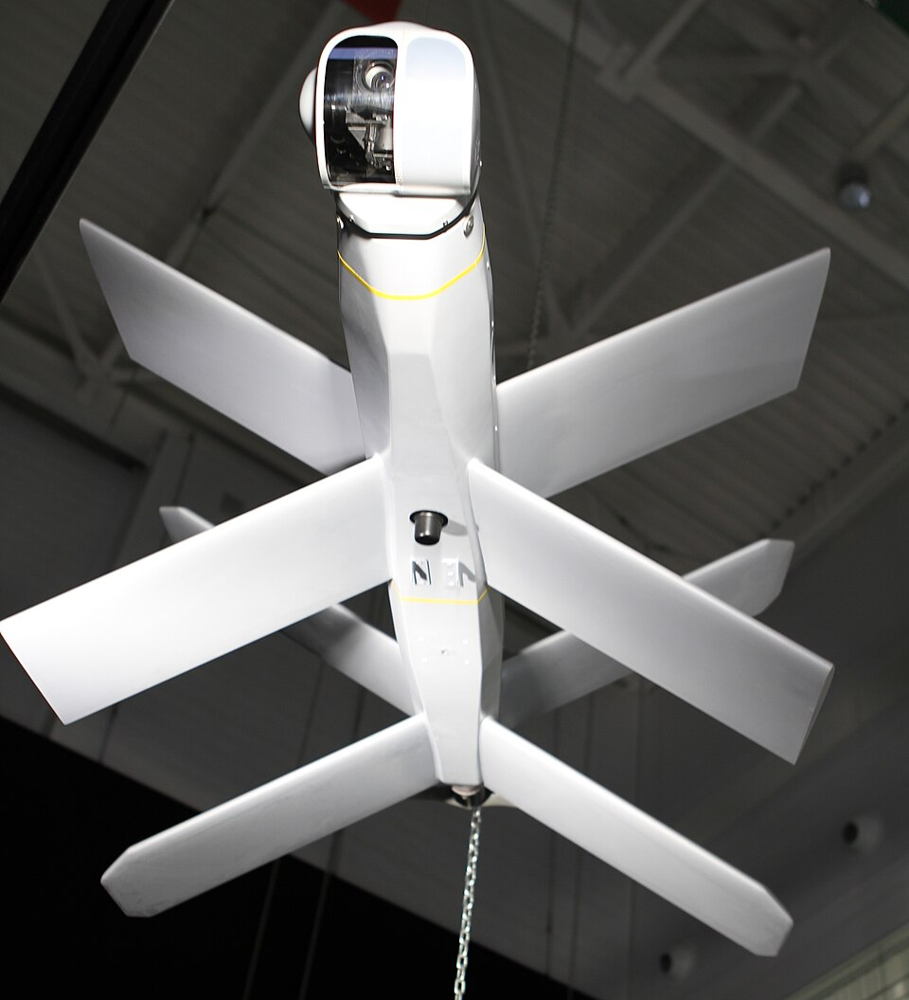

# Lancet — precyzyjny dron kamikaze (loitering munition)
### ZALA Lancet / Lancet-3 | Ланцет

---

## Opis

Lancet to rosyjski precyzyjny dron kamikaze produkowany przez ZALA Aero Group (filię Kałasznikowa) od 2019 r. W odróżnieniu od Gerana-2 przeznaczonego do ataków na infrastrukturę, Lancet to broń precyzyjna służąca do niszczenia konkretnych celów wojskowych — artylerii, radarów, śmigłowców na ziemi, wozów bojowych. Jego optyczny system naprowadzania potrafi śledzić cel do ostatniej chwili, co daje celność w metrach. Lancet-3 z głowicą 3 kg zniszczył setki ukraińskich dział artyleryjskich, w tym haubice M777, holowane działa 2A65 i wyrzutnie HIMARS. Stał się jedną z najbardziej skutecznych broni precyzyjnych rosyjskiej armii w tej wojnie.

## Dane techniczne

| Parametr | Wartość |
|----------|---------|
| Typ | Precyzyjny dron kamikaze (loitering munition taktyczny) |
| Kraj produkcji | Rosja (ZALA Aero Group / Kalashnikov Concern) |
| Rok wprowadzenia | 2019 (Lancet-1), 2022 (Lancet-3 w masowym użyciu) |
| Rozpiętość skrzydeł | ok. 0,95 m (Lancet-3) |
| Masa | ok. 12 kg (Lancet-3) |
| Głowica | 3 kg (Lancet-3) lub 1 kg (Lancet-1) |
| Napęd | Silnik elektryczny (cichy) |
| Prędkość | 80–110 km/h |
| Zasięg operacyjny | 40 km |
| Wytrzymałość | ok. 30 minut |
| Naprowadzanie | Optyczno-elektroniczne (TV/IR) z korekcją GPS |

## Charakterystyczne cechy rozpoznawcze

> Jak rozpoznać Lancet w powietrzu i na materiale wideo:

- **Kształt X (krzyżowy) skrzydeł** — absolutnie unikalna cecha: cztery małe skrzydełka ułożone w literę X lub + (w rzucie z przodu); żaden inny dron bojowy nie ma takiego układu; widoczne na nagraniach jako „latający X"
- **Bardzo cichy lot** — silnik elektryczny; na nagraniach ledwo słyszalny; dron pojawia się „znikąd" dla celów bez optycznego rozpoznania
- **Mały i zwinny** — szybkie ruchy korekcyjne w ostatniej fazie ataku; typowy atak: dron zatacza szeroki łuk, po czym nurkuje z góry na cel
- **Kamera w nosie** — transmituje obraz do operatora w czasie rzeczywistym przez cały lot; na rosyjskich nagraniach wideo widać charakterystyczny prostokątny kadr nagrania z nakierowanym celem
- **Nurkuje pionowo** — finalny atak zwykle prawie pionowy (60–90°), by trafić w górę słabo opancerzonego pojazdu; odróżnia od poziomego lotu Gerana
- **Rozmieszczany ze środka transportu** — startuje z kontenera lub katapulty na samochodzie ciężarowym; na zdjęciach rozpoznawalny jako zestaw ZALA w obudowie skrzyniowej

## Ciekawostka

> Nagrania ataków Lancetów stały się hitem w rosyjskich mediach społecznościowych jako propaganda. Ukraina zareagowała mocując sieci stalowe nad artylerią (tzw. „żółwiochrony" lub „daszki") — gruba siatka druciana nad M777 lub HIMARS'em sprawia, że Lancet detonuje za wcześnie, zanim trafi w podwozie. Ta improwizowana taktyka ochrony kosztuje kilkaset dolarów vs kilkanaście tysięcy za Lancet — przykład asymetrycznej odpowiedzi na precyzyjne uzbrojenie.
