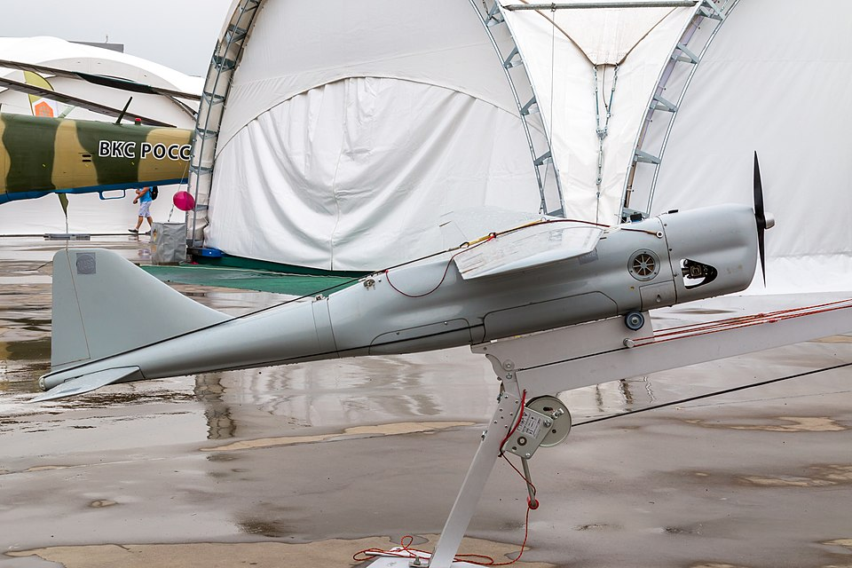

# Orlan-10 — taktyczny dron rozpoznawczy
### STC Orlan-10 | Орлан-10

---

## Opis

Orlan-10 to rosyjski taktyczny bezzałogowy statek powietrzny (BSP) klasy rozpoznawczej, produkowany przez Specjalne Centrum Technologiczne (STC) z Sankt Petersburga. Wszedł do użytku w 2010 r. i stał się podstawowym dronem obserwacyjnym rosyjskiej armii. W Ukrainie używany masowo do korekty ognia artyleryjskiego — wynosi w powietrze kamery i przekazuje obraz do artylerzystów na ziemi. Odgrywa kluczową rolę w rosyjskim systemie wywiadowczym: lokalizuje ukraińskie pozycje, śledzi ruch wojsk i naprowadza rakiety i drony kamikaze. Ukraina zestrzelała tysiące Orlanów — były cennym źródłem wiedzy o rosyjskiej elektronice (używał chińskich chipów, japońskich kamer Sony, kanadyjskich silników).

## Dane techniczne

| Parametr | Wartość |
|----------|---------|
| Typ | Taktyczny dron rozpoznawczy (ISR) |
| Kraj produkcji | Rosja (STC, Sankt Petersburg) |
| Rok wprowadzenia | 2010 |
| Rozpiętość skrzydeł | ok. 3,1 m |
| Masa startowa | ok. 15 kg |
| Ładunek użyteczny | do 6 kg (kamera dzienna/nocna, nadajnik zakłóceń) |
| Silnik | 3W-28i (kopia silnika modelarskiego), benzyna + olej |
| Prędkość maks. | 150 km/h |
| Prędkość przelotowa | 90–120 km/h |
| Wytrzymałość | do 16 godzin |
| Zasięg transmisji | 120 km (łącze radiowe) |
| Pułap operacyjny | do 5 000 m |
| Start | katapulta gumowa lub pneumatyczna |
| Lądowanie | na spadochronie |

## Charakterystyczne cechy rozpoznawcze

> Jak rozpoznać Orlan-10 w powietrzu i na ziemi:

- **Klasyczny kształt małego samolotu** — konwencjonalne skrzydło, kadłub i usterzenie; nie wygląda jak skrzydło delta ani quadcopter; mylony z modelem samolotu
- **Śmigło pchające z tyłu** — silnik zamontowany z tyłu kadłuba ze śmigłem pchanym; charakterystyczne przy oglądalniu od tyłu lub boku
- **Mały, lekki i cichy** — 15 kg i silniczek 28 cm³; dźwięk to ciche buczenie/cykanie piston silnika; trudny do usłyszenia z ziemi przy wietrze
- **Lata w kółko wysoko i długo** — typowe zachowanie: okrąża cel lub obszar w dużych kręgach na wysokości 500–2 000 m; może pozostać w powietrzu 16 godzin bez lądowania
- **Jasny kolor** — malowany na biało lub szaro; bardzo trudny do zauważenia na jasnym niebie
- **Prymitywna budowa** ze znanych podzespołów cywilnych — zestrzelone egzemplarze miały kamerę Sony α6000 wyjętą ze sklepu, kanadyjski silnik Saito, chińskie kontrolery lotu i GPS bez protekcji przeciw zagłuszaniu

## Ciekawostka

> Analiza zestrzelonych Orlanów-10 ujawniła, że Rosja montowała w nich mapy terenu Ukrainy... wydrukowane na zwykłych drukarkach A4, laminowane i przyklejone taśmą klejącą w środku kadłuba. Silniki oznaczono literami „L" i „P" (lewy/prawy) dla mechanika długopisem. Jeden z Orlanów-10 zestrzelony nad Ukrainą miał w środku butelkę rozkazu lotu i tablicę informującą, kto jest właścicielem drona — po imieniu i nazwisku żołnierza.
