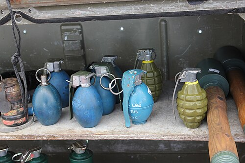

# Granat ręczny F-1
### F-1 Hand Grenade | Ф-1 («Лимонка»)

---

## Opis

F-1 (Ф-1, potocznie "Limonka" — Cytrynka) to radziecki defensywny odłamkowy granat ręczny z żeliwną obudową rowkowaną, opracowany w ZSRR w latach 40. na bazie francuskiego granatu F1 (stąd oznaczenie) i przyjęty masowo do służby. Jest to granat defensywny — zasięg odłamków do 200 m, wymagający ukrycia strzelca za przeszkodą po rzucie. Rowkowana żeliwna obudowa rozpada się na ok. 290 ciężkich odłamków zdolnych do rażenia na duże odległości. F-1 używa standardowego zapalnika UZRGM (3,2–4,2 s opóźnienia). Jest jednym z najbardziej rozpoznawalnych granatów ręcznych na świecie — stosowany w ponad 50 krajach i przez niezliczone siły nieregularne; produkowany masowo przez ZSRR przez dekady.

## Dane techniczne

| Parametr | Wartość |
|----------|---------|
| Typ | Odłamkowy granat ręczny (defensywny) |
| Kraj produkcji | ZSRR / Rosja |
| Rok wprowadzenia | lata 40. |
| Masa | 600 g |
| Masa ładunku | 60 g TNT |
| Długość | 130 mm |
| Średnica | 55 mm |
| Czas opóźnienia zapalnika | 3,2–4,2 s |
| Zasięg odłamków | do 200 m |
| Zasięg rzutu | 20–40 m |

## Charakterystyczne cechy rozpoznawcze

> Jak odróżnić F-1 od RGD-5 i zachodnich granatów:

- **Charakterystyczna "ananasowa" siatka rowków na obudowie:** F-1 ma ikoniczną rowkowaną żeliwną obudowę — pionowe i poziome rowki tworzące charakterystyczną kratkę "ananasową"; RGD-5 jest gładki; ta rowkowana faktura jest absolutnym identyfikatorem F-1
- **Cięższy od RGD-5 — 600 g vs 310 g:** F-1 jest prawie dwa razy cięższy od RGD-5; przy trzymaniu w dłoni różnica masy jest natychmiast wyczuwalna; ciężar F-1 jest charakterystyczny
- **Cytrynowaty kształt — nie jajko, ale "cytryna":** F-1 ma charakterystyczny kształt przypominający cytrynę — lekko podłużny, nieco spłaszczony; stąd potoczna nazwa "Limonka"; RGD-5 jest bardziej "jajowaty"
- **Żeliwna obudowa — ciemnostalowa lub szara barwa:** F-1 ma charakterystyczną ciemnostalową lub szarawą barwę żeliwa — inną od ciemnozielonej stali RGD-5; przy porównaniu tekstura powierzchni jest też inna (żeliwo vs stal)
- **Ten sam zapalnik UZRGM co RGD-5 — góra granatu wygląda identycznie:** zapalnik na górze F-1 i RGD-5 jest identyczny (UZRGM); patrząc tylko na zapalnik nie można odróżnić; różnica jest w korpusie granatu
- **Defensywny — rzucany z ukrycia, nie z otwartego terenu:** F-1 ze względu na zasięg odłamków 200 m jest używany wyłącznie z ukrycia za solidną przeszkodą; żołnierz rzucający F-1 na otwartym terenie naraża siebie; ta taktyczna właściwość odróżnia F-1 od "ofensywnego" RGD-5

## Ciekawostka

> F-1 "Limonka" stała się symbolem rosyjskiej przestępczości zorganizowanej lat 90. — bo była masowo dostępna na czarnym rynku po rozpadzie ZSRR. Magazyny wojskowe były rozkradane tysiącami; F-1 kosztowała na czarnym rynku kilka dolarów. W efekcie "Limonki" były używane do zastraszania i eliminowania rywali przez grupy gangsterskie w całej byłej FSB. Rosyjska policja szacowała, że w samej Moskwie skradziono w latach 1992–1996 ponad 100 000 granatów F-1 z magazynów wojskowych — z czego część nigdy nie odzyskano.

