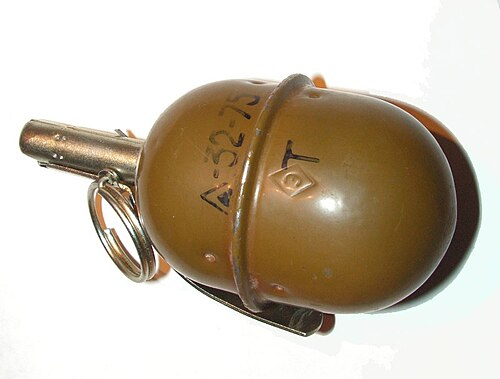

# Granat ręczny RGD-5
### RGD-5 Hand Grenade | РГД-5

---

## Opis

RGD-5 (Ручная Граnatа Дистанционная-5) to radziecki odłamkowy granat ręczny z zapalnikiem czasowym UZRGM, opracowany w końcu lat 40. i przyjęty do służby w 1954 roku jako zastępnik granatu RG-42. Jest standardowym ofensywnym granatem ręcznym radzieckiej i rosyjskiej armii przez ponad 70 lat. Stalowa koperta rozrywa się na odłamki — zasięg rozrzutu odłamków 15–20 m (granat ofensywny, rażenie mniejsze niż F-1). Zapalnik UZRGM daje 3,2–4,2 sekundy opóźnienia od wyciągnięcia zawleczki do wybuchu. RGD-5 jest masowo eksportowany — stosowany przez armie ponad 40 państw i setki nieregularnych sił zbrojnych na całym świecie.

## Dane techniczne

| Parametr | Wartość |
|----------|---------|
| Typ | Odłamkowy granat ręczny (ofensywny) |
| Kraj produkcji | ZSRR / Rosja |
| Rok wprowadzenia | 1954 |
| Masa | 310 g |
| Masa ładunku | 110 g TNT |
| Długość | 117 mm |
| Średnica | 58 mm |
| Czas opóźnienia zapalnika | 3,2–4,2 s |
| Zasięg odłamków | 15–20 m |
| Zasięg rzutu | 30–50 m |

## Charakterystyczne cechy rozpoznawcze

> Jak odróżnić RGD-5 od F-1 i zachodnich granatów:

- **Gładka jajowata / cylindryczna obudowa bez rowkowania:** RGD-5 ma gładką stalową obudowę bez charakterystycznej "ananasowej" siatki rowków jak F-1; kształt jest jajowaty lub cylindryczno-stożkowy; ta gładkość jest kluczowym wyróżnikiem od F-1
- **Mniejszy i lżejszy od F-1 — 310 g vs 600 g:** RGD-5 jest wyraźnie mniejszy i lżejszy od F-1; przy trzymaniu obu granatów naraz różnica masy (niemal 2:1) jest natychmiast wyczuwalna
- **Zapalnik UZRGM z metalową kapsułką i zawleczką — standardowy radziecki:** zapalnik UZRGM jest standardowy dla rodziny radzieckich granatów; charakterystyczny metalowy "kapturek" zapalnika na górze granatu z zawleczką po boku
- **Zielono-oliwkowy kolor z czarnym lub żółtym oznaczeniem:** RGD-5 ma zazwyczaj ciemnooliwkowy (khaki) kolor; na górze lub boku widoczne oznaczenia (czasem żółte paski wskazujące typ ładunku); F-1 ma podobny kolor, ale inną fakturę powierzchni
- **Jajowaty kształt — "jajko granatowe":** sylwetka RGD-5 jest typowym "jajkiem" — zaokrąglony dół, nieco zwężający się ku górze zapalnika; F-1 jest bardziej cylindryczny z wyraźnym ulistnieniem rowków
- **Zasięg rozrzutu 15–20 m — granat "ofensywny":** RGD-5 ma mniejszy zasięg odłamków niż F-1 (do 200 m); dlatego można go rzucić z otwartego terenu bez ukrycia; F-1 wymaga ukrycia po rzucie ze względu na duży zasięg odłamków

## Ciekawostka

> RGD-5 ma jedną słabość, która kosztowała życie wielu żołnierzy radzieckich w Afganistanie — krótka zawleczka łatwo wypadała przy noszeniu w kieszeni lub plecaku bez specjalnej kabury. Wypadnięcie zawleczki bez zapalnika UZRGM nie powoduje wybuchu — ale wypadnięcie zawleczki Z zapalnikiem już tak. W rezultacie w Afganistanie wprowadzono obowiązek noszenia granatów w specjalnych kasetach i zabezpieczania zawleczki taśmą. Ta prosta poprawka — kawałek taśmy na zawleczce — uratowała więcej żołnierzy radzieckich niż niejeden nowy system broni.

