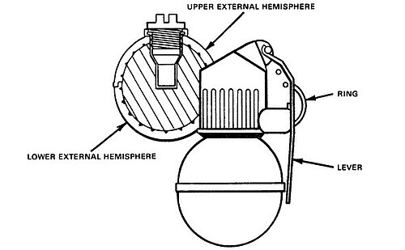

# Granat ręczny RGN
### RGN Hand Grenade | РГН (Ручная Граната Наступательная)

---

## Opis

RGN (Ручная Граната Наступательная — Ręczny Granat Natarcia) to radziecki ofensywny granat ręczny z zapalnikiem udarowo-czasowym opracowany w TsNIITochMash i przyjęty do służby w 1981 roku jako modernizacja RGD-5. Wyróżnia się zapalnikiem uderzeniowym UD (ударный детонатор) — granat wybucha przy uderzeniu w cel (przy padaniu na ziemię lub w przeszkodę), bez czekania na wygaśnięcie zapalnika czasowego; jeśli udar nie zadziała, jako rezerwa aktywuje się zapalnik czasowy (3,5 s). Dwuczłonowa aluminiowa obudowa z wewnętrzną warstwą odłamkującą daje jednolitą chmurę odłamków. Zasięg rażenia podobny do RGD-5 (15–20 m), ale zapalnik uderzeniowy eliminuje problem "toczącego się granatu z opóźnieniem".

## Dane techniczne

| Parametr | Wartość |
|----------|---------|
| Typ | Ofensywny granat ręczny z zapalnikiem uderzeniowym |
| Kraj produkcji | ZSRR / Rosja |
| Rok wprowadzenia | 1981 |
| Masa | 310 g |
| Masa ładunku | 114 g A-IX-1 |
| Długość | 113 mm |
| Średnica | 60 mm |
| Zapalnik | Uderzeniowy + czasowy 3,5 s rezerwa |
| Zasięg odłamków | 15–20 m |
| Zasięg rzutu | 25–45 m |

## Charakterystyczne cechy rozpoznawcze

> Jak odróżnić RGN od RGD-5 i RGO:

- **Aluminiowa obudowa w dwóch kształtach ze szwem pośrodku:** RGN ma charakterystyczną dwuczłonową aluminiową obudowę — dolna półkula połączona z górną z wyraźnym "szwem" pośrodku; RGD-5 ma jednoczęściową stalową obudowę; ten szew jest identyfikatorem całej rodziny RGN/RGO
- **Brak rowkowania — gładka z zaznaczonym szwem:** RGN jest gładki jak RGD-5 (bez rowkowania jak F-1), ale z charakterystycznym szwem środkowym; wizualnie "gładka kula z linią pośrodku"
- **Aluminiowy matowy kolor — srebrzysto-szary zamiast stalowego zielonego:** RGN jest z aluminium; kolor jest srebrzysto-szary lub ciemnoszary z matowym wykończeniem; RGD-5 jest ciemnozielony; F-1 — stalowoszary żeliwo; kolor aluminium jest charakterystyczny
- **Zapalnik z "nitką" do uzbrojeniana — widoczna zmiana w zapalnikowym kapturku:** zapalnik RGN ma nieco inny wygląd niż UZRGM granatu RGD-5; kapturek zapalnika ma inną geometrię; subtelna różnica w kształcie zapalnika
- **Mniejszy zasięg odłamków niż F-1 — ofensywny charakter:** jak RGD-5, RGN jest ofensywny i można go rzucić z otwartego terenu; F-1 wymaga ukrycia; ta właściwość taktyczna nie jest wizualna, ale jest ważną informacją operacyjną
- **Rzadziej widoczny niż F-1 i RGD-5 — nowszy i mniej powszechny:** RGN jest relatywnie nowszy i produkowany w mniejszych ilościach; na polach walki częściej widać F-1 i RGD-5 ze starszych zapasów

## Ciekawostka

> RGN (i RGO) zostały opracowane po doświadczeniach z Afganistanu, gdzie żołnierze radzieccy narzekali na jeden problem z RGD-5 i F-1: po rzucie granat toczył się po nierównym terenie skalnym lub piasku, oddalając się od celu przed eksplozją — co zmniejszało skuteczność. Granat z zapalnikiem uderzeniowym wybucha przy pierwszym kontakcie z ziemią lub przeszkodą — bez toczenia i bez opóźnienia. Ta prosta zmiana znacząco poprawiła skuteczność w górzystym afgańskim terenie, gdzie toczące się granaty były prawdziwym problemem.

