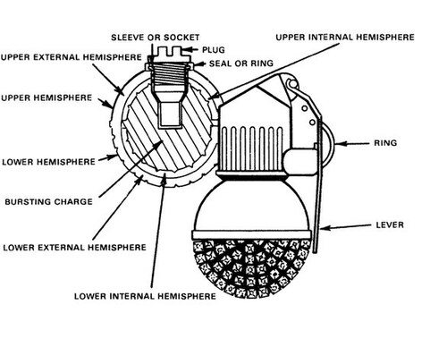

# Granat ręczny RGO
### RGO Hand Grenade | РГО (Ручная Граната Оборонительная)

---

## Opis

RGO (Ручная Граната Оборонительная — Ręczny Granat Obrony) to radziecki defensywny granat ręczny z zapalnikiem udarowo-czasowym opracowany w TsNIITochMash i przyjęty do służby w 1981 roku jako para dla RGN. RGO jest defensywną wersją — cięższy (530 g) i z większym zasięgiem odłamków (do 150 m) dzięki wewnętrznej żeliwnej wkładce fragmentacyjnej. Jak RGN, ma zapalnik uderzeniowy + zapalnik czasowy 3,5 s jako rezerwa. Czterosegmentowa wkładka żeliwna i aluminiowa obudowa zewnętrzna dają łącznie gęstszą chmurę odłamków niż F-1 przy podobnej masie. RGO jest bardziej śmiercionośny od RGN w terenie otwartym — wymagający ukrycia po rzucie.

## Dane techniczne

| Parametr | Wartość |
|----------|---------|
| Typ | Defensywny granat ręczny z zapalnikiem uderzeniowym |
| Kraj produkcji | ZSRR / Rosja |
| Rok wprowadzenia | 1981 |
| Masa | 530 g |
| Masa ładunku | 92 g A-IX-1 |
| Długość | 130 mm |
| Średnica | 61 mm |
| Zapalnik | Uderzeniowy + czasowy 3,5 s rezerwa |
| Zasięg odłamków | do 150 m |
| Zasięg rzutu | 20–40 m |

## Charakterystyczne cechy rozpoznawcze

> Jak odróżnić RGO od RGN i F-1:

- **Dwuczłonowa obudowa jak RGN — ale cięższy (530 g vs 310 g):** RGO i RGN mają identyczną aluminiową dwuczłonową obudowę z charakterystycznym szwem środkowym; różnica jest w masie — RGO jest wyraźnie cięższy; przy trzymaniu obu naraz różnica 220 g jest wyczuwalna
- **Identyczny szew środkowy jak RGN — klucz do odróżnienia od F-1 i RGD-5:** szew środkowy jest wspólny dla RGN i RGO; F-1 i RGD-5 nie mają szwu; jeśli granat ma szew — to RGN lub RGO
- **Aluminiowa obudowa z szarawym lub ciemnooliwkowym wykończeniem:** RGO jak RGN jest z aluminium; kolor jest szarawooliwkowy lub matowoszary; wizualnie podobny do RGN, ale zidentyfikowany przez masę i oznaczenia
- **Oznaczenia na granatie wskazują typ (N — natarcie, O — obrona):** na górnej części obudowy lub zapalnika rosyjskie granaty mają oznaczenia; "N" lub "RGN" to ofensywny, "O" lub "RGO" to defensywny; przy bliskim oglądaniu lub znajomości oznaczeń to kluczowy wyróżnik
- **Zasięg odłamków 150 m — nie rzucać bez ukrycia:** RGO wymaga ukrycia za solidną przeszkodą po rzucie; ten wymóg taktyczny odróżnia RGO od ofensywnego RGN; żołnierz rzucający RGO na otwartym terenie jest zagrożony własną bronią
- **Para dla RGN — oba granaty często transportowane razem:** rosyjskie oddziały często noszą zestawy RGN + RGO; widok dwóch granatów ze szwem środkowym przy żołnierzu to prawdopodobnie właśnie ta para

## Ciekawostka

> RGO rozwiązał "problem defensywny" F-1 w Afganistanie — analogicznie do RGN dla ofensywnych. F-1 z zapalnikiem czasowym 4 sekundy dawał mudżahedinom czas na ucieczkę przed eksplozją jeśli granat wylądował w ich pobliżu. RGO z zapalnikiem uderzeniowym niszczy cel natychmiast po kontakcie z ziemią — bez sekundy na ucieczkę. Rosyjscy żołnierze w Czeczenii chwalili RGO za właśnie to — "jak wyciągam zawleczkę i rzucam, to on wybucha gdy trafia, nie sekundy później". Ta właściwość jest szczególnie cenna przy oczyszczaniu budynków, gdzie sekundy opóźnienia mogą kosztować życie.

