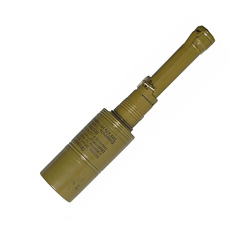

# Granat przeciwpancerny RKG-3
### RKG-3 Anti-Tank Hand Grenade | РКГ-3

---

## Opis

RKG-3 (Ручная Кумулятивная Граната-3 — Ręczny Granat Kumulacyjny-3) to radziecki ręczny granat przeciwpancerny z głowicą kumulacyjną HEAT, opracowany w 1950 roku. Wyróżnia się stabilizatorem paraszutowym — po rzucie rozkłada się mały paraszut (baldachim) zapewniający prawidłową orientację głowicy kumulacyjnej prostopadle do pancerza przy uderzeniu; bez prawidłowej orientacji głowica kumulacyjna jest nieefektywna. RKG-3 przebija do 75 mm pancerza jednolitego (wersja RKG-3M: 170 mm), co wystarczało do rażenia czołgów II wojny światowej i wczesnych powojennnych — ale jest niewystarczające wobec nowoczesnych czołgów z pancerzem reaktywnym. Nadal stosowany przez nieregularne siły zbrojne i w konfliktach niskointensywnych.

## Dane techniczne

| Parametr | Wartość |
|----------|---------|
| Typ | Ręczny granat przeciwpancerny (HEAT) |
| Kraj produkcji | ZSRR |
| Rok wprowadzenia | 1950 |
| Masa | 771 g |
| Masa ładunku | 567 g RDX/TNT |
| Długość | 362 mm |
| Przenikanie pancerza | 75 mm (RKG-3) / 170 mm (RKG-3M) |
| Zasięg rzutu | 15–20 m |
| Zapalnik | Uderzeniowy, bez opóźnienia |

## Charakterystyczne cechy rozpoznawcze

> Jak odróżnić RKG-3 od granatów odłamkowych:

- **Cylindryczny kształt z rączką — wyraźnie inny od "jajka" F-1 i RGD-5:** RKG-3 ma charakterystyczny cylindryczny kształt z długą rączką do rzutu; wygląda jak "mała bomba" lub "puszka na kijku"; zupełnie inny od zaokrąglonych granatów F-1, RGD-5, RGN
- **Stabilizator paraszutowy — charakterystyczny "baldachim" po rzucie:** po rzucie z RKG-3 rozkłada się mały kolorowy (zazwyczaj żółty lub pomarańczowy) paraszut stabilizujący orientację głowicy; widok "lecącego granatu z paraszutem" jest absolutnie unikalny i identyfikuje RKG-3
- **Wyraźna długa rączka drewniana lub plastikowa:** RKG-3 ma charakterystyczną długą rączkę (ok. 15 cm) umożliwiającą rzut z siłą; żadny granat odłamkowy nie ma tak długiej rączki; wygląd jest zbliżony do (ale inny od) granatów trzonkowych WWII
- **Charakterystyczny nosek kumulacyjny z przodu — piezoelektryczny zapalnik:** front RKG-3 ma charakterystyczny stożkowy nosek z zapalnikiem uderzeniowym na szczycie; ta "iglicowa" forma przodu jest widoczna przy bliskim oglądaniu
- **Wyraźnie cięższy od RGD-5 — 771 g vs 310 g:** RKG-3 jest ponad dwa razy cięższy od RGD-5; rzucony zasięgiem tylko 15–20 m (vs 30–50 m RGD-5) ze względu na masę; krótki zasięg rzutu jest istotną informacją taktyczną
- **Broń coraz rzadsza — widoczna głównie u nieregularnych sił zbrojnych:** RKG-3 jest przestarzała wobec nowoczesnych czołgów; pojawia się u nieregularnych sił zbrojnych i na rynku czarnym; widok tej broni sugeruje starszy arsenał lub siły nieregularne

## Ciekawostka

> RKG-3 zyskała nowe "życie" w Iraku w 2004–2008 roku, gdy bojownicy iraccy opracowali taktykę rzucania ich z dachów budynków na przejeżdżające americańskie Hummee i MRAP. Granaty stabilizowane paraszutem trafiały w górne, słabiej opancerzone partie pojazdów. US Army była zaskoczona — bo RKG-3 był bronią z lat 50. uważaną za przestarzałą. W odpowiedzi USA przyspieszyły montaż klatek ochronnych (slat armor) na pojazdach, które zatrzymują granat przed dotarciem do pancerza. Ta "stara broń, nowa taktyka" jest klasycznym przykładem asymetrycznej adaptacji.

