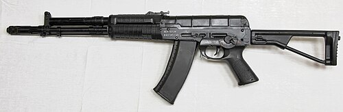

# Karabin szturmowy AEK-971
### AEK-971 Assault Rifle | АЕК-971

---

## Opis

AEK-971 to rosyjski karabin szturmowy kalibru 5,45×39 mm (wersja AEK-973 to 7,62×39 mm) zaprojektowany w Kowrowie przez Stanisława Koksharova i Borysa Garyova. Wyróżnia się mechanizmem zrównoważonej automatyki (zbilansowanej automatyki) — dodatkowa masa poruszająca się w przeciwną stronę niż zamek niweluje odrzut, drastycznie zmniejszając podrzut lufy przy seriach. W programie "Abakan" AEK-971 przegrał z AN-94, ale w 2015 roku wrócił na rynek jako podstawa rodziny A-545 i A-762 — przyjętych na uzbrojenie wojsk rosyjskich w 2018 roku jako uzupełnienie AK-12 i AK-15. A-545/A-762 (nowsze wersje AEK-971) są stosowane przez rosyjskie siły specjalne i oddziały Gwardii Narodowej (Rosgwardia).

## Dane techniczne

| Parametr | Wartość |
|----------|---------|
| Typ | Karabin szturmowy ze zrównoważoną automatyką |
| Kraj produkcji | Rosja |
| Rok wprowadzenia | A-545/A-762: 2018 (prototyp AEK-971: lata 80.) |
| Kaliber | 5,45×39 mm (A-545) / 7,62×39 mm (A-762) |
| Długość (kolba rozłożona) | 960 mm |
| Długość (kolba złożona) | 725 mm |
| Długość lufy | 415 mm |
| Masa (bez magazynka) | 3,5 kg |
| Pojemność magazynka | 30 nabojów |
| Szybkostrzelność | 850 strz./min |
| Skuteczny zasięg | 500 m |

## Charakterystyczne cechy rozpoznawcze

> Jak odróżnić AEK-971/A-545 od AK-12 i AN-94:

- **Charakterystyczny port wentylacyjny na górze komory zamkowej:** AEK-971/A-545 ma wyraźny otwór lub szczelinę wentylacyjną na górze tylnej części komory zamkowej — widoczny element związany z mechanizmem zrównoważonej automatyki; AK-12 go nie ma
- **Prosty, klasyczny układ podobny do AK — ale chwyt cofnięty:** sylwetka AEK-971 przypomina AK, ale chwyt pistoletowy jest cofnięty dalej ku tyłowi niż w standardowym AK — daje to charakterystyczną bryłę
- **Kolba rurowa lub teleskopowa — inna geometria niż AK-74M:** AEK-971 miał charakterystyczną metalową kolbę rurową; A-545 ma nowocześniejszą regulowaną kolbę polimeru podobną do AK-12
- **Hamulec wylotowy w kształcie "klatki" (cage-style):** A-545 wyposażony jest w charakterystyczny kompensator/hamulec w formie cylindrycznej klatki — inny niż hamulec AK-12 i AK-15
- **Brak zewnętrznej różnicy wizualnej między A-545 a A-762:** wersje 5,45 mm i 7,62 mm A-545/A-762 wyglądają identycznie — różnica tylko w magazynku (smukły 5,45 vs grubszy 7,62)
- **Szyny Picatinny w układzie zbliżonym do AK-12:** cztery szyny taktyczne jak w AK-12 — góra/boki/dół; sprawia, że A-545 można pomylić z AK-12 bez bliskiego oglądania

## Ciekawostka

> AEK-971 przegrał konkurs "Abakan" z AN-94 na początku lat 90., ale miał niezwykłą drugą szansę — gdy armia rosyjska, niezadowolona z wysokiej ceny AN-94, ogłosiła w 2011 roku konkurs na "Ratnik" (żołnierz przyszłości). AEK-971 w unowocześnionej formie (A-545) pokonał tym razem AK-12 w testach celności przy ogniu automatycznym — uzyskując wyraźnie lepsze skupienie. Mimo to wojsko zdecydowało się przyjąć oba: AK-12/AK-15 (tańsze, dla masowej piechoty) i A-545/A-762 (droższe, ale celniejsze, dla specjalsów). To rzadki przypadek, gdy armia kupiła i wygrany, i przegrany projekt naraz.

