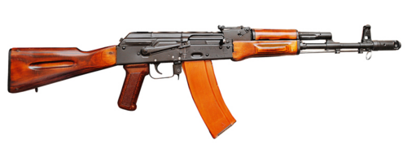

# Karabin szturmowy AK-103
### AK-103 Assault Rifle | АК-103

---

## Opis

AK-103 to rosyjski karabin szturmowy kalibru 7,62×39 mm opracowany przez Konsorcjum Kałasznikowa w 1994 roku jako wersja eksportowa z powrotem na klasyczny nabój 7,62 mm. Jest rozwinięciem AK-74M z modernizacją ergonomiczną, ale z powrotem wykorzystuje nabój AKM — co czyni go atrakcyjnym dla krajów, które mają zapasy amunicji 7,62×39 mm. AK-103 ma czarny plastikowy chwyt, kolbę i łoże z AK-74M, ale magazynek i lufę z AKM. Wyposażony jest w szynę boczną montażową do celowników noktowizyjnych. Stosowany m.in. przez siły zbrojne Wenezueli, Algierii i innych krajów arabskich, a w ostatnich latach coraz częściej przez żołnierzy rosyjskich jako alternatywa dla AK-12 (ze względu na większą energię naboju 7,62 mm).

## Dane techniczne

| Parametr | Wartość |
|----------|---------|
| Typ | Karabin szturmowy |
| Kraj produkcji | Rosja |
| Rok wprowadzenia | 1994 |
| Kaliber | 7,62×39 mm |
| Długość (kolba rozłożona) | 943 mm |
| Długość (kolba złożona) | 704 mm |
| Długość lufy | 415 mm |
| Masa (bez magazynka) | 3,4 kg |
| Pojemność magazynka | 30 nabojów |
| Prędkość wylotowa | 715 m/s |
| Skuteczny zasięg | 400 m |

## Charakterystyczne cechy rozpoznawcze

> Jak odróżnić AK-103 od AK-74M i AKM:

- **Czarny plastikowy chwyt i łoże — jak AK-74M, ale nabój 7,62:** z zewnątrz AK-103 wygląda jak AK-74M (czarny plastik), ale ma wyraźnie grubszy magazynek kalibru 7,62 mm — to kluczowy identyfikator
- **Grubszy magazynek z lekkim wygięciem 7,62 mm:** magazynek AK-103 (7,62×39) jest grubszy i bardziej wygięty niż smukły pomarańczowy AK-74; bardziej podobny do magazynka AKM, ale czarny
- **Hamulec wylotowy taki sam jak AK-74M:** na końcu lufy AK-103 widnieje charakterystyczny cylindryczny hamulec wylotowy identyczny jak w AK-74M — to odróżnia go od AKM (skośny kompensator)
- **Boczna szyna montażowa po lewej:** charakterystyczna metalowa szyna z boku komory zamkowej (po lewej) do mocowania celowników noktowizyjnych — obecna w AK-103, nie ma jej w starszym AKM
- **Czarna plastikowa składana kolba (bok lewy):** kolba AK-103 jest czarnym plastikiem, składa się na lewo — podobnie jak AK-74M; stary AKM miał drewnianą lub stałą plastikową kolbę
- **Grubsza lufa niż AK-74:** kaliber 7,62 mm daje wyraźnie grubszą lufę niż AK-74/AK-103 — przy bezpośrednim porównaniu różnica 5,45 vs 7,62 mm jest widoczna

## Ciekawostka

> AK-103 był pierwszym karabinem Kałasznikowa oficjalnie zaoferowanym w wersji z tłumikiem dźwięku w katalogu eksportowym Konsorcjum Kałasznikowa — co było przełomem, bo wcześniej sowiecka doktryna negowała potrzebę tłumienia broni indywidualnej. Wenezuela zamówiła fabrykę licencyjną produkującą AK-103 i rozdała je milicjom obywatelskim — co sprawiło, że w 2019 roku zachodnie media alarmowały o "uzbrojeniu Ameryki Łacińskiej w Kałasznikowy".
