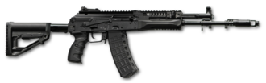

# Karabin szturmowy AK-12
### AK-12 Assault Rifle | АК-12

---

## Opis

AK-12 to rosyjski karabin szturmowy piątej generacji rodziny Kałasznikowa, oficjalnie przyjęty na uzbrojenie armii rosyjskiej w styczniu 2018 roku w ramach programu wyposażenia "Ratnik". Opracowany przez Konsorcjum Kałasznikowa jako następca AK-74M, wprowadza nowoczesną ergonomię: składaną regulowaną kolbę, pełną szynę Picatinny 1913 na górze i po bokach, ambidekstralne sterowanie, wolnopływającą lufę dla lepszej celności oraz nowy mechanizm spustowy z możliwością strzelania seriami po 2 naboje z przyspieszoną cyklicznością. AK-12 jest standardowym karabinem rosyjskiej piechoty w wojnie w Ukrainie od 2022 roku.

## Dane techniczne

| Parametr | Wartość |
|----------|---------|
| Typ | Karabin szturmowy |
| Kraj produkcji | Rosja |
| Rok wprowadzenia | 2018 |
| Kaliber | 5,45×39 mm |
| Długość (kolba rozłożona) | 922 mm |
| Długość (kolba złożona) | 688 mm |
| Masa (bez magazynka) | 3,5 kg |
| Pojemność magazynka | 30 nabojów |
| Szybkostrzelność | 700 strz./min |
| Prędkość wylotowa | 880–900 m/s |
| Skuteczny zasięg | 440 m |

## Charakterystyczne cechy rozpoznawcze

> Jak odróżnić AK-12 od AK-74 i AK-74M:

- **Pełna szyna Picatinny na górnej powierzchni:** na całej górnej powierzchni komory zamkowej i przedniej części łoża biegnie szyna 1913 — w AK-74M jest tylko krótki adapter; to natychmiastowy wyróżnik AK-12
- **Regulowana teleskopowa kolba po lewej stronie:** kolba AK-12 składa się w lewo i jest teleskopowo regulowana (4 pozycje) — AK-74M miał stałą plastikową kolbę lub boczną stałą kolbę; AK-12 wygląda "nowocześniej"
- **Czarna nowoczesna synthetyczna obudowa:** całkowicie czarny polimer na kolbie, łożu i chwycie — wyraźnie bardziej nowoczesny wygląd niż drewno/bakelit starszych AK
- **Ambidekstralne sterowanie bezpiecznikiem i zatrzymaniem zamka:** nowe przyciski i dźwignie po obu stronach komory zamkowej — AK-74 miał sterowanie tylko po prawej stronie
- **Wolnopływająca lufa i krótszy hamulec wylotowy:** hamulec wylotowy AK-12 jest krótszy i inaczej ukształtowany niż cylindryczny kompensator AK-74; lufa jest odizolowana od łoża
- **Szyny boczne na chwycie czołowym:** boczne szyny Picatinny na chwycie czołowym pozwalają mocować latarki i celowniki boczne — charakterystyczny element AK-12, nieobecny w AK-74

## Ciekawostka

> AK-12 przeszedł jedną z najdłuższych procedur testowania i odrzucania w historii rosyjskiego uzbrojenia — między 2011 a 2018 rokiem wojsko trzykrotnie odrzucało kolejne wersje prototypowe, żądając poprawek. Ironią historii jest, że finalnie przyjęta wersja jest tak bardzo zmodyfikowana w stosunku do oryginalnego prototypu, że konstruktorzy Konsorcjum Kałasznikowa żartowali, iż "nowy AK-12 to tak naprawdę AK-74M z plastikowym kamuflażem i szyną".
