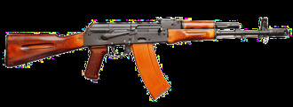

# Karabin szturmowy AK-74
### AK-74 Assault Rifle | АК-74

---

## Opis

AK-74 to radziecki karabin szturmowy zaprojektowany przez Michaiła Kałasznikowa w 1974 roku jako następca AKM, przystosowany do nowego naboju 5,45×39 mm o mniejszym kalibrze i wyższej prędkości wylotowej. Mniejszy kaliber zapewnił żołnierzowi możliwość niesienia większego zapasu amunicji przy tej samej masie, a wysoka prędkość pocisku (880–900 m/s) poprawiła skuteczność rażenia. AK-74 po raz pierwszy trafił do walki w Afganistanie w 1979 roku. Zmodernizowana wersja AK-74M z 1991 roku, z plastikową kolbą składaną i szyną Picatinny, jest do dziś podstawowym karabinem piechoty rosyjskiej. Posłużył jako wzorzec dla całej rodziny AK-100 i współczesnych AK-12/AK-15.

## Dane techniczne

| Parametr | Wartość |
|----------|---------|
| Typ | Karabin szturmowy |
| Kraj produkcji | ZSRR / Rosja |
| Rok wprowadzenia | 1974 |
| Kaliber | 5,45×39 mm |
| Długość (kolba rozłożona) | 943 mm |
| Długość lufy | 415 mm |
| Masa (bez magazynka) | 3,07 kg |
| Pojemność magazynka | 30 nabojów (standardowy) |
| Szybkostrzelność | 650 strz./min |
| Prędkość wylotowa | 880–900 m/s |
| Skuteczny zasięg | 500 m (cel punktowy) / 800 m (cel grupowy) |

## Charakterystyczne cechy rozpoznawcze

> Jak odróżnić AK-74 od AKM i innych Kałasznikowów:

- **Charakterystyczny hamulec wylotowy z bocznym otworem:** unikalny cylindryczny hamulec kompensator z poprzecznym prostokątnym oknem po lewej stronie — żaden inny AK nie ma identycznego — to natychmiastowy identyfikator AK-74
- **Pomarańczowo-brązowy magazynek z żeberkami:** standardowy magazynek AK-74 jest wykonany z pomarańczowego lub brązowego bakelitu z poprzecznymi żeberkami; magazynki AKM są stalowe lub czarne plastikowe
- **Smuklejsza lufa niż AKM:** kaliber 5,45 mm daje AK-74 wyraźnie cieńszą lufę niż AKM (7,62 mm) — widoczne przy porównaniu obu broni
- **Wycięcie w zamku (charakterystyczne):** zamek AK-74 ma nieco inne proporcje niż AKM; pudło zamkowe jest identyczne, ale detale różnią się od pierwszego wejrzenia
- **AK-74M: składana czarna plastikowa kolba:** wersja M ma charakterystyczną czarną kolbę składaną w bok (nie jak AKM — drewniana lub składana ku dołowi) z charakterystycznym blokadą
- **Krótszy niż SVD, dłuższy niż AKS-74U:** proporcje karabinu są pośrednie; nie tak długi jak SVD, nie tak krótki jak AKS-74U — pomocne przy identyfikacji z odległości

## Ciekawostka

> Pocisk 5,45×39 mm AK-74 był przez zachodnie służby wywiadowcze nazywany "Poison Bullet" (Trująca Kula) — nie z powodu substancji chemicznych, ale dlatego że po trafieniu w ciało pocisk traci stabilność i zaczyna się obracać w tkankach, powodując nieproporcjonalnie duże rany w stosunku do małego kalibru. Właściwość ta była w sowieckim projekcie zamierzona i od razu wzbudziła kontrowersje podczas debat o Konwencji Haskiej.
