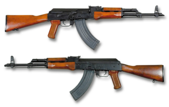

# Karabin szturmowy AKM
### AKM Assault Rifle | АКМ (Автомат Калашникова Модернизированный)

---

## Opis

AKM (Awtomat Kałasznikowa Modernizirowannyj — Zmodernizowany Automat Kałasznikowa) to radziecki karabin szturmowy wprowadzony do służby w 1959 roku jako zmodernizowana wersja AK-47. Główne zmiany to redukcja masy o ~1 kg przez zastosowanie tłoczonego blachownicy zamiast frezowanej, nowy kompensator skokowy na lufie oraz nowe łoże i chwyt pistoletowy. AKM strzelający nabojem 7,62×39 mm jest jednym z najszerzej rozpowszechnionych karabinów szturmowych w historii — szacuje się, że wyprodukowano ponad 50 milionów egzemplarzy różnych klonów. Choć rosyjska armia przeszła na AK-74 (5,45 mm) w latach 70., AKM wciąż jest w powszechnym użyciu w siłach bezpieczeństwa, magazynach rezerwowych i rękach aktorów niepaństwowych na całym świecie.

## Dane techniczne

| Parametr | Wartość |
|----------|---------|
| Typ | Karabin szturmowy |
| Kraj produkcji | ZSRR / Rosja |
| Rok wprowadzenia | 1959 |
| Kaliber | 7,62×39 mm |
| Długość | 880 mm |
| Długość lufy | 415 mm |
| Masa (bez magazynka) | 3,3 kg |
| Pojemność magazynka | 30 nabojów |
| Szybkostrzelność | 600 strz./min |
| Prędkość wylotowa | 715 m/s |
| Skuteczny zasięg | 300 m (cel punktowy) |

## Charakterystyczne cechy rozpoznawcze

> Jak odróżnić AKM od AK-74 i innych Kałasznikowów:

- **Charakterystyczny skośny kompensator wylotowy:** AKM ma unikalny skośnie ścięty kompensator na końcu lufy (ścięcie pod kątem ~45°) — żaden inny AK nie ma identycznego; AK-74 ma cylindryczny hamulec z bocznym oknem
- **Czarny lub drewniany kolba i łoże w kolorze drewna:** standardowy AKM ma drewniane elementy (kolba, łoże, chwyt) w kolorze naturalnego drewna lub ciemnobrązowym lakierze; AK-74 często ma brązowy lub czarny plastik
- **Grubsza lufa niż AK-74:** kaliber 7,62 mm daje wyraźnie grubszą lufę niż AK-74 (5,45 mm) — widoczne przy bezpośrednim porównaniu lub na zdjęciach z bliska
- **Stalowy lub brązowy magazynek z delikatnym wygięciem:** magazynek AKM jest metalowy (stalowy) lub brązowy bakelit z lekkim wygięciem; magazynki AK-74 są wyraźnie bardziej "bananowe" (bardziej wygięte) i pomarańczowo-brązowe
- **Blachownica tłoczona z widocznymi wytłoczeniami:** pudło zamkowe AKM ma charakterystyczne owalne wytłoczenia po obu stronach (wzmocnienia ścian) — AK-47 miał pudło frezowane (grubsze, bez wytłoczeń)
- **Tylna podstawa muszki bez bocznych skrzydełek (AKM):** muszka AKM jest prostsza niż w AK-74M, który ma charakterystyczne boczne skrzydełka ochronne

## Ciekawostka

> AKM jest prawdopodobnie bronią, która zabiła więcej ludzi niż jakikolwiek inny wynalazek w historii ludzkości po bombie atomowej. Michaiłowi Kałasznikowowi pytano go o to wielokrotnie — do końca życia twierdził, że winni są politycy, którzy dostarczali broń do konfliktów, nie konstruktor. Przed śmiercią w 2013 roku napisał list do patriarchy rosyjskiego Kościoła Prawosławnego z pytaniem, czy ponosi moralną odpowiedzialność za śmierć zadaną jego bronią.
