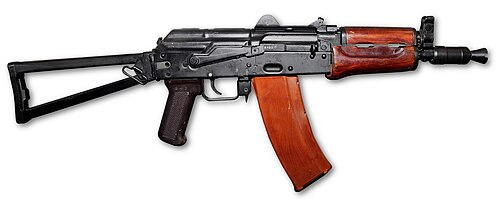

# Skrócony karabin szturmowy AKS-74U
### AKS-74U Carbine | АКС-74У («Ксюха»)

---

## Opis

AKS-74U (potocznie: „Ksyucha") to radziecka skrócona wersja karabinu AKS-74 z odchylaną kolbą i krótką lufą (212 mm zamiast 415 mm), zaprojektowana w 1977 roku dla służb specjalnych, kierowców pojazdów bojowych, obsługi sprzętu artyleryjskiego i sił powietrznodesantowych. Mała masa (~2,7 kg) i kompaktowe wymiary (490 mm z kolbą złożoną) czynią ją idealną bronią osobistą tam, gdzie pełnowymiarowy karabin byłby niewygodny. Ceną za mały rozmiar jest znacznie zmniejszona celność i zasięg skuteczny (200 m zamiast 500 m) oraz wyraźnie głośniejszy huk i mocniejszy płomień wylotowy. AKS-74U była standardową bronią radzieckich i rosyjskich oddziałów specjalnych przez dekady.

## Dane techniczne

| Parametr | Wartość |
|----------|---------|
| Typ | Skrócony karabin szturmowy (PDW/karabin) |
| Kraj produkcji | ZSRR / Rosja |
| Rok wprowadzenia | 1979 |
| Kaliber | 5,45×39 mm |
| Długość (kolba rozłożona) | 735 mm |
| Długość (kolba złożona) | 490 mm |
| Długość lufy | 212 mm |
| Masa (bez magazynka) | 2,7 kg |
| Pojemność magazynka | 30 nabojów |
| Szybkostrzelność | 700 strz./min |
| Skuteczny zasięg | 200 m |

## Charakterystyczne cechy rozpoznawcze

> Jak odróżnić AKS-74U od AK-74 i innych Kałasznikowów:

- **Bardzo krótka lufa z dużym rozbudowanym tłumikiem gazowym/kompensatorem:** na krótkiej lufie widnieje charakterystyczny duży cylindryczny kompensator wylotowy — nieproporcjonalnie duży do długości lufy; żaden inny AK nie wygląda tak
- **Boczna składana metalowa kolba (na lewą stronę):** kolba AKS-74U składa się na lewą stronę i jest metalowa, kratownicowa — wyraźnie różna od plastikowej kolby AK-74M
- **Skrócone łoże — rączkę pistoletową widać blisko komory zamkowej:** łoże jest bardzo krótkie, a chwyt pistoletowy jest znacznie bliżej komory zamkowej niż w standardowym AK-74 — proporcje są wyraźnie inne
- **Mała, prosta muszka bez podstawy gazowej na lufie:** gazownik AKS-74U jest tuż przy komorze, a muszka stoi na krótkim bloku przy komórze wylotowej — inny układ niż w pełnowymiarowym karabinie
- **Wyraźnie krótszy od jakiegokolwiek pełnowymiarowego AK:** z kolbą złożoną AKS-74U wygląda jak pistolet maszynowy — jest krótszy niż lufa standardowego AK-74
- **Magazynek 5,45 mm (pomarańczowy lub brązowy) — tak jak AK-74:** magazynek jest identyczny jak w AK-74, co odróżnia od skróconego AKS-74U kalibru 7,62 (AKS)

## Ciekawostka

> AKS-74U zyskała przydomek "Ksyucha" (ros. zdrobnienie imienia Ksenija) od rosyjskich żołnierzy — według legendy dlatego, że jest "kapryśna jak kobieta" i często powoduje zacięcia przy intensywnej strzelaniu ze względu na bardzo krótki cykl pracy gazów. Afgańscy mudżahedini zdobywając AKS-74U na sowieckich żołnierzach nazywali ją "małym karabin" i traktowali jako szczególny łup — ze względu na rozmiary łatwiejszy do ukrycia pod ubraniem niż pełny AK.
